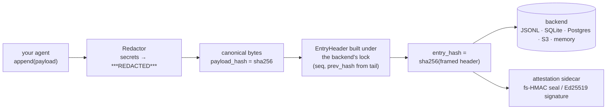
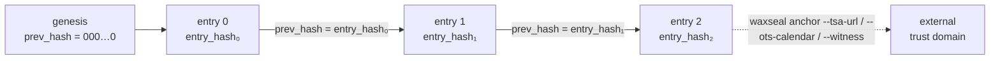
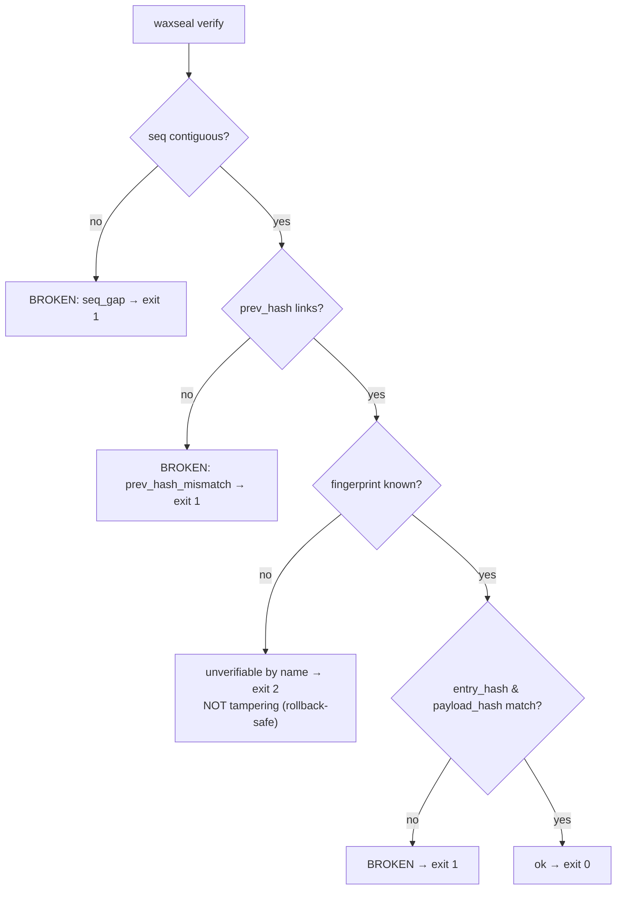
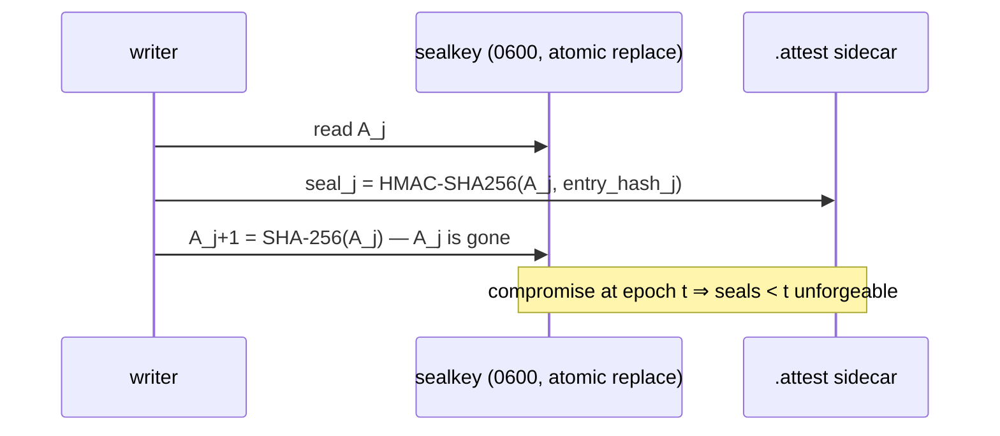

# waxseal

**English** | [Tiếng Việt](README.vi.md) | [中文](README.zh.md)

**Tamper-evident, schema-evolution-safe audit hash chain for AI agent frameworks.**
Zero dependencies. MIT. Python ≥ 3.11.

waxseal gives your agent a cryptographic audit trail: every action is appended to a
SHA-256 hash chain, so any edit, deletion, insertion, or reordering of history is
detected. Schema evolution does not trigger false tampering alarms: old rows verify
under the fingerprint they were written with.


<sub>Append · tamper · schema evolution · coverage · anchoring · cross-agent handoff · verdict. Regenerate with `python tools/gen_workflow_animation.py --render`.</sub>

## Why another audit log?

Hash-chained logs usually break for a boring reason: the schema changes. Two incidents
shaped this library.

In the first, a production system widened the set of fields it hashed without giving the
new layout a version identity of its own. Every historical row was then recomputed under
a field set it had never been written with, so all of them failed verification at once,
and the alarm that fired was a false one.

In the second, an agent-memory tool called beads shipped a schema migration by accident
in version 1.2.2 (August 2026). When that release was reverted, the older binary found a
database it did not recognise and refused to start, printing *"schema version mismatch:
database is at v65, binary knows up to v53"*. The only way past it was an environment
variable that turned the safety check off completely.

Both failures have the same shape: a version identity that is only an ordinal, and an
unknown version treated as an error. waxseal is built so that neither is expressible.

The chain hashes a fixed header and nothing else (`seq`, `ts`, `hash_version`,
`payload_type`, `payload_hash`, `prev_hash`). Your payload is arbitrary bytes referenced
only by its digest, so changing the payload schema never touches the chain at all.

`hash_version` is not a string that anyone types. It is the SHA-256 of a canonical
descriptor of the header schema together with its encoding, so widening the field set or
changing the encoding produces a different identity whether you meant to or not. Old rows
keep verifying under the fingerprint they were actually written with.

When a verifier meets a fingerprint it does not know, it reports that row as unverifiable
by name. It does not report tampering, and it does not crash. This is the same principle
RFC 6962 applies to unrecognized types, which it treats as opaque rather than as errors,
and it is what lets a version rollback degrade gracefully instead of setting off alarms.

The library has since used that mechanism on itself. Version 0.1.4 replaced the canonical
encoding outright, moving from `lp64v1` to `lp64`, which is unconditionally injective (the
[CHANGELOG](CHANGELOG.md) explains why), rather than carrying both. Because the encoding
is part of the descriptor, every fingerprint moved on its own. No migration existed to get
wrong, and a 0.1.3 trail read by 0.1.4 reports *unverifiable* rather than *tampered*,
which is exactly what the paragraph above promises. It is a breaking format change, made
deliberately at a point when no trail written under the old encoding existed outside
development.

## Comparison with other hash-chain approaches

Every hash-chain library will catch a flipped byte. The table below is about the things
most of them do not do. It comes from a survey of Python audit-log libraries in August
2026, and [DESIGN.md](DESIGN.md) has the literature behind each row.

|  | waxseal | typical audit-chain libs | DIY hash chain |
|---|---|---|---|
| Schema evolution without false tampering alarms (automatic fingerprints) | ✅ | ❌ manual version strings, or none | ❌ |
| Version rollback degrades gracefully (unverifiable ≠ tampered, exit 2 ≠ exit 1) | ✅ | ❌ unknown version = error | ❌ |
| Completeness reported separately: `dropped_writes`, `None` ≠ `0` | ✅ | ❌ chain-ok implies all-ok | ❌ |
| Fork-proof concurrent appends, with the mechanism documented **per backend** and a falsifiability-tested lock | ✅ | varies, usually single-writer assumed | ❌ |
| Byte-level SPEC (freeze planned for v1) + golden test vectors → portable to Go/Rust/TS | ✅ | ❌ format = whatever the code does | ❌ |
| Zero runtime dependencies (S3/Postgres clients are injected, never imported) | ✅ | often pulls crypto/serialization stacks | ✅ |
| Redact-before-hash (secrets never reach disk, hash commits to redacted bytes) | ✅ | sometimes | ❌ |
| Built-in external anchoring: RFC 3161 TSA, OpenTimestamps, witness, or your own sink (`anchor_every=N`) | ✅ | ❌ | ❌ |
| Pinned-head (TOFU) + witness cross-check against a dishonest chain server | ✅ | ❌ | ❌ |
| Forward-secure seals (key-evolving HMAC, stdlib only) + injected Ed25519 signatures | ✅ | ❌ | ❌ |
| FssAgg aggregate tag closing the truncation gap even if the keyfile leaks | ✅ | ❌ | ❌ |
| Remote HTTP backend as a full peer to local storage, with an explicit trust model | ✅ | rare, undocumented trust model | ❌ |

The first two rows are the failure class from the two incidents above.

## How it works

Every append follows this path:



Each entry commits to the one before it, which is what makes an edit detectable:



Verification keeps its outcomes apart, and an unknown fingerprint is never one of
the tampering ones:



## Install

```bash
pip install waxseal
```

Released on [PyPI](https://pypi.org/project/waxseal/). From source:
`pip install git+https://github.com/cuongbphv/waxseal`

> **Looking for WaxSeal SDK?** `waxseal` on PyPI is this library, an audit hash
> chain. The **WaxSeal SDK** on npm (`@waxseal/verify`, `@waxseal/mcp`, and the
> service at waxseal.id) is an unrelated Ed25519 identity product by a different
> author: different language, different problem, no connection to this project.
> If you came here wanting to sign and verify agent identities, that is the one
> you want. [docs/research/landscape.md](docs/research/landscape.md) § 3 sets the
> two apart in full.

## Capability extras

Zero dependencies describes the core, not a ceiling on what waxseal can do. The
core keeps `dependencies = []`, which is an invariant rather than a preference,
and capability that needs a third-party client arrives through an optional extra
plus injection: you install the client, you construct it, you pass it in, and
waxseal never imports it itself. `S3Backend` and `PostgresBackend` under
[Storage backends](#storage-backends) are the pattern, and the extras exist so
`pip` can fetch a compatible client for you rather than because waxseal needs
one.

Shipped today:

| Extra | Install | Client it fetches | What you can then inject |
|---|---|---|---|
| `s3` | `pip install waxseal[s3]` | `boto3` | an S3 client for `S3Backend` (conditional-PUT appends) |
| `postgres` | `pip install waxseal[postgres]` | `psycopg[binary]>=3.1` | a connection factory for `PostgresBackend` |
| `rfc3161` | `pip install waxseal[rfc3161]` | `cryptography>=40` | nothing — see the note below |
| `evm` | `pip install waxseal[evm]` | none — deliberately empty, see below | a `Signer` for the on-chain ledger layer's write path |

`rfc3161` is the one extra waxseal does import itself, inside a single function
(`adapters/rfc3161_verify.py`), which is why its "inject" column is empty. It
turns on the optional signature dimension of `verify`/`report`, and only when
you name a CA bundle with `--tsa-ca-file`: a token whose CMS signature or
certificate chain fails is exit 1, and anything that could not be checked at
all — the extra absent included — is exit 2 with a label saying which, never a
silent exit 0. Without the flag nothing changes: receipts are checked
structurally, exactly as before. See [SPEC.md](SPEC.md) section 17.1.

`evm` is shipped, and its emptiness is the design, not an unfinished feature:
the on-chain ledger layer (`ports/ledger.py`, `domain/bond.py`,
`domain/liveness.py`, `domain/abi.py`, `domain/registry.py`,
`adapters/evm.py`) reads a contract over the same stdlib JSON-RPC `Transport`
`RemoteBackend` already uses (`eth_call`, no client to fetch) and writes
through a `Signer` the operator constructs and injects — there is nothing for
`pip` to pull in. The extra exists only so `pip install waxseal[evm]` is a
valid thing to type and the capability has a name in the metadata; it never
becomes a route by which a crypto library reaches the core. The layer is
chain-agnostic behind the port — EVM is the first adapter, not the design.
CLI surface: `waxseal ledger-status`, `waxseal registry publish`, `waxseal
bond deposit`/`bond prove`, and `verify`/`report --rpc/--liveness/--registry`,
`anchor --evm-liveness` (see the CLI list under [Usage](#usage) below) —
checked end-to-end against two live anvil chains running real Foundry contracts
(`contracts/src/AnchoringLiveness.sol`, `BondedCheckpoints.sol`,
`FingerprintRegistry.sol`; commits `26b074c`/`c21e0e6`/`20f2762`/`26e3e91`).
[docs/paper/conformance.md](docs/paper/conformance.md) tracks this layer row
by row, including two open, non-blocking gaps recorded there rather than
smoothed over.

(`dev` also exists, for running the test suite. It is not a capability extra.)

Adding a *hard* dependency is a different question, and the answer is no. Extras
are the sanctioned route.

The shipped-extras table above is the single source for these client package
names and version specifiers. [README.vi.md](README.vi.md) and
[README.zh.md](README.zh.md) translate the prose of this section but link back
to that table rather than duplicating the strings, so a translation that falls
behind costs a click and never prints a wrong install command. Ship or retire an
extra and you edit that table; the other two READMEs need touching only when the
*list of shipped extra names* changes, which they do carry in prose.

## Usage

```python
from waxseal import AuditLog

log = AuditLog.open("~/.myagent/audit/trail.jsonl")   # or trail.db for SQLite

log.append(
    payload={"tool": "bash", "command": "ls -la", "exit_code": 0},
    payload_type="application/vnd.myagent.toolcall+json",
)

result = log.verify()
# VerifyResult(ok=True, checked=1, broken_seq=None, reason=None,
#              unverifiable=(), dropped_writes=0)
```

Redact secrets **before** they are hashed and stored:

```python
from waxseal.adapters.redactors import RegexRedactor

log = AuditLog.open("trail.jsonl", redactor=RegexRedactor())
log.append(payload={"cmd": "curl -H 'Authorization: Bearer sk-...'"},
           payload_type="application/vnd.myagent.toolcall+json")
# cleartext never reaches disk; the hash commits to the redacted payload
```

CLI:

```bash
waxseal verify trail.jsonl   # exit 0 intact / 1 broken / 2 unverifiable present / 3 no such trail
waxseal tail trail.jsonl -n 20
waxseal inspect trail.jsonl
waxseal head trail.jsonl       # print the chain head (seq + entry_hash) for anchoring
waxseal checkpoint trail.jsonl # print {seq, entry_hash, root} — a batch root, not just the tip
waxseal anchor trail.jsonl     # append a checkpoint to the local .anchors sidecar
waxseal verify --anchors trail.jsonl  # also check trail history against .anchors
waxseal preflight trail.jsonl  # which attacker-capability rung this config stops; always exit 0 (exit 3: no such trail)
waxseal segments trail-dir/    # verify every sealed segment + rotation binding in a directory; read-only

# Any of the above except `anchor` also accepts a remote chain server URL:
waxseal verify http://chain.example.com/v1/chains/default

# On-chain ledger layer (waxseal[evm]; see Capability extras above):
waxseal ledger-status trail.jsonl --liveness 0xADDR --rpc https://rpc1 --rpc https://rpc2
waxseal registry publish --descriptor-of FINGERPRINT --registry 0xADDR --rpc https://rpc1 --rpc https://rpc2
waxseal bond deposit --bond 0xADDR --amount-wei 1000000000000000000 --rpc https://rpc1 --rpc https://rpc2
```

## Storage backends

Every backend enforces the same rule: read-tail + append is one critical section, so
concurrent writers can never fork the chain.

| Backend | Module | Serialization mechanism | Extra deps |
|---|---|---|---|
| JSONL file | `waxseal.adapters.jsonl` | cross-platform file lock | none |
| SQLite | `waxseal.adapters.sqlite` | `BEGIN IMMEDIATE` + `PRIMARY KEY(seq)` | none |
| In-memory | `waxseal.adapters.memory` | mutex | none |
| Amazon S3 | `waxseal.adapters.s3` | conditional PUT (`IfNoneMatch: *`) | inject your boto3 client |
| PostgreSQL | `waxseal.adapters.postgres` | `pg_advisory_xact_lock` + `PRIMARY KEY(seq)` | inject your psycopg connection |
| Remote (HTTP) | `waxseal.adapters.remote` | server-side compare-and-swap on `(seq, prev_hash)`, client retries on `409` | none (stdlib `urllib`) |

```python
# S3 — the client is injected; waxseal itself stays dependency-free
import boto3
from waxseal import AuditLog
from waxseal.adapters.s3 import S3Backend

backend = S3Backend(boto3.client("s3"), bucket="my-audit", prefix="agent-1")
log = AuditLog(backend)

# PostgreSQL — same pattern with a connection factory
import psycopg
from waxseal.adapters.postgres import PostgresBackend

log = AuditLog(PostgresBackend(lambda: psycopg.connect("postgresql://...")))
```

> Note on Kafka: compacted topics delete old records (tombstones), so they are **not**
> append-only, so do not use them as a tamper-evidence store.

### Remote backend

`RemoteBackend` talks to any server implementing the wire contract in
[REMOTE.md](REMOTE.md). That contract is a small HTTP surface
(`GET /v1/chains/{id}/head`, `POST .../entries`, `GET .../entries?cursor=`)
rather than a proprietary protocol. The critical section every other backend enforces with a lock is
enforced server-side here: `POST` is a compare-and-swap on `(seq, prev_hash)`,
and a losing writer retries against the fresh head rather than forking the chain.

```python
from waxseal import AuditLog

log = AuditLog.open("http://chain.example.com/v1/chains/default")
log.append(payload={...}, payload_type="application/vnd.myagent.toolcall+json")
```

`WAXSEAL_API_KEY` supplies a bearer token (never argv, never the URL itself).

**Trust model, stated plainly:** the server is a *trusted writer*, not a
Byzantine-fault-tolerant peer. `verify_chain` still runs entirely client-side
and catches corruption, truncation, and reordering, but a dishonest server can
serve a consistently forged rewrite of the whole trail that `verify_chain` alone
cannot catch. Three things narrow that: anchor the head independently at a
service *other than* the chain server, keep a `--pin` so a rewrite of history
you already confirmed is caught, and add a `--witness` in a different trust
domain so a split-view is caught (see Anchoring and Attested time, below).
None of them make the server trusted; they move the question to who controls
the pin, the witness and the sink.

## Metadata sources

Beyond agent actions, chain any file/document history:

```python
from waxseal.sources.files import record_file, current_matches_last

record_file(log, "SPEC.md", doc_id="spec")          # snapshot content hash into the chain
current_matches_last(log, "SPEC.md", doc_id="spec")  # True / False / None (never recorded)
```

## AI decision logs

`DecisionRecord` is a decision-shaped payload for AI systems that decide or assist:
which system, which model version, what it decided and why, and whether a human was
involved. The input is committed by hash after redaction rather than stored.

```python
from waxseal import AuditLog, DecisionRecord, ModelRef, HumanOversight
from waxseal.adapters.redactors import RegexRedactor
from waxseal.sources.decisions import commit_input, record_decision

redactor = RegexRedactor()
log = AuditLog.open("decisions.jsonl", redactor=redactor)

record_decision(log, DecisionRecord(
    decision_id="DEC-1001",
    decision_type="transaction_approval",
    system_id="screening-agent",
    model=ModelRef(name="my-model", version="2026.08.1"),
    input_commitment=commit_input(model_input, redactor=redactor),  # redacted, then hashed
    outcome="approve",
    rationale="below thresholds, established counterparty",
    human_oversight=HumanOversight(mode="automated"),  # None = not recorded, NOT automated
))
```

Read decisions back with `iter_decisions`, which walks the trail in chain order and
yields `(entry, record)`. A row whose bytes no longer parse as a decision is still
yielded (with `record=None`) rather than silently skipped; whether it was *tampered*
is `verify`'s question, answered separately:

```python
from waxseal.sources.decisions import iter_decisions

for entry, record in iter_decisions(log, decision_type="transaction_approval"):
    if record is None:
        print(f"seq {entry.header.seq}: unparseable — run `waxseal verify`")
    else:
        print(f"seq {entry.header.seq}: {record.decision_id} → {record.outcome}")
```

An auditor reads a report, and can check one decision without being handed the log:

```bash
waxseal report decisions.jsonl              # Markdown; --json for SIEM/GRC
waxseal export-proof decisions.jsonl 3 > proof.json
waxseal verify-proof proof.json             # offline; no trail needed
```

A proof bundle is one entry plus its Merkle path, so answering a question about one
subject does not disclose every other decision in the trail. The report prints a check
that was **not run** as *not checked*, never as a pass.

- [examples/banking-poc/](examples/banking-poc/README.md) is a runnable end-to-end demo
  with an animated data-flow walkthrough and eight tamper scenarios, each asserting its
  own exit code.
- [docs/architecture/banking-deployment.md](docs/architecture/banking-deployment.md) is a
  reference deployment covering four trust domains, separation of duties, retention and
  disaster recovery.
- [docs/compliance/mapping.md](docs/compliance/mapping.md) sets out what this evidences
  against the EU AI Act, NIST AI RMF, the DORA RTS and others, together with an honest
  gap analysis. It is an evidence layer, so it supports record-keeping obligations and
  discharges none of them.

## Anchoring: checkpoints and consistency proofs

A hash chain by itself cannot resist an attacker who can rewrite the whole
trail file, because every `prev_hash` downstream of the edit is recomputable.
`checkpoint_for(entry_hashes)` pins `(seq, entry_hash, root)`, where `root` is
an RFC 6962 batch root over every entry hash so far; anchoring that checkpoint
somewhere the writer cannot reach closes the whole-trail-rewrite gap the chain
cannot close on its own.

```python
from waxseal import AuditLog
from waxseal.adapters.anchors import FileAnchorSink

log = AuditLog.open("trail.jsonl",
                    anchor_sink=FileAnchorSink("trail.jsonl"), anchor_every=100)
# every 100th append best-effort publishes a checkpoint outside the write path;
# a failed anchor never blocks a write — it only counts against anchor_failures
```

`waxseal verify --anchors` replays every recorded checkpoint against the
current trail and reports the first break: `anchor_beyond_head` (truncated
since the checkpoint), `anchor_entry_hash_mismatch` (the tip was rewritten), or
`anchor_root_mismatch` (an earlier entry was rewritten without breaking the
`prev_hash` chain). `domain.anchoring` also exposes RFC 9162 §2.1.4
`consistency_proof` and `verify_consistency`, which prove that a later head
extends an earlier one without replaying the whole log, and RFC 6962
`membership_proof` and `verify_membership` for single-entry inclusion proofs.

## Attested time, pins, and witnesses

An anchor is only worth the authority it sits under. Three commands move a checkpoint out
of the writer's reach:

```bash
waxseal anchor trail.jsonl --tsa-url https://freetsa.org/tsr    # RFC 3161 timestamp
waxseal anchor trail.jsonl --ots-calendar https://a.pool.opentimestamps.org
waxseal anchor trail.jsonl --witness https://witness.example/anchor
waxseal verify trail.jsonl --anchors --pin ~/.waxseal/prod.pin --witness https://witness.example/anchor
```

- **RFC 3161** makes `ts` attested rather than asserted. waxseal checks the reply
  *structurally* (status, message imprint, nonce, digest algorithm) and says so in every
  line it prints. By default it does **not** verify the CMS/X.509 signature; that is
  delegated to `openssl ts -verify` and the recipe is in the docs. A receipt it cannot
  read is *unverifiable* (exit 2); only one that attests different bytes is *broken*
  (exit 1). With the `rfc3161` extra installed and a CA bundle you name
  (`--tsa-ca-file`), the signature dimension is checked too — and a token it could not
  check is exit 2 with a label, never a silent pass.
- **OpenTimestamps** stores a *pending* Bitcoin proof, opaquely and on purpose. Finish it
  later with `ots upgrade` / `ots verify`.
- The two can be given **together on one `anchor` run**, publishing the same checkpoint to
  both in a single invocation rather than two runs back to back. The authority buys you a
  minutes-scale detection window and the calendar buys long-horizon non-repudiation. One
  sink being
  unreachable never costs the other its record; the failure is printed labelled, never
  swallowed. Each independent domain you reach is one more authority an attacker has to hold.
- **`--pin`** is `known_hosts` for a trail: the verifier keeps a checkpoint it computed
  itself and refuses a history inconsistent with it. First use is labelled, the pin
  advances only on a clean run, and a corrupted pin is never silently re-pinned.
  A pin can also carry what the operator *expects*, and a run that observes less than
  was declared says so at exit 2. That is an absence of corroboration, never a claim of
  tampering:
  - `expect_anchor_binding`: a checkpoint frame without the section 15 aggregate fields
    is byte-identical to one that never had them, so an attacker holding the `.anchors`
    sidecar could strip that protection silently. With the flag set, a sidecar carrying
    only unbound records at or after the pinned seq reports `anchor_policy_downgrade`.
    Records this build cannot parse are reported as `anchor_binding_unreadable`, and are
    never read as "no binding".
  - `max_anchor_age_s` sets a silence deadline. The newest `.anchors` record older than
    this (or no record at all) is `anchor_stale`. A timestamp this build cannot parse is
    `anchor_timestamp_unparseable`, never counted as fresh.
  - `declared_topology` records how many independent authorities the operator says hold a
    binding. A run observing fewer external anchor sinks, or no consistent witness,
    than declared reports `separation_shortfall`. Undeclared reads as *not declared*,
    never as zero.

  `verify`/`report --pin` accept `--expect-anchor-binding` (a flag), `--max-anchor-age-s
  SECONDS`, and `--declare-topology SPEC` (all four `SeparationTopology` subfields together,
  e.g. `seal_escrow=true,anchor_sinks=2,witness=true,pin_separate=true`) to write these three
  declarations. Each of them requires `--pin`, each only lands on a run that actually
  advances the pin, and a `--declare-topology` naming some but not all four subfields is a
  CLI usage error
  rather than a silent default. A pin advance with none of these flags preserves whatever
  was already declared. You can still hand-edit the pin state JSON directly; the format is
  SPEC section 13.1. `waxseal verify`/`waxseal report` print the separation degree τ that
  `declared_topology` describes on every run; see
  [docs/paper/conformance.md](docs/paper/conformance.md), gap G2 (now shipped).
- **`--witness`** is the outside channel a pin cannot be. A pin catches a server that
  rewrites history for you; only a witness in a *different* trust domain catches one
  showing two clients two different histories. An unreachable witness prints
  `unreachable — NOT checked` and exits 2 (unverifiable): a check that did not
  run is neither a pass nor tampering.

- [docs/anchoring-external-time.md](docs/anchoring-external-time.md) has the `openssl ts`
  delegation recipe, the OTS upgrade path, and how to write an `AnchorSink` for another
  chain (EVM, Hyperledger, private).
- [docs/security/threat-model.md](docs/security/threat-model.md) explains why
  tamper-*proof* is unreachable for pure software, what a client can and provably cannot
  detect against a Byzantine chain server, and how to cite waxseal output without
  overclaiming.
- [docs/paper/conformance.md](docs/paper/conformance.md) records what an independent
  formal re-analysis of this library asked for, what 0.1.4 delivered, and, row by row
  with evidence, what it did not, including the parts no release note had declared.

## Signatures & forward-secure seals

A keyless hash chain can be recomputed by anyone with write access. The attestation
layer closes that gap, and it does so without adding a single dependency.

**Forward-secure seals (stdlib HMAC, Bellare–Yee / Schneier–Kelsey construction):**
the seal key evolves one-way per entry (`A_{j+1} = SHA-256(A_j)`) and the old key is
discarded, so an attacker who compromises the machine at epoch *t* cannot forge or
re-seal anything written before *t*. A consistently rewritten suffix now fails
verification instead of passing:



```python
from waxseal import AuditLog
from waxseal.adapters.attest import FileAttestor
from waxseal.domain.sealing import generate_key

k0 = generate_key()                      # escrow A_0 with your verifier, off this machine
log = AuditLog.open("trail.jsonl",
                    attestor=FileAttestor("trail.jsonl", initial_key=k0))
log.append(payload={...}, payload_type="application/vnd.myagent.toolcall+json")

log.verify_attestations(initial_key=k0)  # AttestResult(ok=True, checked=1, ...)
```

**Real digital signatures (Ed25519 and friends).** The signer is injected, so waxseal
never imports a crypto library itself:

```python
# any object with .algorithm, .key_id, .sign(bytes) -> bytes
log = AuditLog.open("trail.jsonl",
                    attestor=FileAttestor("trail.jsonl", signer=my_ed25519_signer))
log.verify_attestations(verifier=my_ed25519_verifier)
```

Attestations live in a `.attest` sidecar (no backend schema changes; old logs stay
readable), and an attestation scheme the verifier doesn't know is reported
unverifiable by name, following the same never-cry-wolf rule the chain itself uses.
Verification also bakes in the lessons from the systemd-journald FSS CVEs
(2023-31437/38/39): seals are bound to their position in both directions,
cross-checked against hashes recomputed from the trail, and **tail truncation of
trail + sidecar together is detected**, because the keyfile epoch is one-way and
cannot be rolled back. Two limits are worth stating: Python cannot zeroize memory, and
entries written *after* a compromise are attacker-controlled under any scheme. See
[DESIGN.md](DESIGN.md) §6.

**When the keyfile itself must not be trusted**, pass
`scheme="fs-hmac-agg-sha256-v1"` to `FileAttestor`: every seal folds into one
KEYED running accumulator (`.sealagg`, only the latest value ever persisted),
so an attacker who copies the trail, the `.attest` sidecar, and even the final
accumulator value still cannot refold it themselves. That closes the gap the plain
scheme leaves open if the keyfile leaks alongside a truncated tail.

## Cross-trail handoff binding

When agent B's task is delegated from agent A and each keeps its OWN trail, a
handoff *phase* that carries only the agents' names commits to nothing
cryptographically. What `record_handoff` writes instead is a pointer,
`(chain_id, seq, head_hash)`, into B's own trail, naming A's chain identity and
its exact head at the moment of delegation:

```python
from waxseal.sources.handoff import record_handoff

# On the DELEGATE's own trail (log_b), pointing at the ORIGIN's (log_a)
# current head:
entries = list(log_a.entries())
seq_a, hash_a = entries[-1].header.seq, entries[-1].entry_hash

record_handoff(log_b, chain_id="agent-a", seq=seq_a, head_hash=hash_a)
```

Once any later entry on B's trail is anchored, that anchor transitively pins
A's prefix up to `seq_a` as well. `waxseal verify-handoff <delegate-trail>
--origin <origin-trail>` re-checks every handoff binding recorded on the
delegate trail against the origin trail's current history and reports which
ones, if any, no longer hold. It reads both trails and writes to neither.

`record_handoff` itself has no CLI command, and never will: it calls
`log.append`, and the CLI's own contract is that it never appends chain
entries (the same reason `record_file`, `record_decision`, and `generate_key`
above are library calls the operator's own code imports and invokes directly,
not subcommands).

## Completeness: measuring dropped writes

Chain integrity is not the same thing as trail completeness. A write dropped
before it reaches storage leaves no `seq` gap for `verify` to catch.
`AuditLog.open(path, record_drops=True)` records each drop's reason, though never
its payload, to a `.drops` sidecar that outlives the process which wrote it, and
`verify` and `inspect` report it as `dropped_writes >= N (measured minimum, ...)`.
A `None` there still means the count was never measured, which is a different
claim from a measured `0`.

## Integrations

Audit hooks for seven agent frameworks and coding tools, one exporter for a
host that already keeps its own ledger (OpenClaw), and one audit-sink Protocol
implementation for a governance layer that owns its own logging (Microsoft
AGT). Each one is verified against the target's current hook contract (version noted in its README),
records dispatch *before* execution, redacts secrets before hashing, clips huge
outputs visibly, and **can never block or veto the host's work**, since every failure
degrades to a labelled, counted dropped write.

Everything ships in the wheel, so there is no source checkout and no file copying:

```bash
pip install waxseal
waxseal install hermes        # or claude-code / codex / cursor / hermes-gateway / openclaw
```

`install` writes thin shims into the host's config directory (importing
`waxseal.integrations.*`, so `pip install -U waxseal` upgrades hook behavior in
place) and prints any settings snippet the host still needs. The LangChain,
CrewAI, OpenAI Agents, and Microsoft AGT integrations need no install step at
all; import them directly, for example `from waxseal.integrations.langchain
import WaxsealCallbackHandler`.

| Target | Mechanism | Directory |
|---|---|---|
| Claude Code | hooks (`PreToolUse` / `PostToolUse` / `UserPromptSubmit`) | [integrations/claude-code/](integrations/claude-code/) |
| Codex CLI | lifecycle hooks (`hooks.json`, ≥ 0.149.0) | [integrations/codex/](integrations/codex/) |
| Cursor | Agent Hooks (`.cursor/hooks.json`) | [integrations/cursor/](integrations/cursor/) |
| LangChain / LangGraph | `BaseCallbackHandler` | [integrations/langchain/](integrations/langchain/) |
| CrewAI | event listener (`crewai.events`) | [integrations/crewai/](integrations/crewai/) |
| OpenAI Agents SDK | `RunHooks` | [integrations/openai-agents/](integrations/openai-agents/) |
| hermes-agent | plugin + gateway hook | [integrations/hermes/](integrations/hermes/) |
| OpenClaw | audit-ledger exporter (`openclaw audit --json`, no hook) | [integrations/openclaw/](integrations/openclaw/) |
| Microsoft AGT | `AuditSink` Protocol (attach to AGT's own `AuditLog`) | [`waxseal.integrations.agt`](src/waxseal/integrations/agt.py) |

Scope note for the coding tools: these hooks give you a parallel,
tamper-evident, **secret-free** record of every action. They do not (and cannot)
rewrite the tool's own transcript files. If a key lands in one of those, rotate it. The
waxseal trail is the copy you can keep, share, and verify.

## Self-hosted server

`server/` is a self-hosted chain server, witness, and public read point, with
a read-only Vue 3 web portal — a separate application on its own FastAPI +
uvicorn stack, not part of the `waxseal` wheel (CLAUDE.md rule 1 constrains
the library's dependencies, not this directory's; nothing here is packaged
into it). Its write path uses `waxseal` as a library; every read/verify route
shells out to `python -m waxseal.cli` and reports the exit code, so the CLI
stays the one verdict authority and no route ever edits, deletes, reorders,
or repairs an entry. Three credentials stay apart: the chain API key, the
witness key, and a credential-free public read point with no write route at
all. Operators, roles, and API keys live in PostgreSQL — trails themselves
stay plain JSONL files a third party can verify with the stock `waxseal
verify`, never something only this server can read.

```bash
docker compose -f server/docker-compose.yml up --build   # http://127.0.0.1:8000
```

[server/README.md](server/README.md) covers the layout;
[server/docs/deployment.md](server/docs/deployment.md) covers configuration,
data layout, TLS termination at a reverse proxy, and what self-hosting does
and does not buy.

## Guarantees and non-guarantees

waxseal detects edited entries, deleted entries (which leave a `seq` gap), inserted or
reordered entries (which break the prev-hash link), and payload substitution.

Chain integrity is not the same thing as trail completeness. A write dropped before it
reaches storage leaves no gap behind, so `verify` has nothing to catch. Completeness is
reported separately through `dropped_writes`, where `None` means the count was never
measured and is never conflated with a measured `0`.

Concurrent writers cannot fork the chain. The backends table above names the mechanism
for each one; in the case of `RemoteBackend` it is a server-side compare-and-swap rather
than a lock held by the client.

waxseal is tamper-*evident* rather than tamper-*proof*, and no release will change that.
An attacker with write access can rewrite the whole suffix of a chain, and pure software
cannot prevent it, because every local byte is rewritable. What software can do is make
the rewrite visible against a copy the attacker cannot reach. Anchor the head into an
external trust domain with `waxseal anchor --tsa-url` (RFC 3161), `--ots-calendar`
(OpenTimestamps), `--witness`, or `anchor_every=N` and a sink of your own. That bounds
the attack only to the extent that the sink sits under a *different administrative
authority*. A sidecar written to the same disk bounds nothing.

A `RemoteBackend` target is a *trusted writer* rather than a Byzantine-fault-tolerant
one, though two client-side checks narrow what it can get away with. `--pin` catches a
server that rewrites history you have already confirmed (`pin_mismatch`) or serves you a
shorter one (`pin_beyond_head`). `--witness` catches a server showing two clients two
different self-consistent histories, which a single client provably cannot detect on its
own (fork consistency, Mazières and Shasha). Three things stay out of reach: a
first-contact client holding neither a pin nor a witness, witnesses that collude with the
server, and a client whose entire network path the attacker controls. Point your pins,
witnesses and anchor sinks at something other than the chain server, because that
separation of authority is what the whole security argument rests on.

## Spec & design

- [SPEC.md](SPEC.md) describes the byte-level format (the lp64 encoding, PAE-style
  framing, and how a fingerprint is constructed; the freeze is planned for v1) and
  carries golden test vectors, so it can be reimplemented in any language.
- [REMOTE.md](REMOTE.md) is the `RemoteBackend` wire contract: endpoints, envelope
  shape, authentication, and the trusted-writer trust model.
- [DESIGN.md](DESIGN.md) covers the algorithm choices and the academic literature
  behind them.
- [docs/research/](docs/research/) holds the positioning notes: how waxseal
  differs from adjacent projects ([landscape.md](docs/research/landscape.md)) and
  which ideas were read off a public distributed-ledger design without adopting
  the service ([hedera-lessons.md](docs/research/hedera-lessons.md)).

## License

MIT
