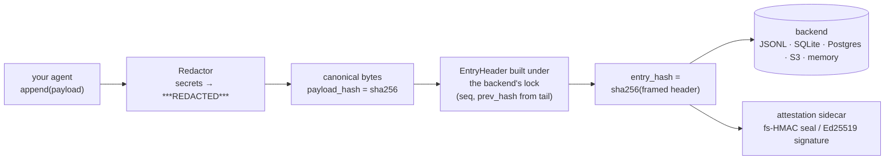
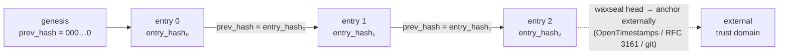
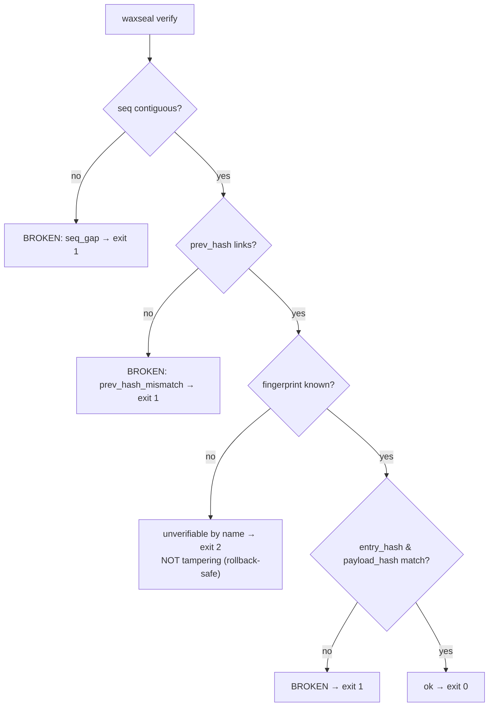
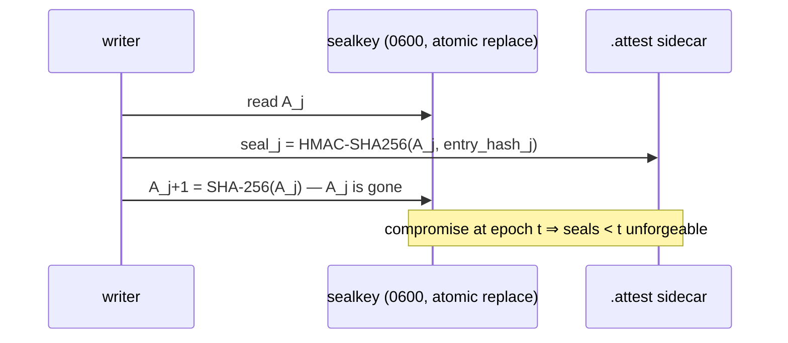

# waxseal

**English** | [Tiếng Việt](README.vi.md) | [中文](README.zh.md)

**Tamper-evident, schema-evolution-safe audit hash chain for AI agent frameworks.**
Zero dependencies. MIT. Python ≥ 3.11.

waxseal gives your agent a cryptographic audit trail: every action is appended to a
SHA-256 hash chain, so any edit, deletion, insertion, or reordering of history is
detected. Schema evolution does not trigger false tampering alarms: old rows verify
under the fingerprint they were written with.

## Why another audit log?

Hash-chained logs break in practice for a boring reason: **the schema changes**. Two
real-world incidents shaped this library:

- A production system widened its hashed field set without a version identity — every
  historical row failed verification. A mass false tampering alarm.
- An agent-memory tool (beads v1.2.2, 08/2026) accidentally shipped a schema migration;
  the reverted binary hit *"schema version mismatch: database is at v65, binary knows up
  to v53"* and hard-failed. The only escape hatch disabled safety entirely.

Both are the same failure class: *ordinal version identity + unknown version treated as
an error*. waxseal makes that class unrepresentable:

1. **Envelope design** — the chain hashes only a fixed header
   (`seq, ts, hash_version, payload_type, payload_hash, prev_hash`). Your payload is
   arbitrary bytes; changing its schema never touches the chain.
2. **Automatic schema fingerprints** — `hash_version` is the SHA-256 of a canonical
   descriptor of the header schema. Widening the field set *cannot* keep the old
   identity; old rows always verify under their own fingerprint.
3. **Unknown fingerprint → "unverifiable by name"** — never "tampered", never a crash
   (the RFC 6962 principle: unrecognized types are opaque, not errors). Rollbacks
   degrade gracefully.

## Comparison with other hash-chain approaches

Every hash-chain library detects a flipped byte. These are the things the others
don't do (survey of Python audit-log libraries, August 2026 — see [DESIGN.md](DESIGN.md)
for the literature behind each choice):

|  | waxseal | typical audit-chain libs | DIY hash chain |
|---|---|---|---|
| Schema evolution without false tampering alarms (automatic fingerprints) | ✅ | ❌ manual version strings, or none | ❌ |
| Version rollback degrades gracefully (unverifiable ≠ tampered, exit 2 ≠ exit 1) | ✅ | ❌ unknown version = error | ❌ |
| Completeness reported separately: `dropped_writes`, `None` ≠ `0` | ✅ | ❌ chain-ok implies all-ok | ❌ |
| Fork-proof concurrent appends, with the mechanism documented **per backend** and a falsifiability-tested lock | ✅ | varies, usually single-writer assumed | ❌ |
| Byte-level SPEC (freeze planned for v1) + golden test vectors → portable to Go/Rust/TS | ✅ | ❌ format = whatever the code does | ❌ |
| Zero runtime dependencies (S3/Postgres clients are injected, never imported) | ✅ | often pulls crypto/serialization stacks | ✅ |
| Redact-before-hash (secrets never reach disk, hash commits to redacted bytes) | ✅ | sometimes | ❌ |
| Built-in external anchoring, manual (`waxseal head`) or automatic (`anchor_every=N`) | ✅ | ❌ | ❌ |
| Forward-secure seals (key-evolving HMAC, stdlib only) + injected Ed25519 signatures | ✅ | ❌ | ❌ |
| FssAgg aggregate tag closing the truncation gap even if the keyfile leaks | ✅ | ❌ | ❌ |
| Remote HTTP backend as a full peer to local storage, with an explicit trust model | ✅ | rare, undocumented trust model | ❌ |

The first two rows are the failure class from the incidents above; see
[DESIGN.md](DESIGN.md) for the literature behind each row.

## How it works

**Data flow — every append:**



**The chain — why any edit is caught:**



**Verification — every outcome is distinct, unknown is never tampered:**



## Install

```bash
pip install waxseal
```

Released on [PyPI](https://pypi.org/project/waxseal/). From source:
`pip install git+https://github.com/cuongbphv/waxseal`

## Usage

```python
from waxseal import AuditLog

log = AuditLog.open("~/.myagent/audit/trail.jsonl")   # or trail.db for SQLite

log.append(
    payload={"tool": "bash", "command": "ls -la", "exit_code": 0},
    payload_type="application/vnd.myagent.toolcall+json",
)

result = log.verify()
# VerifyResult(ok=True, checked=1, broken_seq=None, reason=None,
#              unverifiable=(), dropped_writes=0)
```

Redact secrets **before** they are hashed and stored:

```python
from waxseal.adapters.redactors import RegexRedactor

log = AuditLog.open("trail.jsonl", redactor=RegexRedactor())
log.append(payload={"cmd": "curl -H 'Authorization: Bearer sk-...'"},
           payload_type="application/vnd.myagent.toolcall+json")
# cleartext never reaches disk; the hash commits to the redacted payload
```

CLI:

```bash
waxseal verify trail.jsonl   # exit 0 intact / 1 broken / 2 unverifiable present / 3 no such trail
waxseal tail trail.jsonl -n 20
waxseal inspect trail.jsonl
waxseal head trail.jsonl       # print the chain head (seq + entry_hash) for anchoring
waxseal checkpoint trail.jsonl # print {seq, entry_hash, root} — a batch root, not just the tip
waxseal anchor trail.jsonl     # append a checkpoint to the local .anchors sidecar
waxseal verify --anchors trail.jsonl  # also check trail history against .anchors

# Any of the above except `anchor` also accepts a remote chain server URL:
waxseal verify http://chain.example.com/v1/chains/default
```

## Storage backends

Every backend enforces the same rule: read-tail + append is one critical section, so
concurrent writers can never fork the chain.

| Backend | Module | Serialization mechanism | Extra deps |
|---|---|---|---|
| JSONL file | `waxseal.adapters.jsonl` | cross-platform file lock | none |
| SQLite | `waxseal.adapters.sqlite` | `BEGIN IMMEDIATE` + `PRIMARY KEY(seq)` | none |
| In-memory | `waxseal.adapters.memory` | mutex | none |
| Amazon S3 | `waxseal.adapters.s3` | conditional PUT (`IfNoneMatch: *`) | inject your boto3 client |
| PostgreSQL | `waxseal.adapters.postgres` | `pg_advisory_xact_lock` + `PRIMARY KEY(seq)` | inject your psycopg connection |
| Remote (HTTP) | `waxseal.adapters.remote` | server-side compare-and-swap on `(seq, prev_hash)`, client retries on `409` | none (stdlib `urllib`) |

```python
# S3 — the client is injected; waxseal itself stays dependency-free
import boto3
from waxseal import AuditLog
from waxseal.adapters.s3 import S3Backend

backend = S3Backend(boto3.client("s3"), bucket="my-audit", prefix="agent-1")
log = AuditLog(backend)

# PostgreSQL — same pattern with a connection factory
import psycopg
from waxseal.adapters.postgres import PostgresBackend

log = AuditLog(PostgresBackend(lambda: psycopg.connect("postgresql://...")))
```

> Note on Kafka: compacted topics delete old records (tombstones), so they are **not**
> append-only — do not use them as a tamper-evidence store.

### Remote backend

`RemoteBackend` talks to any server implementing the wire contract in
[REMOTE.md](REMOTE.md) — a small HTTP surface (`GET /v1/chains/{id}/head`,
`POST .../entries`, `GET .../entries?cursor=`) instead of a proprietary
protocol. The critical section every other backend enforces with a lock is
enforced server-side here: `POST` is a compare-and-swap on `(seq, prev_hash)`,
and a losing writer retries against the fresh head rather than forking the chain.

```python
from waxseal import AuditLog

log = AuditLog.open("http://chain.example.com/v1/chains/default")
log.append(payload={...}, payload_type="application/vnd.myagent.toolcall+json")
```

`WAXSEAL_API_KEY` supplies a bearer token (never argv, never the URL itself).

**Trust model, stated plainly:** the server is a *trusted writer*, not a
Byzantine-fault-tolerant peer. `verify_chain` still runs entirely client-side
and catches corruption, truncation, and reordering — but a dishonest server can
serve a consistently-forged rewrite of the whole trail that no client-side
check can catch on its own. The mitigation is the same one this README already
recommends for a local attacker with write access: anchor the head
independently, ideally at a service *other than* the chain server itself (see
Anchoring, below).

## Metadata sources

Beyond agent actions, chain any file/document history:

```python
from waxseal.sources.files import record_file, current_matches_last

record_file(log, "SPEC.md", doc_id="spec")          # snapshot content hash into the chain
current_matches_last(log, "SPEC.md", doc_id="spec")  # True / False / None (never recorded)
```

## Anchoring: checkpoints and consistency proofs

A hash chain by itself cannot resist an attacker who can rewrite the whole
trail file — every `prev_hash` downstream of the edit is recomputable.
`checkpoint_for(entry_hashes)` pins `(seq, entry_hash, root)`, where `root` is
an RFC 6962 batch root over every entry hash so far; anchoring that checkpoint
somewhere the writer cannot reach closes the whole-trail-rewrite gap the chain
cannot close on its own.

```python
from waxseal import AuditLog
from waxseal.adapters.anchors import FileAnchorSink

log = AuditLog.open("trail.jsonl",
                    anchor_sink=FileAnchorSink("trail.jsonl"), anchor_every=100)
# every 100th append best-effort publishes a checkpoint outside the write path;
# a failed anchor never blocks a write — it only counts against anchor_failures
```

`waxseal verify --anchors` replays every recorded checkpoint against the
current trail and reports the first break: `anchor_beyond_head` (truncated
since the checkpoint), `anchor_entry_hash_mismatch` (the tip was rewritten), or
`anchor_root_mismatch` (an earlier entry was rewritten without breaking the
`prev_hash` chain). `domain.anchoring` also exposes RFC 9162 §2.1.4
`consistency_proof`/`verify_consistency` — proving a later head extends an
earlier one without replaying the whole log — and RFC 6962 `membership_proof`/
`verify_membership` for single-entry inclusion proofs.

## Signatures & forward-secure seals

A keyless hash chain can be recomputed by anyone with write access. The attestation
layer closes that gap — without adding a single dependency:

**Forward-secure seals (stdlib HMAC, Bellare–Yee / Schneier–Kelsey construction):**
the seal key evolves one-way per entry (`A_{j+1} = SHA-256(A_j)`) and the old key is
discarded, so an attacker who compromises the machine at epoch *t* cannot forge or
re-seal anything written before *t* — a consistently rewritten suffix now FAILS
verification instead of passing:



```python
from waxseal import AuditLog
from waxseal.adapters.attest import FileAttestor
from waxseal.domain.sealing import generate_key

k0 = generate_key()                      # escrow A_0 with your verifier, off this machine
log = AuditLog.open("trail.jsonl",
                    attestor=FileAttestor("trail.jsonl", initial_key=k0))
log.append(payload={...}, payload_type="application/vnd.myagent.toolcall+json")

log.verify_attestations(initial_key=k0)  # AttestResult(ok=True, checked=1, ...)
```

**Real digital signatures (Ed25519 etc.)** — the signer is injected, waxseal never
imports a crypto library:

```python
# any object with .algorithm, .key_id, .sign(bytes) -> bytes
log = AuditLog.open("trail.jsonl",
                    attestor=FileAttestor("trail.jsonl", signer=my_ed25519_signer))
log.verify_attestations(verifier=my_ed25519_verifier)
```

Attestations live in a `.attest` sidecar (no backend schema changes; old logs stay
readable), and an attestation scheme the verifier doesn't know is reported
unverifiable-by-name — the same never-cry-wolf rule the chain itself follows.
Verification also bakes in the lessons from the systemd-journald FSS CVEs
(2023-31437/38/39): seals are bound to their position in both directions,
cross-checked against hashes recomputed from the trail, and **tail truncation of
trail + sidecar together is detected** — the keyfile epoch is one-way and cannot be
rolled back.
Limits: Python cannot zeroize memory, and entries written *after* compromise
are attacker-controlled under any scheme — see [DESIGN.md](DESIGN.md) §6.

**When the keyfile itself must not be trusted**, pass
`scheme="fs-hmac-agg-sha256-v1"` to `FileAttestor`: every seal folds into one
KEYED running accumulator (`.sealagg`, only the latest value ever persisted),
so an attacker who copies the trail, the `.attest` sidecar, and even the final
accumulator value still cannot refold it themselves — closing the gap the
plain scheme leaves if the keyfile leaks alongside a truncated tail.

## Completeness: measuring dropped writes

Chain integrity is not the same thing as trail completeness — a write dropped
before it reaches storage leaves no `seq` gap for `verify` to catch.
`AuditLog.open(path, record_drops=True)` records every drop's reason (never its
payload) to a `.drops` sidecar independent of the current process, and
`verify`/`inspect` report it as `dropped_writes >= N (measured minimum, ...)` —
`None` still means *never measured*, distinct from a measured `0`.

## Integrations

Audit hooks for seven agent frameworks and coding tools. Each one is
verified against the target's current hook contract (version noted in its README),
records dispatch *before* execution, redacts secrets before hashing, clips huge
outputs visibly, and **can never block or veto the host's work** — every failure
degrades to a labelled, counted dropped write.

Everything ships in the wheel — no source checkout, no file copying:

```bash
pip install waxseal
waxseal install hermes        # or claude-code / codex / cursor / hermes-gateway
```

`install` writes thin shims into the host's config directory (importing
`waxseal.integrations.*`, so `pip install -U waxseal` upgrades hook behavior in
place) and prints any settings snippet the host still needs. The LangChain,
CrewAI, and OpenAI Agents integrations need no install step at all — import
them directly, e.g. `from waxseal.integrations.langchain import
WaxsealCallbackHandler`.

| Target | Mechanism | Directory |
|---|---|---|
| Claude Code | hooks (`PreToolUse` / `PostToolUse` / `UserPromptSubmit`) | [integrations/claude-code/](integrations/claude-code/) |
| Codex CLI | lifecycle hooks (`hooks.json`, ≥ 0.149.0) | [integrations/codex/](integrations/codex/) |
| Cursor | Agent Hooks (`.cursor/hooks.json`) | [integrations/cursor/](integrations/cursor/) |
| LangChain / LangGraph | `BaseCallbackHandler` | [integrations/langchain/](integrations/langchain/) |
| CrewAI | event listener (`crewai.events`) | [integrations/crewai/](integrations/crewai/) |
| OpenAI Agents SDK | `RunHooks` | [integrations/openai-agents/](integrations/openai-agents/) |
| hermes-agent | plugin + gateway hook | [integrations/hermes/](integrations/hermes/) |

Scope note for the coding tools: these hooks give you a parallel,
tamper-evident, **secret-free** record of every action. They do not (and cannot)
rewrite the tool's own transcript files — if a key lands there, rotate it; the
waxseal trail is the copy you can keep, share, and verify.

## Guarantees and non-guarantees

- Detects: edited entries, deleted entries (seq gap), inserted/reordered entries
  (prev-hash break), payload substitution.
- **Chain integrity ≠ trail completeness**: a write dropped before it reaches storage
  leaves no gap. `dropped_writes` reports this separately; `None` means *not measured* —
  never conflated with `0`.
- Concurrent writers cannot fork the chain (see backends table); for `RemoteBackend`
  this is a server-side compare-and-swap rather than a client-held lock.
- waxseal is tamper-*evident*, not tamper-*proof*: an attacker with write access can
  rewrite the whole suffix of a chain. Anchor the head in an external trust domain —
  manually (`waxseal head` → an OpenTimestamps proof, an RFC 3161 timestamp, a git
  commit pushed to a remote) or automatically (`anchor_every=N` with a `FileAnchorSink`
  or `HTTPAnchorSink`) — to bound that attack.
- A `RemoteBackend` target is a *trusted writer*, not Byzantine-fault-tolerant: a
  dishonest chain server can serve a consistently-forged rewrite that no client-side
  check catches. Point the anchor sink at a service other than the chain server.

## Spec & design

- [SPEC.md](SPEC.md) — byte-level format (lp64v1 encoding, PAE-style framing,
  fingerprint construction; freeze planned for v1) with golden test vectors — portable
  to any language.
- [REMOTE.md](REMOTE.md) — the `RemoteBackend` wire contract: endpoints, envelope
  shape, authentication, and the trusted-writer trust model.
- [DESIGN.md](DESIGN.md) — algorithm choices and the academic literature behind them.

## License

MIT
