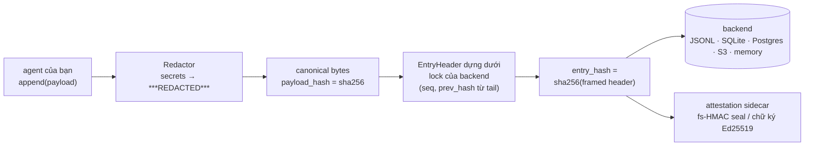
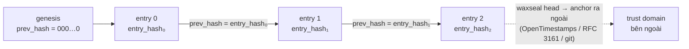
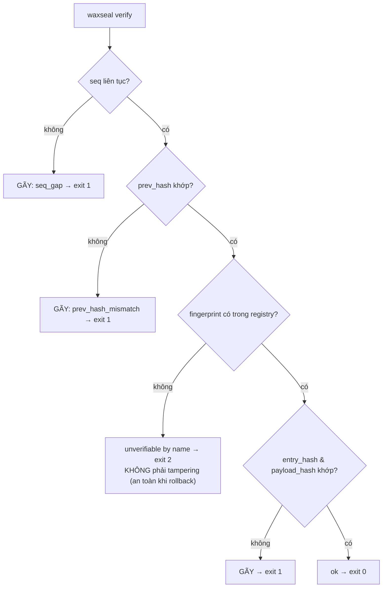
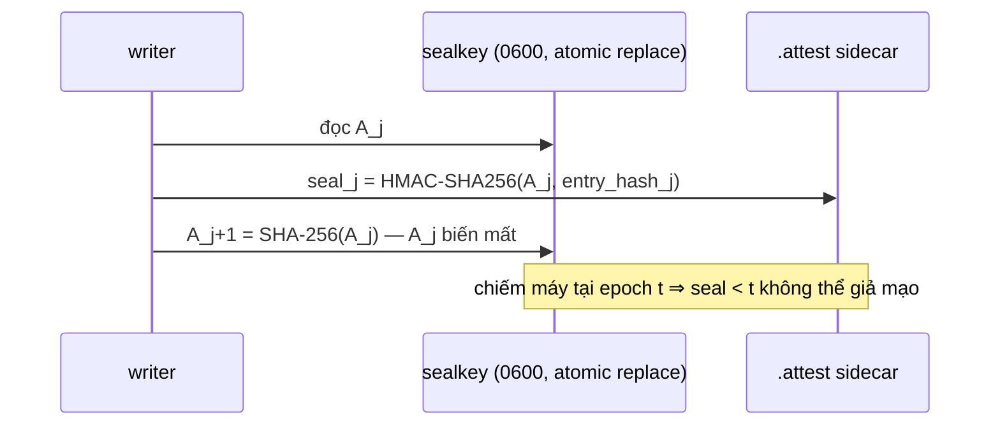

# waxseal

[English](README.md) | **Tiếng Việt** | [中文](README.zh.md)

**Audit hash chain chống giả mạo, an toàn khi schema tiến hóa, dành cho các AI agent framework.**
Zero dependency. MIT. Python ≥ 3.11.

waxseal cung cấp cho agent của bạn một audit trail mật mã học: mọi hành động được nối
vào một hash chain SHA-256, nên mọi hành vi sửa, xóa, chèn hoặc đảo thứ tự lịch sử đều
bị phát hiện. Schema tiến hóa không gây báo động giả về giả mạo: row cũ verify dưới
đúng fingerprint đã ghi nó.

## Vì sao cần thêm một audit log nữa?

Log dạng hash chain trong thực tế thường vỡ vì một lý do rất tầm thường: **schema thay
đổi**. Hai sự cố thực tế đã định hình thư viện này:

- Một hệ thống production mở rộng field set được hash mà không có định danh version —
  toàn bộ row lịch sử fail verify. Một đợt báo động giả về giả mạo hàng loạt.
- Một công cụ bộ nhớ agent (beads v1.2.2, 08/2026) vô tình phát hành một migration
  schema; binary sau khi revert gặp lỗi *"schema version mismatch: database is at v65,
  binary knows up to v53"* và chết cứng. Lối thoát duy nhất là tắt toàn bộ cơ chế an toàn.

Cả hai cùng một lớp lỗi: *định danh version kiểu thứ tự (ordinal) + version lạ bị coi là
lỗi*. waxseal khiến lớp lỗi này không thể biểu diễn được:

1. **Thiết kế envelope** — chain chỉ hash một header cố định
   (`seq, ts, hash_version, payload_type, payload_hash, prev_hash`). Payload là bytes
   tùy ý; đổi schema payload không bao giờ đụng vào chain.
2. **Schema fingerprint tự động** — `hash_version` là SHA-256 của descriptor chuẩn hóa
   mô tả schema header. Mở rộng field set *không thể* giữ định danh cũ; row cũ luôn
   verify bằng đúng fingerprint của chính nó.
3. **Fingerprint lạ → "unverifiable by name"** — không bao giờ là "tampered", không bao
   giờ crash (nguyên tắc RFC 6962: kiểu không nhận diện được là dữ liệu đục, không phải
   lỗi). Rollback version chỉ giảm khả năng verify một cách có kiểm soát (degrade
   gracefully), không gây lỗi.

## So sánh với các hướng hash-chain khác

Lib hash-chain nào cũng phát hiện được 1 byte bị lật. Dưới đây là những thứ các lib
khác KHÔNG làm (khảo sát các thư viện audit-log Python, tháng 8/2026 — xem
[DESIGN.md](DESIGN.md) cho nền tảng học thuật của từng lựa chọn):

|  | waxseal | lib audit-chain thông thường | DIY hash chain |
|---|---|---|---|
| Schema tiến hóa không gây báo động giả về giả mạo (fingerprint tự động) | ✅ | ❌ version string thủ công, hoặc không có | ❌ |
| Rollback version chỉ giảm khả năng verify một cách có kiểm soát, không gây lỗi (unverifiable ≠ tampered, exit 2 ≠ exit 1) | ✅ | ❌ version lạ = lỗi | ❌ |
| Độ đầy đủ được báo cáo riêng: `dropped_writes`, `None` ≠ `0` | ✅ | ❌ chain-ok bị hiểu là all-ok | ❌ |
| Chống fork khi append song song, cơ chế ghi rõ **theo từng backend**, lock có falsifiability test | ✅ | tùy, thường giả định single-writer | ❌ |
| SPEC byte-level (dự kiến freeze ở v1) + golden vectors → port sang Go/Rust/TS | ✅ | ❌ format = code chạy sao thì vậy | ❌ |
| Zero runtime dependency (client S3/Postgres được inject, không bao giờ import) | ✅ | thường kéo cả stack crypto/serialization | ✅ |
| Redact-before-hash (secret không bao giờ chạm disk, hash cam kết trên bytes đã redact) | ✅ | thỉnh thoảng | ❌ |
| Móc anchoring ra ngoài có sẵn (`waxseal head`) chống rewrite/truncate phần đuôi | ✅ | ❌ | ❌ |
| Forward-secure seal (HMAC key-evolving, thuần stdlib) + chữ ký Ed25519 inject | ✅ | ❌ | ❌ |

Hai dòng đầu chính là lớp lỗi từ hai sự cố kể trên; xem [DESIGN.md](DESIGN.md) cho
nền tảng học thuật của từng dòng.

## Cách hoạt động

**Data flow — mỗi lần append:**



**Cấu trúc chain — vì sao mọi chỉnh sửa đều bị bắt:**



**Luồng verify — mỗi kết cục một mã riêng, unknown không bao giờ là tampered:**



## Cài đặt

```bash
pip install waxseal
```

Đã phát hành trên [PyPI](https://pypi.org/project/waxseal/). Cài từ source:
`pip install git+https://github.com/cuongbphv/waxseal`

## Sử dụng

```python
from waxseal import AuditLog

log = AuditLog.open("~/.myagent/audit/trail.jsonl")   # hoặc trail.db cho SQLite

log.append(
    payload={"tool": "bash", "command": "ls -la", "exit_code": 0},
    payload_type="application/vnd.myagent.toolcall+json",
)

result = log.verify()
# VerifyResult(ok=True, checked=1, broken_seq=None, reason=None,
#              unverifiable=(), dropped_writes=0)
```

Redact secret **trước khi** hash và lưu:

```python
from waxseal.adapters.redactors import RegexRedactor

log = AuditLog.open("trail.jsonl", redactor=RegexRedactor())
log.append(payload={"cmd": "curl -H 'Authorization: Bearer sk-...'"},
           payload_type="application/vnd.myagent.toolcall+json")
# cleartext không bao giờ chạm disk; hash cam kết trên payload đã redact
```

CLI:

```bash
waxseal verify trail.jsonl   # exit 0 nguyên vẹn / 1 gãy / 2 có row unverifiable / 3 không có trail
waxseal tail trail.jsonl -n 20
waxseal inspect trail.jsonl
waxseal head trail.jsonl     # in head của chain (seq + entry_hash) để anchor ra ngoài
```

## Storage backends

Mọi backend đều tuân cùng một luật: đọc-tail + append là MỘT critical section, nên các
writer song song không bao giờ fork được chain.

| Backend | Module | Cơ chế serialize | Dep thêm |
|---|---|---|---|
| File JSONL | `waxseal.adapters.jsonl` | file lock đa nền tảng | không |
| SQLite | `waxseal.adapters.sqlite` | `BEGIN IMMEDIATE` + `PRIMARY KEY(seq)` | không |
| In-memory | `waxseal.adapters.memory` | mutex | không |
| Amazon S3 | `waxseal.adapters.s3` | conditional PUT (`IfNoneMatch: *`) | tự inject boto3 client |
| PostgreSQL | `waxseal.adapters.postgres` | `pg_advisory_xact_lock` + `PRIMARY KEY(seq)` | tự inject psycopg connection |

```python
# S3 — client được inject; bản thân waxseal vẫn zero-dependency
import boto3
from waxseal import AuditLog
from waxseal.adapters.s3 import S3Backend

backend = S3Backend(boto3.client("s3"), bucket="my-audit", prefix="agent-1")
log = AuditLog(backend)

# PostgreSQL — cùng pattern với connection factory
import psycopg
from waxseal.adapters.postgres import PostgresBackend

log = AuditLog(PostgresBackend(lambda: psycopg.connect("postgresql://...")))
```

> Lưu ý về Kafka: compacted topic xóa record cũ (tombstone) nên **không** phải
> append-only — đừng dùng làm store cho tamper-evidence.

## Nguồn metadata

Ngoài hành động của agent, có thể chain cả lịch sử file/tài liệu:

```python
from waxseal.sources.files import record_file, current_matches_last

record_file(log, "SPEC.md", doc_id="spec")          # snapshot content hash vào chain
current_matches_last(log, "SPEC.md", doc_id="spec")  # True / False / None (chưa từng ghi)
```

## Chữ ký & forward-secure seal

Hash chain không khóa thì ai có quyền ghi cũng tính lại được. Tầng attestation đóng
lỗ hổng đó — mà không thêm một dependency nào:

**Forward-secure seal (HMAC thuần stdlib, construction Bellare–Yee / Schneier–Kelsey):**
key seal tiến hóa một chiều theo từng entry (`A_{j+1} = SHA-256(A_j)`), key cũ bị bỏ —
kẻ chiếm máy tại epoch *t* không thể giả mạo hay re-seal bất kỳ thứ gì viết trước *t*.
Rewrite cả đoạn đuôi một cách "nhất quán" giờ sẽ FAIL verify thay vì lọt:



```python
from waxseal import AuditLog
from waxseal.adapters.attest import FileAttestor
from waxseal.domain.sealing import generate_key

k0 = generate_key()                      # gửi A_0 cho verifier, giữ NGOÀI máy này
log = AuditLog.open("trail.jsonl",
                    attestor=FileAttestor("trail.jsonl", initial_key=k0))
log.append(payload={...}, payload_type="application/vnd.myagent.toolcall+json")

log.verify_attestations(initial_key=k0)  # AttestResult(ok=True, checked=1, ...)
```

**Chữ ký số thật (Ed25519...)** — signer được inject, waxseal không bao giờ import
thư viện crypto:

```python
# bất kỳ object nào có .algorithm, .key_id, .sign(bytes) -> bytes
log = AuditLog.open("trail.jsonl",
                    attestor=FileAttestor("trail.jsonl", signer=my_ed25519_signer))
log.verify_attestations(verifier=my_ed25519_verifier)
```

Attestation nằm trong sidecar `.attest` (không đổi schema backend nào; log cũ vẫn đọc
được), và scheme mà verifier không biết sẽ được báo unverifiable-by-name — đúng luật
never-cry-wolf của chính chain. Verify còn tích hợp sẵn bài học từ các CVE của
systemd-journald FSS (2023-31437/38/39): seal bị ràng vào vị trí theo cả hai chiều,
cross-check với hash được TÍNH LẠI từ trail, và **truncate đuôi cả trail + sidecar
cùng lúc vẫn bị phát hiện** — epoch trong keyfile là một chiều, không thể quay lui.
Giới hạn: Python không zeroize được memory, và entry viết *sau* thời điểm máy bị
chiếm là do attacker kiểm soát dưới mọi scheme — xem [DESIGN.md](DESIGN.md) §6.

## Tích hợp

Hook audit cho bảy agent framework và coding tool. Mỗi integration
được verify với hook contract hiện hành của đích (phiên bản ghi trong README riêng),
ghi lại dispatch *trước khi* thực thi, redact secret trước khi hash, clip output lớn
một cách hiển thị, và **không bao giờ chặn/veto công việc của host** — mọi lỗi đều
degrade thành dropped write có nhãn, có đếm.

Tất cả nằm sẵn trong wheel — không cần checkout source, không copy file:

```bash
pip install waxseal
waxseal install hermes        # hoặc claude-code / codex / cursor / hermes-gateway
```

`install` ghi các shim mỏng vào thư mục config của host (import
`waxseal.integrations.*`, nên `pip install -U waxseal` là hook được nâng cấp
tại chỗ) và in ra đoạn settings mà host còn cần. Các integration LangChain,
CrewAI, OpenAI Agents không cần bước install — import trực tiếp, ví dụ
`from waxseal.integrations.langchain import WaxsealCallbackHandler`.

| Đích | Cơ chế | Thư mục |
|---|---|---|
| Claude Code | hooks (`PreToolUse` / `PostToolUse` / `UserPromptSubmit`) | [integrations/claude-code/](integrations/claude-code/) |
| Codex CLI | lifecycle hooks (`hooks.json`, ≥ 0.149.0) | [integrations/codex/](integrations/codex/) |
| Cursor | Agent Hooks (`.cursor/hooks.json`) | [integrations/cursor/](integrations/cursor/) |
| LangChain / LangGraph | `BaseCallbackHandler` | [integrations/langchain/](integrations/langchain/) |
| CrewAI | event listener (`crewai.events`) | [integrations/crewai/](integrations/crewai/) |
| OpenAI Agents SDK | `RunHooks` | [integrations/openai-agents/](integrations/openai-agents/) |
| hermes-agent | plugin + gateway hook | [integrations/hermes/](integrations/hermes/) |

Ghi chú phạm vi cho nhóm coding tool: các hook này cho bạn một bản ghi
song song, tamper-evident, **không chứa secret** của mọi hành động. Chúng không (và
không thể) sửa file transcript của chính tool — nếu key đã lọt vào đó, hãy rotate
key; trail của waxseal là bản ghi bạn có thể giữ, chia sẻ và verify.

## Đảm bảo và KHÔNG đảm bảo

- Phát hiện: entry bị sửa, bị xóa (seq gap), bị chèn/đảo thứ tự (gãy prev-hash),
  payload bị tráo.
- **Toàn vẹn chain ≠ đầy đủ trail**: một write bị rơi trước khi chạm storage không để
  lại khoảng trống. `dropped_writes` báo cáo riêng chuyện này; `None` nghĩa là *chưa đo* —
  không bao giờ đánh đồng với `0`.
- Writer song song không thể fork chain (xem bảng backend).
- waxseal là tamper-*evident* (phát hiện giả mạo), không phải tamper-*proof* (chống
  giả mạo tuyệt đối): kẻ tấn công có quyền ghi vẫn có thể viết lại toàn bộ phần đuôi
  chain. Dùng `waxseal head` để anchor head hash ra một trust domain bên ngoài — một
  proof OpenTimestamps, một timestamp RFC 3161, hoặc một git commit đã push lên
  remote — để chặn kiểu tấn công này.

## Spec & thiết kế

- [SPEC.md](SPEC.md) — format byte-level (lp64v1 encoding, PAE-style framing, cách
  dựng fingerprint; dự kiến freeze ở v1) kèm golden test vectors — port được sang mọi
  ngôn ngữ.
- [DESIGN.md](DESIGN.md) — các lựa chọn thuật toán và nền tảng học thuật phía sau.

## Giấy phép

MIT
