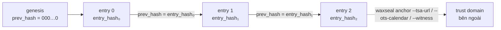
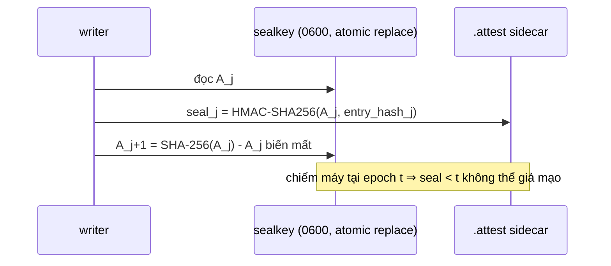

# waxseal

[English](README.md) | **Tiếng Việt** | [中文](README.zh.md)

[](https://pepy.tech/projects/waxseal)

**Audit hash chain chống giả mạo, an toàn khi schema tiến hóa, dành cho các AI agent framework.**
Zero dependency. MIT. Python ≥ 3.11.

waxseal cung cấp cho agent của bạn một audit trail mật mã học: mọi hành động được nối
vào một hash chain SHA-256, nên mọi hành vi sửa, xóa, chèn hoặc đảo thứ tự lịch sử đều
bị phát hiện. Schema tiến hóa không gây báo động giả về giả mạo: row cũ verify dưới
đúng fingerprint đã ghi nó.


<sub>Ghi · giả mạo · tiến hóa schema · độ bao phủ · neo thời gian · handoff đa agent · kết luận. Sinh lại bằng `python tools/gen_workflow_animation.py --render`.</sub>

## Vì sao cần thêm một audit log nữa?

Log dạng hash chain trong thực tế thường vỡ vì một lý do rất tầm thường: schema thay
đổi. Có hai sự cố đã định hình thư viện này.

Sự cố thứ nhất: một hệ thống production mở rộng tập field được đem đi hash mà không cấp
cho bố cục mới một định danh version riêng. Toàn bộ row lịch sử vì thế bị tính lại theo
một tập field mà chúng chưa từng được ghi dưới đó, nên tất cả cùng fail verify một lượt,
và cái chuông báo động reo lên là một báo động giả.

Sự cố thứ hai: một công cụ bộ nhớ agent tên là beads vô tình phát hành một migration
schema ở bản 1.2.2 (tháng 8/2026). Khi bản đó được revert, binary cũ gặp một database nó
không nhận ra và từ chối khởi động, in ra *"schema version mismatch: database is at v65,
binary knows up to v53"*. Cách duy nhất đi tiếp là một biến môi trường tắt hẳn cơ chế an
toàn.

Cả hai thất bại có cùng một hình dạng: định danh version chỉ là một số thứ tự, và version
lạ bị coi là lỗi. waxseal được dựng sao cho không cái nào trong hai thứ đó biểu diễn được.

Chain chỉ hash một header cố định và không hash gì khác (`seq`, `ts`, `hash_version`,
`payload_type`, `payload_hash`, `prev_hash`). Payload của bạn là bytes tùy ý, chỉ được
tham chiếu qua digest của nó, nên đổi schema payload không bao giờ đụng tới chain.

`hash_version` không phải một chuỗi do ai đó gõ ra. Nó là SHA-256 của descriptor chuẩn
hóa mô tả schema header cùng với encoding của schema đó, nên mở rộng tập field hay đổi
encoding đều sinh ra một định danh khác, dù bạn có chủ ý hay không. Row cũ vẫn tiếp tục
verify được bằng đúng fingerprint mà chúng thực sự được ghi dưới đó.

Khi một verifier gặp fingerprint nó không biết, nó báo row đó là unverifiable by name. Nó
không báo giả mạo, và nó cũng không crash. Đây chính là nguyên tắc RFC 6962 áp dụng cho
các kiểu không nhận diện được, coi chúng là dữ liệu đục chứ không phải lỗi, và đó là thứ
cho phép một lần rollback version suy giảm êm thay vì làm chuông báo động reo lên.

Thư viện đã dùng chính cơ chế đó lên bản thân nó. Bản 0.1.4 thay hẳn encoding chuẩn hóa,
chuyển từ `lp64v1` sang `lp64` vốn đơn ánh vô điều kiện ([CHANGELOG](CHANGELOG.md) giải
thích vì sao), chứ không mang song song cả hai. Vì encoding là một thành phần của
descriptor, mọi fingerprint tự đổi theo. Không tồn tại migration nào để làm sai, và một
trail 0.1.3 đọc bằng 0.1.4 sẽ báo *unverifiable* chứ không phải *tampered*, đúng như đoạn
ở trên đã hứa. Đây là một thay đổi format phá vỡ tương thích, được làm có chủ đích vào
lúc chưa có trail nào viết dưới encoding cũ tồn tại ngoài môi trường phát triển.

## So sánh với các hướng hash-chain khác

Lib hash-chain nào cũng phát hiện được một byte bị lật. Bảng dưới đây nói về những thứ
phần lớn các lib khác không làm. Nó đến từ một khảo sát các thư viện audit-log Python vào
tháng 8/2026, và [DESIGN.md](DESIGN.md) có nền tảng học thuật cho từng dòng.

|  | waxseal | lib audit-chain thông thường | DIY hash chain |
|---|---|---|---|
| Schema tiến hóa không gây báo động giả về giả mạo (fingerprint tự động) | ✅ | ❌ version string thủ công, hoặc không có | ❌ |
| Rollback version chỉ giảm khả năng verify một cách có kiểm soát, không gây lỗi (unverifiable ≠ tampered, exit 2 ≠ exit 1) | ✅ | ❌ version lạ = lỗi | ❌ |
| Độ đầy đủ được báo cáo riêng: `dropped_writes`, `None` ≠ `0` | ✅ | ❌ chain-ok bị hiểu là all-ok | ❌ |
| Chống fork khi append song song, cơ chế ghi rõ **theo từng backend**, lock có falsifiability test | ✅ | tùy, thường giả định single-writer | ❌ |
| SPEC byte-level (dự kiến freeze ở v1) + golden vectors -> port sang Go/Rust/TS | ✅ | ❌ format = code chạy sao thì vậy | ❌ |
| Zero runtime dependency (client S3/Postgres được inject, không bao giờ import) | ✅ | thường kéo cả stack crypto/serialization | ✅ |
| Redact-before-hash (secret không bao giờ chạm disk, hash cam kết trên bytes đã redact) | ✅ | thỉnh thoảng | ❌ |
| Anchoring ra ngoài có sẵn: TSA RFC 3161, OpenTimestamps, witness, hoặc sink tự viết (`anchor_every=N`) | ✅ | ❌ | ❌ |
| Pinned-head (TOFU) + witness cross-check chống chain server không trung thực | ✅ | ❌ | ❌ |
| Forward-secure seal (HMAC key-evolving, thuần stdlib) + chữ ký Ed25519 inject | ✅ | ❌ | ❌ |
| Aggregate tag FssAgg đóng lỗ hổng truncation kể cả khi keyfile bị lộ | ✅ | ❌ | ❌ |
| Remote backend HTTP là backend ngang hàng đầy đủ với storage local, trust model ghi rõ | ✅ | hiếm, trust model không ghi rõ | ❌ |
| Ledger ternary: live / delinquent / unreachable (`waxseal ledger-status`) | ✅ | ❌ | ❌ |
| WORM có phạm vi cho segment đã seal (S3 Object Lock; không bao giờ là live tail) | ✅ | ❌ | ❌ |
| Segment đã seal + ràng buộc rotation (`waxseal segments`) | ✅ | ❌ | ❌ |
| Nhịp anchor tối ưu chi phí (`waxseal cadence`; không mở trail) | ✅ | ❌ | ❌ |

Hai dòng đầu chính là lớp lỗi từ hai sự cố kể trên; xem [DESIGN.md](DESIGN.md) cho
nền tảng học thuật của từng dòng.

## Cách hoạt động

Mỗi lần append đi theo đường này:


Mỗi entry cam kết vào entry ngay trước nó, và đó là thứ khiến một chỉnh sửa bị lộ:



Verify giữ các kết cục tách bạch, và một fingerprint lạ không bao giờ nằm trong nhóm
giả mạo:


## Cài đặt

```bash
pip install waxseal
```

Đã phát hành trên [PyPI](https://pypi.org/project/waxseal/). Cài từ source:
`pip install git+https://github.com/cuongbphv/waxseal`

Bốn cách khác, cho những nơi một verifier thực sự phải chạy:

```bash
uv tool install waxseal            # hoặc: pipx install waxseal
curl -fsSL https://raw.githubusercontent.com/cuongbphv/waxseal/main/deploy/install.sh | sh
docker run --rm -v "$PWD:/data:ro" ghcr.io/cuongbphv/waxseal verify /data/trail.jsonl
python3 waxseal-0.1.6.pyz verify trail.jsonl
```

Script cài đặt đối chiếu SHA-256 của artifact với `SHA256SUMS` của bản phát
hành trước khi di chuyển hay thực thi bất cứ thứ gì, và nói rõ ra khi nó không
kiểm được chữ ký. Dòng cuối là zipapp một file đính kèm mỗi bản phát hành: vì
danh sách dependency lúc chạy là rỗng, một file cộng với `python3` đã là một
verifier hoàn chỉnh - đúng thứ mà một cuộc soát xét trên máy ngắt mạng cần.

Cho cluster hoặc cho một host, `deploy/` chứa image runtime, hai Helm chart
thuộc hai thẩm quyền quản trị khác nhau, các unit systemd và một overlay
compose. Đọc [deploy/README.md](deploy/README.md) trước - nó nói rõ thành phần
nào thuộc trust domain nào, và hai thành phần nào tuyệt đối không được dùng
chung một thẩm quyền.

## Extras mở rộng năng lực

<!-- Quyết định dịch thuật (waxseal-fg4.32, 01/09/2026): mục này DỊCH phần prose và TRỎ
     về bảng tiếng Anh cho các specifier, thay vì nhân bản bảng ra ba tệp README. Lý do:
     bảng là nội dung sống - `rfc3161` đã chuyển Planned -> shipped ở c57a7b7, `evm` cũng
     đã chuyển Planned -> shipped (Workstream F3) - nên một bảng dịch bị lỡ cập nhật sẽ in
     ra một chỉ dẫn cài đặt SAI (tên gói / version specifier cũ), còn một con trỏ thì cùng
     lắm là thêm một cú nhấp. Hệ quả cho người ship extra mới: chỉ phải sửa BẢNG ở README.md;
     ba tệp README chỉ cần đụng tới khi DANH SÁCH TÊN extra đã ship thay đổi, vì tên
     extra vẫn được nêu bằng prose ở đây. -->

Zero-dependency mô tả phần lõi, không phải trần năng lực của waxseal. Lõi giữ
`dependencies = []` như một bất biến chứ không phải một sở thích, và năng lực nào cần
client của bên thứ ba thì đến qua một optional extra cộng với injection: bạn cài client,
bạn khởi tạo nó, bạn truyền nó vào, và bản thân waxseal không bao giờ import nó.
`S3Backend` và `PostgresBackend` ở [Storage backends](#storage-backends) chính là pattern
đó, và extras tồn tại để `pip` lấy giúp bạn một client tương thích, chứ không phải vì
waxseal cần một client nào.

Đã ship hôm nay là bốn extra: `pip install waxseal[s3]`, `pip install waxseal[postgres]`,
`pip install waxseal[rfc3161]` và `pip install waxseal[evm]`.

`rfc3161` là extra DUY NHẤT mà waxseal tự import, bên trong đúng một hàm
(`adapters/rfc3161_verify.py`) - vì thế nó không có gì để bạn inject. Nó bật chiều kiểm
chữ ký tùy chọn của `verify`/`report`, và chỉ khi bạn nêu tên một CA bundle bằng
`--tsa-ca-file`: token có chữ ký CMS hoặc chuỗi chứng thư sai là exit 1, còn bất cứ thứ
gì không kiểm được - kể cả vì thiếu extra - là exit 2 kèm nhãn nói rõ là thứ nào, không
bao giờ là một exit 0 im lặng. Không có cờ đó thì không gì đổi: receipt vẫn được kiểm về
mặt cấu trúc, đúng như trước. Xem [SPEC.md](SPEC.md) mục 17.1.

`evm` - lớp ledger on-chain - đã ship, và cái rỗng của nó là thiết kế chứ không
phải một tính năng làm dở: `ports/ledger.py`, `domain/bond.py`,
`domain/liveness.py`, `domain/abi.py`, `domain/registry.py`, `adapters/evm.py`
đọc contract qua đúng cái `Transport` JSON-RPC thuần stdlib mà `RemoteBackend`
đã dùng (`eth_call`, không có client nào để kéo về) và ghi qua một `Signer` do
operator tự dựng rồi inject - nên không có gì cho `pip` cài cả. `evm = []` rỗng
trong `pyproject.toml` KHÔNG có nghĩa "chưa ship": extra tồn tại chỉ để
`pip install waxseal[evm]` là một lệnh hợp lệ và để năng lực này có tên trong
metadata, chứ không bao giờ trở thành con đường để một thư viện crypto lọt vào
lõi. Bản thân lớp này trung lập với chain ở sau port - EVM là adapter đầu tiên,
không phải là thiết kế. Bề mặt CLI: `waxseal ledger-status`, `waxseal registry
publish`, `waxseal bond deposit`/`bond prove`, và `verify`/`report
--rpc/--liveness/--registry`, `anchor --evm-liveness` (xem danh sách CLI ở mục
[Sử dụng](#sử-dụng) bên dưới) - đã kiểm end-to-end với hai chain anvil chạy thật
cùng contract Foundry thật (`contracts/src/AnchoringLiveness.sol`,
`BondedCheckpoints.sol`, `FingerprintRegistry.sol`; commit
`26b074c`/`c21e0e6`/`20f2762`/`26e3e91`).
[docs/paper/conformance.vi.md](docs/paper/conformance.vi.md) giữ sổ theo từng
dòng cho lớp này, gồm cả hai khoảng trống còn mở, không chặn phát hành, được
ghi ở đó thay vì bị làm mờ đi.

(`dev` cũng tồn tại, để chạy test suite. Nó không phải một extra năng lực.)

Thêm một dependency CỨNG là câu hỏi khác, và câu trả lời là không. Extras là con đường
được phép.

Bảng chính thức - extra nào kéo về gói client nào, ở version specifier nào - nằm ở
[README.md § Capability extras](README.md#capability-extras) bản tiếng Anh, và đó là
nguồn duy nhất cho những chuỗi ấy.

## Sử dụng

```python
from waxseal import AuditLog

log = AuditLog.open("~/.myagent/audit/trail.jsonl")   # hoặc trail.db cho SQLite

log.append(
    payload={"tool": "bash", "command": "ls -la", "exit_code": 0},
    payload_type="application/vnd.myagent.toolcall+json",
)

result = log.verify()
# VerifyResult(ok=True, checked=1, broken_seq=None, reason=None,
#              unverifiable=(), dropped_writes=0)
```

Redact secret **trước khi** hash và lưu:

```python
from waxseal.adapters.redactors import RegexRedactor

log = AuditLog.open("trail.jsonl", redactor=RegexRedactor())
log.append(payload={"cmd": "curl -H 'Authorization: Bearer sk-...'"},
           payload_type="application/vnd.myagent.toolcall+json")
# cleartext không bao giờ chạm disk; hash cam kết trên payload đã redact
```

CLI:

```bash
waxseal verify trail.jsonl   # exit 0 nguyên vẹn / 1 gãy / 2 có row unverifiable / 3 không có trail
waxseal tail trail.jsonl -n 20
waxseal inspect trail.jsonl
waxseal head trail.jsonl       # in head của chain (seq + entry_hash) để anchor ra ngoài
waxseal checkpoint trail.jsonl # in {seq, entry_hash, root} - root là batch root, không chỉ tip
waxseal anchor trail.jsonl     # append 1 checkpoint vào sidecar .anchors cục bộ
waxseal verify --anchors trail.jsonl  # kiểm cả lịch sử trail so với .anchors
waxseal preflight trail.jsonl  # cấu hình này chặn được nấc năng lực nào của attacker; luôn exit 0 (exit 3: không có trail)
waxseal segments trail-dir/    # verify mọi segment đã seal + ràng buộc rotation trong một thư mục; chỉ đọc
waxseal cadence --lam RATE --c COST --w HARM --rho RATE --delta SEC --t-max SEC  # N* tối ưu chi phí; không mở trail
waxseal reconcile-tickets trail.jsonl --issuer NAME --lease-size L [--issued SPEC]
waxseal receipt trail.jsonl --out DIR   # trích RFC 3161 / OTS receipt đã lưu; chỉ ghi dưới --out
waxseal verify --tsa-ca-file bundle.pem trail.jsonl  # kiểm CMS/X.509 native (waxseal[rfc3161])

# Mọi lệnh trên trừ `anchor` đều nhận được URL của một remote chain server:
waxseal verify http://chain.example.com/v1/chains/default

# Lớp ledger on-chain (waxseal[evm]; xem mục Extras mở rộng năng lực ở trên):
waxseal ledger-status trail.jsonl --liveness 0xADDR --rpc https://rpc1 --rpc https://rpc2
waxseal registry publish --descriptor-of FINGERPRINT --registry 0xADDR --rpc https://rpc1 --rpc https://rpc2
waxseal bond deposit --bond 0xADDR --amount-wei 1000000000000000000 --rpc https://rpc1 --rpc https://rpc2
waxseal bond prove proof.json --bond 0xADDR --rpc https://rpc1 --rpc https://rpc2
```

## Storage backends

Mọi backend đều tuân cùng một luật: đọc-tail + append là MỘT critical section, nên các
writer song song không bao giờ fork được chain.

| Backend | Module | Cơ chế serialize | Dep thêm |
|---|---|---|---|
| File JSONL | `waxseal.adapters.jsonl` | file lock đa nền tảng | không |
| SQLite | `waxseal.adapters.sqlite` | `BEGIN IMMEDIATE` + `PRIMARY KEY(seq)` | không |
| In-memory | `waxseal.adapters.memory` | mutex | không |
| Amazon S3 | `waxseal.adapters.s3` | conditional PUT (`IfNoneMatch: *`) | tự inject boto3 client |
| PostgreSQL | `waxseal.adapters.postgres` | `pg_advisory_xact_lock` + `PRIMARY KEY(seq)` | tự inject psycopg connection |
| Remote (HTTP) | `waxseal.adapters.remote` | compare-and-swap phía server trên `(seq, prev_hash)`, client retry khi 409 | không (dùng `urllib` stdlib) |

```python
# S3 - client được inject; bản thân waxseal vẫn zero-dependency
import boto3
from waxseal import AuditLog
from waxseal.adapters.s3 import S3Backend

backend = S3Backend(boto3.client("s3"), bucket="my-audit", prefix="agent-1")
log = AuditLog(backend)

# PostgreSQL - cùng pattern với connection factory
import psycopg
from waxseal.adapters.postgres import PostgresBackend

log = AuditLog(PostgresBackend(lambda: psycopg.connect("postgresql://...")))
```

> Lưu ý về Kafka: compacted topic xóa record cũ (tombstone) nên **không** phải
> append-only, nên đừng dùng chúng làm store cho tamper-evidence.

### Remote backend

`RemoteBackend` nói chuyện với bất kỳ server nào hiện thực wire contract trong
[REMOTE.md](REMOTE.md). Hợp đồng đó là một bề mặt HTTP nhỏ (`GET /v1/chains/{id}/head`,
`POST .../entries`, `GET .../entries?cursor=`) thay vì một protocol riêng.
Critical section mà mọi backend khác giữ bằng lock thì ở đây được giữ phía
server: `POST` là compare-and-swap trên `(seq, prev_hash)`, writer thua race
sẽ đọc lại head mới nhất rồi retry thay vì làm fork chain.

```python
from waxseal import AuditLog

log = AuditLog.open("http://chain.example.com/v1/chains/default")
log.append(payload={...}, payload_type="application/vnd.myagent.toolcall+json")
```

`WAXSEAL_API_KEY` cung cấp bearer token (không bao giờ qua argv hay URL).

**Trust model, nói thẳng:** server là *trusted writer*, không phải một peer
Byzantine-fault-tolerant. `verify_chain` vẫn chạy hoàn toàn phía client và bắt
được corruption, truncation, reorder, nhưng một server không trung thực có
thể trả về một bản rewrite giả mạo nhất quán toàn bộ trail mà riêng
`verify_chain` không bắt được. Ba thứ thu hẹp điều đó: anchor head độc lập tại
một service KHÁC với chính chain server, giữ một `--pin` để bắt việc viết lại
đoạn lịch sử bạn đã xác nhận, và thêm `--witness` ở một trust domain khác để
bắt split-view (xem phần Anchoring và Thời gian được chứng thực bên dưới).
Không thứ nào biến server thành đáng tin; chúng chỉ chuyển câu hỏi sang: ai
nắm pin, ai nắm witness, ai nắm sink.

## Nguồn metadata

Ngoài hành động của agent, có thể chain cả lịch sử file/tài liệu:

```python
from waxseal.sources.files import record_file, current_matches_last

record_file(log, "SPEC.md", doc_id="spec")          # snapshot content hash vào chain
current_matches_last(log, "SPEC.md", doc_id="spec")  # True / False / None (chưa từng ghi)
```

## Nhật ký quyết định AI


*Mọi dòng trong terminal đó đều là output thật: [examples/risk-poc/](examples/risk-poc/README.vi.md) chạy end-to-end, rồi `waxseal verify` trên chính trail và trên một bản sao bị sửa một phê duyệt. Tạo lại bằng `python tools/gen_poc_terminal_animation.py --render`.*

`DecisionRecord` là payload mang hình dạng một quyết định, dành cho hệ thống AI ra quyết
định hoặc hỗ trợ ra quyết định: hệ thống nào, phiên bản mô hình nào, quyết định gì và vì
sao, và có con người tham gia hay không. Input được cam kết bằng hash sau khi redact, chứ
không được lưu lại.

```python
from waxseal import AuditLog, DecisionRecord, ModelRef, HumanOversight
from waxseal.adapters.redactors import RegexRedactor
from waxseal.sources.decisions import commit_input, record_decision

redactor = RegexRedactor()
log = AuditLog.open("decisions.jsonl", redactor=redactor)

record_decision(log, DecisionRecord(
    decision_id="DEC-1001",
    decision_type="transaction_approval",
    system_id="screening-agent",
    model=ModelRef(name="my-model", version="2026.08.1"),
    input_commitment=commit_input(model_input, redactor=redactor),  # redact xong mới hash
    outcome="approve",
    rationale="dưới ngưỡng, đối tác đã có lịch sử",
    human_oversight=HumanOversight(mode="automated"),  # None = chưa ghi nhận, KHÁC automated
    risk_tier="high",           # phân loại của CHÍNH nhà cung cấp; None = chưa khai báo
    classification_ref="RC-2026-014/v2",   # con trỏ tới hồ sơ, không bao giờ là nội dung hồ sơ
))
```

`risk_tier` được ghi nguyên văn và không bao giờ được diễn giải: `"high"` và `"cao"`
là hai lời khai khác nhau, vì gộp chúng lại là diễn giải hộ một việc phân loại
thuộc quyền nhà cung cấp. `None` nghĩa là chưa khai mức nào, và báo cáo đếm
trường hợp đó riêng khỏi mọi mức, không bao giờ hiện thành mức thấp nhất.

Đọc lại các quyết định bằng `iter_decisions`, hàm này duyệt trail theo đúng thứ tự chuỗi và
yield `(entry, record)`. Một dòng mà bytes không còn parse được thành quyết định vẫn được
yield (với `record=None`) chứ không bị bỏ qua trong im lặng; còn dòng đó có bị *sửa đổi*
hay không là câu hỏi của `verify`, được trả lời riêng:

```python
from waxseal.sources.decisions import iter_decisions

for entry, record in iter_decisions(log, decision_type="transaction_approval"):
    if record is None:
        print(f"seq {entry.header.seq}: không parse được - chạy `waxseal verify`")
    else:
        print(f"seq {entry.header.seq}: {record.decision_id} -> {record.outcome}")
```

Kiểm toán viên đọc một báo cáo, và kiểm tra được một quyết định mà không cần được trao cả
nhật ký:

```bash
waxseal report decisions.jsonl              # Markdown; --json cho SIEM/GRC
waxseal export-proof decisions.jsonl 3 > proof.json
waxseal verify-proof proof.json             # offline; không cần trail
```

### Sự cố và can thiệp của con người

Hai họ bằng chứng nữa, cho hai điều mà một cơ quan quản lý hỏi tới sau một nhật
ký quyết định: điều gì đã xảy ra khi hệ thống sai, và ai đã can thiệp.

```python
from waxseal import IncidentRecord, InterventionRecord
from waxseal.sources.incidents import record_incident
from waxseal.sources.interventions import record_intervention

record_incident(log, IncidentRecord(
    incident_id="INC-2026-0007",
    system_id="screening-agent",
    detected_at="2026-09-01T07:10:00+00:00",
    confirmed_at="2026-09-01T08:00:00+00:00",   # mốc mà một đồng hồ báo cáo bắt đầu chạy từ đó
    severity="serious",
    summary="điểm đánh giá lệch sau khi đổi nguồn dữ liệu",  # được redact trước khi hash
    report_ref=None,          # không có ghi nhận nộp Ở ĐÂY - chưa bao giờ nghĩa là "chưa nộp"
))

record_intervention(log, InterventionRecord(
    intervention_id="IV-41",
    system_id="screening-agent",
    actor_ref="risk-queue-7",     # giả danh, giống reviewer_ref
    action="halt",
    decision_ref="DEC-1001",      # None = không phải hành vi trên một quyết định đã ghi
))
```

```bash
waxseal incidents decisions.jsonl --report-window-h 72 --as-of 2026-09-05T08:00:00+00:00
```

Lệnh đó đọc, nó không phán xử. Exit code của nó là 0, 2 và 3 - không bao giờ 1 -
vì mọi mốc thời gian liên quan đều là lời khai của bên ghi, và cửa sổ là con số
người vận hành gõ vào. Một phép đọc `no_report_recorded_past_window` là một
phát biểu về trail này, không phải một kết luận rằng đã trễ hạn: waxseal không
có kênh nào tới cơ quan có thẩm quyền và không thấy được báo cáo đã nộp hay
chưa. Khi việc nộp thực sự xảy ra, hãy append một hàng mới cùng `incident_id`
mang theo mã biên nhận; không gì bị sửa, hàng mới nhất thắng như một bản ghi
nguyên khối, và số hàng vẫn hiện ra để lịch sử trình bày lại đọc được.

Một proof bundle là một entry cộng đường Merkle của nó, nên trả lời câu hỏi về một chủ thể
không làm lộ mọi quyết định khác trong trail. Báo cáo in kiểm tra **không được chạy** thành
*not checked*, không bao giờ in thành đã đạt.

- [examples/risk-poc/](examples/risk-poc/README.vi.md) là một demo end-to-end chạy
  được, có animation minh hoạ luồng dữ liệu và tám kịch bản tấn công, mỗi kịch bản tự
  assert đúng exit code của nó.
- [docs/architecture/deployment.vi.md](docs/architecture/deployment.vi.md)
  là một triển khai tham chiếu, bao gồm bốn miền tin cậy, phân tách nhiệm vụ, lưu trữ và
  khôi phục thảm hoạ.
- [docs/compliance/mapping.vi.md](docs/compliance/mapping.vi.md) trình bày lớp này chứng
  minh được gì đối với EU AI Act, NIST AI RMF, RTS của DORA và các khung khác, kèm một
  phân tích khoảng trống trung thực. Đây là lớp bằng chứng, nên nó hỗ trợ các nghĩa vụ
  lưu trữ hồ sơ và không hoàn thành thay nghĩa vụ nào cả.

## Anchoring: checkpoint và consistency proof

Bản thân hash chain không chống lại được kẻ tấn công có quyền ghi lại toàn bộ
trail, vì mọi `prev_hash` phía sau chỗ sửa đều tính lại được. `checkpoint_for
(entry_hashes)` chốt `(seq, entry_hash, root)`, với `root` là batch root RFC
6962 trên toàn bộ entry hash tính đến thời điểm đó; anchor checkpoint này ở
nơi writer không với tới được sẽ đóng lỗ hổng rewrite-toàn-trail mà bản thân
chain không tự đóng được.

```python
from waxseal import AuditLog
from waxseal.adapters.anchors import FileAnchorSink

log = AuditLog.open("trail.jsonl",
                    anchor_sink=FileAnchorSink("trail.jsonl"), anchor_every=100)
# cứ mỗi 100 lần append, best-effort publish 1 checkpoint ngoài write path;
# anchor lỗi không bao giờ chặn ghi - chỉ tính vào anchor_failures
```

`waxseal verify --anchors` replay lại từng checkpoint đã ghi so với trail hiện
tại và báo lỗi đầu tiên: `anchor_beyond_head` (trail bị truncate sau khi
checkpoint), `anchor_entry_hash_mismatch` (tip bị rewrite), hoặc
`anchor_root_mismatch` (một entry trước đó bị rewrite mà không phá vỡ chuỗi
`prev_hash`). `domain.anchoring` còn có RFC 9162 §2.1.4
`consistency_proof` và `verify_consistency`, dùng để chứng minh một head sau này
mở rộng từ head trước đó mà không cần replay toàn bộ log, cùng với RFC 6962
`membership_proof`/`verify_membership` cho membership proof của từng entry.

## Thời gian được chứng thực, pin và witness

Một anchor chỉ có giá trị bằng đúng thẩm quyền mà nó dựa vào. Ba lệnh sau đưa một checkpoint
ra ngoài tầm với của writer:

```bash
waxseal anchor trail.jsonl --tsa-url https://freetsa.org/tsr    # RFC 3161 timestamp
waxseal anchor trail.jsonl --ots-calendar https://a.pool.opentimestamps.org
waxseal anchor trail.jsonl --witness https://witness.example/anchor
waxseal verify trail.jsonl --anchors --pin ~/.waxseal/prod.pin --witness https://witness.example/anchor
```

- **RFC 3161** biến `ts` từ chỗ tự khai thành được chứng thực. Đường native là
  `waxseal[rfc3161]` cộng `--tsa-ca-file`: waxseal tự kiểm chữ ký CMS/X.509, và
  token không kiểm được là exit 2 kèm nhãn, không bao giờ là một lần lọt im lặng.
  Không extra hoặc không cờ thì receipt vẫn được kiểm *về mặt cấu trúc* (status,
  message imprint, nonce, thuật toán digest) và bước chữ ký để `openssl ts
  -verify` làm fallback (công thức trong docs). Receipt không đọc được là
  *unverifiable* (exit 2); chỉ receipt chứng thực cho bytes khác mới là *gãy*
  (exit 1).
- **OpenTimestamps** lưu một proof Bitcoin ở trạng thái *pending*, mờ đục và có chủ ý. Hoàn
  tất nó về sau bằng `ots upgrade` / `ots verify`.
- Hai cái này **có thể dùng cùng nhau trong một lần chạy `anchor`**, publish cùng một
  checkpoint sang cả hai trong một lượt thay vì chạy hai lượt liên tiếp. Authority cho bạn
  cửa sổ phát hiện cỡ phút, còn calendar cho bạn non-repudiation dài hạn. Một sink không
  tới được không làm mất record của sink kia; lỗi được in ra có nhãn, không bao giờ bị nuốt
  âm thầm. Mỗi domain độc lập bạn với tới được là thêm một thẩm quyền mà kẻ tấn công phải nắm.
- **`--pin`** là `known_hosts` cho một trail: verifier giữ lại checkpoint do chính nó tính ra
  và từ chối lịch sử nào mâu thuẫn với checkpoint đó. Lần dùng đầu tiên được ghi nhãn rõ, pin
  chỉ tiến lên sau một lần chạy sạch, và pin đã hỏng thì không bao giờ bị âm thầm pin lại.
  Pin còn mang được cả những gì operator **kỳ vọng**, và một lần chạy quan sát thấy ít hơn
  mức đã khai báo sẽ nói ra ở exit 2. Đó là thiếu chứng thực, không bao giờ là một cáo
  buộc giả mạo:
  - `expect_anchor_binding`: checkpoint frame không có field aggregate của SPEC 15 thì
    giống hệt từng byte với frame chưa từng có chúng, nên attacker giữ sidecar `.anchors`
    có thể âm thầm gỡ lớp bảo vệ đó. Bật cờ này, sidecar chỉ toàn record không ràng buộc
    tại/sau seq đã pin sẽ báo `anchor_policy_downgrade`. Record build này không đọc nổi
    thì báo `anchor_binding_unreadable`, và không bao giờ hiểu thành "không có ràng buộc".
  - `max_anchor_age_s` đặt ra một hạn chót của sự im lặng. Record `.anchors` mới nhất cũ hơn mốc
    này (hoặc không có record nào) là `anchor_stale`. Timestamp không parse được là
    `anchor_timestamp_unparseable`, không bao giờ được tính là còn tươi.
  - `declared_topology` ghi lại việc operator khai có bao nhiêu thẩm quyền độc lập đang giữ binding.
    Lần chạy quan sát thấy ít anchor sink ngoài hơn, hoặc không có witness nhất quán, so
    với mức khai báo sẽ báo `separation_shortfall`. Chưa khai báo đọc là *chưa khai báo*,
    không bao giờ là số không.

  `verify`/`report --pin` giờ nhận `--expect-anchor-binding` (một cờ), `--max-anchor-age-s
  SECONDS`, và `--declare-topology SPEC` (đủ 4 thành phần của `SeparationTopology` cùng lúc,
  ví dụ `seal_escrow=true,anchor_sinks=2,witness=true,pin_separate=true`, cộng thêm
  `ledger=true`/`ledger=false` tùy chọn) để ghi các khai báo này. Mỗi cờ cần có `--pin`
  đi kèm, chỉ có tác dụng trên một lượt chạy thực sự advance pin, và `--declare-topology`
  khai một phần trong 4 thành phần bắt buộc là lỗi sử dụng CLI chứ không tự điền mặc định.
  Bỏ `ledger=` đọc là `ledger=None` ("chưa hỏi"), không phải declared-false. Một lần pin
  advance không kèm cờ nào giữ nguyên những gì đã khai từ trước.
  Bạn vẫn có thể tự sửa tay file JSON pin state; format vẫn là SPEC section 13.1. `waxseal
  verify` và `waxseal report` in ra τ, tức bậc tách biệt mà `declared_topology` mô tả, trên mọi
  lượt chạy, xem [docs/paper/conformance.vi.md](docs/paper/conformance.vi.md), khoảng trống
  G2 (đã xong).
- **`--witness`** là kênh bên ngoài mà pin không thể thay thế. Pin bắt được server viết lại
  lịch sử cho chính bạn; chỉ witness nằm ở một miền tin cậy *khác* mới bắt được server đưa
  hai lịch sử khác nhau cho hai client. Witness không kết nối được sẽ in
  `unreachable - NOT checked` và trả exit code 2 (không thể xác minh): một
  phép kiểm chưa chạy không phải là đạt, cũng không phải là bằng chứng bị sửa.

- [docs/anchoring-external-time.vi.md](docs/anchoring-external-time.vi.md) có công thức ủy
  quyền cho `openssl ts`, đường nâng cấp OTS, và cách viết một `AnchorSink` cho chain khác
  (EVM, Hyperledger, private).
- [docs/security/threat-model.vi.md](docs/security/threat-model.vi.md) giải thích vì sao
  tamper-*proof* là bất khả thi với phần mềm thuần, client phát hiện được gì và chứng minh
  được là không thể phát hiện gì trước một chain server Byzantine, và cách trích dẫn output
  của waxseal mà không nói quá.
- [docs/paper/conformance.vi.md](docs/paper/conformance.vi.md) ghi lại một bài phân tích
  hình thức độc lập về thư viện này đòi những gì. 0.1.5 đóng lớp contract (liveness, bond,
  fingerprint registry), cadence tối ưu chi phí, và WORM có phạm vi; phần thân vẫn là
  sổ evidence từng dòng đã ship và khoảng trống nào còn mở.

## Chữ ký & forward-secure seal

Hash chain không khóa thì ai có quyền ghi cũng tính lại được. Tầng attestation đóng
lỗ hổng đó, và làm được vậy mà không thêm một dependency nào.

**Forward-secure seal (HMAC thuần stdlib, construction Bellare-Yee / Schneier-Kelsey):**
key seal tiến hóa một chiều theo từng entry (`A_{j+1} = SHA-256(A_j)`) và key cũ bị bỏ,
nên kẻ chiếm máy tại epoch *t* không thể giả mạo hay re-seal bất kỳ thứ gì viết trước *t*.
Rewrite cả đoạn đuôi một cách "nhất quán" giờ sẽ FAIL verify thay vì lọt:



```python
from waxseal import AuditLog
from waxseal.adapters.attest import FileAttestor
from waxseal.domain.sealing import generate_key

k0 = generate_key()                      # gửi A_0 cho verifier, giữ NGOÀI máy này
log = AuditLog.open("trail.jsonl",
                    attestor=FileAttestor("trail.jsonl", initial_key=k0))
log.append(payload={...}, payload_type="application/vnd.myagent.toolcall+json")

log.verify_attestations(initial_key=k0)  # AttestResult(ok=True, checked=1, ...)
```

**Chữ ký số thật (Ed25519 và tương tự).** Signer được inject, nên waxseal không bao giờ
tự import một thư viện crypto nào:

```python
# bất kỳ object nào có .algorithm, .key_id, .sign(bytes) -> bytes
log = AuditLog.open("trail.jsonl",
                    attestor=FileAttestor("trail.jsonl", signer=my_ed25519_signer))
log.verify_attestations(verifier=my_ed25519_verifier)
```

Attestation nằm trong sidecar `.attest` (không đổi schema backend nào; log cũ vẫn đọc
được), và scheme mà verifier không biết sẽ được báo unverifiable by name, theo đúng luật
never-cry-wolf mà chính chain vẫn dùng. Verify còn tích hợp sẵn bài học từ các CVE của
systemd-journald FSS (2023-31437/38/39): seal bị ràng vào vị trí theo cả hai chiều,
cross-check với hash được TÍNH LẠI từ trail, và **truncate đuôi cả trail + sidecar
cùng lúc vẫn bị phát hiện**, vì epoch trong keyfile là một chiều và không thể quay lui.
Có hai giới hạn đáng nói: Python không zeroize được memory, và entry viết *sau* thời điểm
máy bị chiếm là do attacker kiểm soát dưới mọi scheme. Xem [DESIGN.md](DESIGN.md) §6.

**Khi bản thân keyfile không được tin cậy**, truyền
`scheme="fs-hmac-agg-sha256-v1"` cho `FileAttestor`: mọi seal được fold vào MỘT
accumulator keyed duy nhất (`.sealagg`, chỉ lưu giá trị mới nhất), nên kẻ tấn
công dù copy được trail, sidecar `.attest`, và cả giá trị accumulator cuối cùng
vẫn không tự refold được. Điều đó đóng lỗ hổng mà scheme thường để lại nếu keyfile
bị lộ cùng lúc với đuôi trail bị truncate.

## Handoff binding liên trail

Khi task của agent B được delegate từ agent A và mỗi bên giữ trail RIÊNG, một
*phase* handoff chỉ mang **tên** agent thì không cam kết gì về mặt mật mã.
Thứ `record_handoff` ghi vào trail của B thay cho điều đó là một con trỏ,
`(chain_id, seq, head_hash)`, nêu tên chain identity của A và đúng head của nó
tại thời điểm delegate:

```python
from waxseal.sources.handoff import record_handoff

# Trên trail của chính DELEGATE (log_b), trỏ vào head hiện tại của ORIGIN (log_a):
entries = list(log_a.entries())
seq_a, hash_a = entries[-1].header.seq, entries[-1].entry_hash

record_handoff(log_b, chain_id="agent-a", seq=seq_a, head_hash=hash_a)
```

Một khi bất kỳ entry nào sau đó trên trail của B được anchor, anchor đó cũng
bắc cầu pin luôn prefix của A tới `seq_a`. `waxseal verify-handoff
<delegate-trail> --origin <origin-trail>` kiểm lại từng handoff binding đã ghi
trên trail delegate so với lịch sử hiện tại của trail origin, rồi báo binding
nào không còn giữ được, nếu có. Nó đọc cả hai trail và không ghi vào trail
nào.

Bản thân `record_handoff` không có, và sẽ không bao giờ có, lệnh CLI: nó gọi
`log.append`, mà luật của chính CLI là không bao giờ append entry vào chain
(cùng lý do `record_file`, `record_decision`, và `generate_key` ở trên là các
lệnh gọi thư viện mà code của operator tự import và gọi trực tiếp, không phải
subcommand).

## Đo độ đầy đủ: dropped writes

Toàn vẹn chain không đồng nghĩa với đầy đủ trail. Một write bị rơi trước khi
chạm storage không để lại khoảng trống `seq` nào cho `verify` bắt được.
`AuditLog.open(path, record_drops=True)` ghi lý do của mỗi lần drop, nhưng không
bao giờ ghi payload, vào một sidecar `.drops` sống lâu hơn process đã viết ra nó,
và `verify` cùng `inspect` báo cáo dưới dạng `dropped_writes >= N (measured
minimum, ...)`. Một giá trị `None` ở đó vẫn nghĩa là con số chưa từng được đo, và
đó là một khẳng định khác hẳn với một số `0` đã đo được.

## Tích hợp

Hook audit cho bảy agent framework và coding tool, một exporter cho host đã tự
giữ ledger riêng (OpenClaw), và một cài đặt AuditSink Protocol cho một lớp
governance tự giữ log riêng của nó (Microsoft AGT). Mỗi integration
được verify với hook contract hiện hành của đích (phiên bản ghi trong README riêng),
ghi lại dispatch *trước khi* thực thi, redact secret trước khi hash, clip output lớn
một cách hiển thị, và **không bao giờ chặn hay veto công việc của host**, vì mọi lỗi đều
degrade thành một dropped write có nhãn và có đếm.

Tất cả nằm sẵn trong wheel, nên không cần checkout source và không phải copy file:

```bash
pip install waxseal
waxseal install hermes        # hoặc claude-code / codex / cursor / hermes-gateway / openclaw
```

`install` ghi các shim mỏng vào thư mục config của host (import
`waxseal.integrations.*`, nên `pip install -U waxseal` là hook được nâng cấp
tại chỗ) và in ra đoạn settings mà host còn cần. Các integration LangChain,
CrewAI, OpenAI Agents, và Microsoft AGT không cần bước install nào; cứ import
trực tiếp, ví dụ
`from waxseal.integrations.langchain import WaxsealCallbackHandler`.

| Đích | Cơ chế | Thư mục |
|---|---|---|
| Claude Code | hooks (`PreToolUse` / `PostToolUse` / `UserPromptSubmit`) | [integrations/claude-code/](integrations/claude-code/) |
| Codex CLI | lifecycle hooks (`hooks.json`, ≥ 0.149.0) | [integrations/codex/](integrations/codex/) |
| Cursor | Agent Hooks (`.cursor/hooks.json`) | [integrations/cursor/](integrations/cursor/) |
| LangChain / LangGraph | `BaseCallbackHandler` | [integrations/langchain/](integrations/langchain/) |
| CrewAI | event listener (`crewai.events`) | [integrations/crewai/](integrations/crewai/) |
| OpenAI Agents SDK | `RunHooks` | [integrations/openai-agents/](integrations/openai-agents/) |
| hermes-agent | plugin + gateway hook | [integrations/hermes/](integrations/hermes/) |
| OpenClaw | exporter đọc audit ledger (`openclaw audit --json`, không hook) | [integrations/openclaw/](integrations/openclaw/) |
| Microsoft AGT | AuditSink Protocol (gắn vào `AuditLog` riêng của AGT) | [`waxseal.integrations.agt`](src/waxseal/integrations/agt.py) |

Claude Code, Codex và Cursor mở trail qua `open_segmented` (SPEC mục 20): file đang
ghi cuốn thành segment đã seal khi quá 16 MiB, và `waxseal segments <dir>` verify mọi
segment kèm ràng buộc rotation.

Ghi chú phạm vi cho nhóm coding tool: các hook này cho bạn một bản ghi
song song, tamper-evident, **không chứa secret** của mọi hành động. Chúng không (và
không thể) sửa file transcript của chính tool. Nếu key đã lọt vào đó, hãy rotate key.
Trail của waxseal là bản ghi bạn có thể giữ, chia sẻ và verify.

## Server tự vận hành

`server/` là một chain server, witness và điểm đọc công khai tự vận hành, kèm
một portal web Vue 3 chỉ đọc - một ứng dụng riêng trên stack FastAPI + uvicorn
của nó, không nằm trong wheel `waxseal` (luật 1 của CLAUDE.md ràng buộc
dependency của thư viện, không ràng buộc thư mục này; không có gì ở đây được
đóng gói vào wheel). Đường ghi của nó dùng `waxseal` như một thư viện; mọi route
đọc/verify đều gọi ra `python -m waxseal.cli` và báo lại exit code, nên CLI vẫn
là nơi duy nhất ra kết luận và không route nào sửa, xóa, đảo thứ tự hay "vá" một
entry. Ba credential nằm tách nhau: API key của chain, key của witness, và một
điểm đọc công khai không cần credential, cũng không có route ghi nào. Operator,
role và API key nằm trong PostgreSQL - còn bản thân trail vẫn là các file JSONL
thuần mà bên thứ ba verify được bằng đúng lệnh `waxseal verify` tiêu chuẩn, chứ
không phải thứ chỉ server này mới đọc nổi.


| | |
|---|---|
|  |  |
| **Trail** - mỗi kết luận đi kèm đúng `argv` đã sinh ra nó, nên operator tái lập lại được. | **Ledger** - đọc liveness, registry và bond; `unreachable` là một giá trị riêng, không bao giờ in thành "0 phát hiện". |
|  |  |
| **Cadence** - nhịp anchor tối ưu chi phí, tính từ số đo của chính operator. Không mở trail nào. | **Consistency** - chứng minh RFC 9162 rằng head sau mở rộng từ head trước, không cần replay cả log. |

<sub>Portal chỉ đọc. Mọi kết luận trên các màn hình này là exit code của một lượt `python -m waxseal.cli`, in ra nguyên văn. Bộ ảnh đầy đủ, cả desktop lẫn điện thoại, ở [`server/docs/screenshots/vi/`](server/docs/screenshots/vi/) và [`server/docs/screenshots/en/`](server/docs/screenshots/en/); sinh lại bằng `server/scripts/screenshots.sh`.</sub>

```bash
docker compose -f server/docker-compose.yml up --build   # http://127.0.0.1:8000
```

[server/README.md](server/README.md) mô tả bố cục;
[server/docs/deployment.vi.md](server/docs/deployment.vi.md) nói về cấu hình, bố
trí dữ liệu, TLS terminate ở reverse proxy, và việc tự vận hành mua được gì và
không mua được gì.

## Đảm bảo và KHÔNG đảm bảo

waxseal phát hiện được entry bị sửa, entry bị xóa (để lại một `seq` gap), entry bị chèn
hoặc đảo thứ tự (làm gãy liên kết prev-hash), và payload bị tráo.

Toàn vẹn chain không phải là một thứ với đầy đủ trail. Một write bị rơi trước khi chạm
storage không để lại khoảng trống nào, nên `verify` chẳng có gì để bắt. Độ đầy đủ được
báo cáo riêng qua `dropped_writes`, trong đó `None` nghĩa là con số này chưa từng được
đo, và nó không bao giờ bị đánh đồng với một số `0` đã đo được.

Writer song song không thể fork chain. Bảng backend ở trên nêu cơ chế của từng loại;
riêng với `RemoteBackend` thì đó là compare-and-swap phía server chứ không phải một lock
giữ ở client.

waxseal là tamper-*evident* (phát hiện giả mạo) chứ không phải tamper-*proof* (chống giả
mạo tuyệt đối), và sẽ không có bản phát hành nào thay đổi điều đó. Kẻ tấn công có quyền
ghi vẫn viết lại được toàn bộ phần đuôi của một chain, và phần mềm thuần không ngăn nổi,
bởi mọi byte cục bộ đều ghi đè được. Thứ phần mềm làm được là khiến việc ghi đè lộ ra khi
đối chiếu với một bản sao nằm ngoài tầm với của kẻ tấn công. Hãy anchor head ra một trust
domain bên ngoài bằng `waxseal anchor --tsa-url` (RFC 3161), `--ots-calendar`
(OpenTimestamps), `--witness`, hoặc `anchor_every=N` với một sink bạn tự viết. Điều đó chỉ
thu hẹp được tấn công đúng bằng mức mà sink nằm dưới một *quyền quản trị khác*. Một
sidecar nằm cùng ổ đĩa thì không thu hẹp được gì cả.

Một target `RemoteBackend` là *trusted writer* chứ không phải một peer chịu được lỗi
Byzantine, dù hai phép kiểm phía client có thu hẹp phạm vi nó làm càn được. `--pin` bắt
được server viết lại đoạn lịch sử bạn đã xác nhận trước đó (`pin_mismatch`) hoặc trả về
một bản ngắn hơn (`pin_beyond_head`). `--witness` bắt được server cho hai client xem hai
lịch sử tự nhất quán khác nhau, thứ mà một client đơn lẻ chứng minh được là không thể tự
phát hiện (fork consistency, Mazières và Shasha). Có ba thứ vẫn nằm ngoài tầm: client lần
đầu kết nối và chưa có pin lẫn witness, witness thông đồng với server, và client bị kẻ tấn
công nắm toàn bộ đường mạng. Hãy trỏ pin, witness và anchor sink tới nơi khác với chính
chain server, vì sự tách quyền đó là chỗ dựa của toàn bộ lập luận bảo mật.

## Spec & thiết kế

- [SPEC.md](SPEC.md) mô tả format byte-level (encoding lp64, PAE-style framing, và cách
  dựng một fingerprint; dự kiến freeze ở v1) kèm golden test vectors, nên có thể cài đặt
  lại ở bất kỳ ngôn ngữ nào.
- [REMOTE.md](REMOTE.md) là wire contract của `RemoteBackend`: endpoint, khuôn dạng
  envelope, authentication, và trust model trusted-writer.
- [DESIGN.md](DESIGN.md) trình bày các lựa chọn thuật toán và nền tảng học thuật phía sau.

## Giấy phép

MIT
