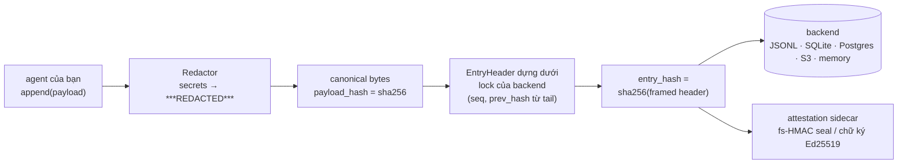
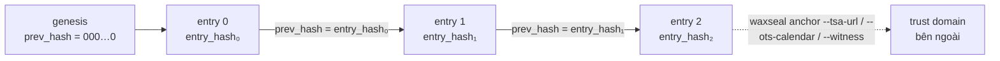
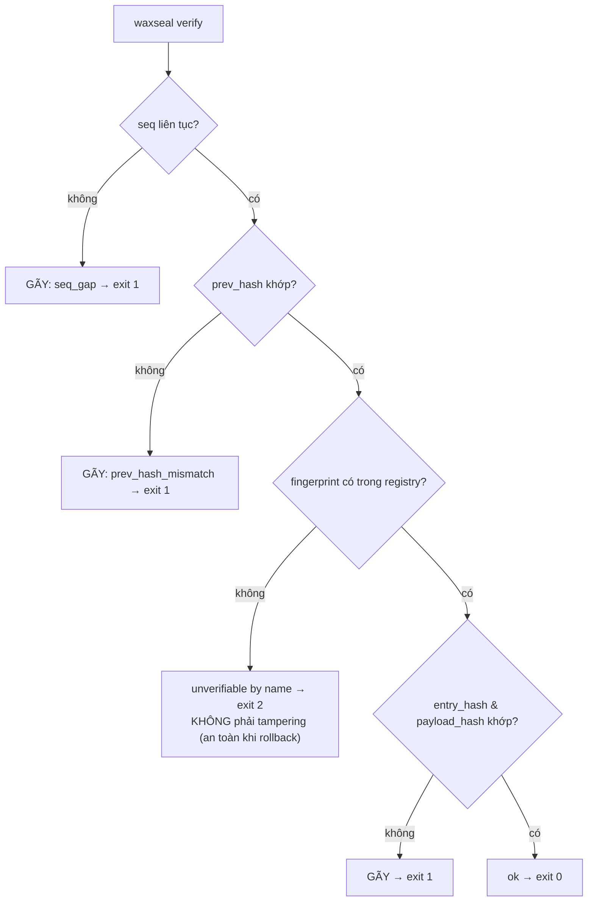
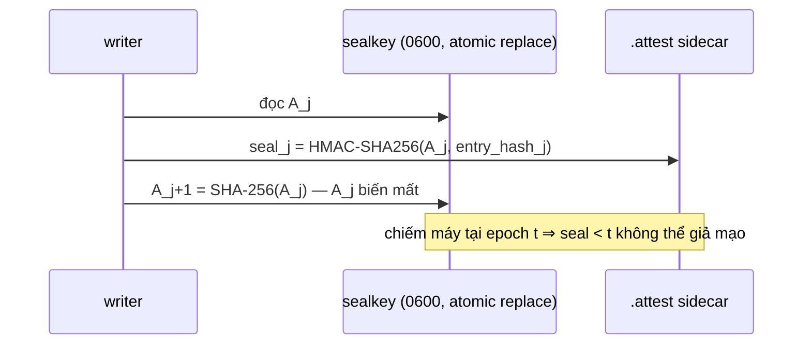

# waxseal

[English](README.md) | **Tiếng Việt** | [中文](README.zh.md)

**Audit hash chain chống giả mạo, an toàn khi schema tiến hóa, dành cho các AI agent framework.**
Zero dependency. MIT. Python ≥ 3.11.

waxseal cung cấp cho agent của bạn một audit trail mật mã học: mọi hành động được nối
vào một hash chain SHA-256, nên mọi hành vi sửa, xóa, chèn hoặc đảo thứ tự lịch sử đều
bị phát hiện. Schema tiến hóa không gây báo động giả về giả mạo: row cũ verify dưới
đúng fingerprint đã ghi nó.

## Vì sao cần thêm một audit log nữa?

Log dạng hash chain trong thực tế thường vỡ vì một lý do rất tầm thường: **schema thay
đổi**. Hai sự cố thực tế đã định hình thư viện này:

- Một hệ thống production mở rộng field set được hash mà không có định danh version —
  toàn bộ row lịch sử fail verify. Một đợt báo động giả về giả mạo hàng loạt.
- Một công cụ bộ nhớ agent (beads v1.2.2, 08/2026) vô tình phát hành một migration
  schema; binary sau khi revert gặp lỗi *"schema version mismatch: database is at v65,
  binary knows up to v53"* và chết cứng. Lối thoát duy nhất là tắt toàn bộ cơ chế an toàn.

Cả hai cùng một lớp lỗi: *định danh version kiểu thứ tự (ordinal) + version lạ bị coi là
lỗi*. waxseal khiến lớp lỗi này không thể biểu diễn được:

1. **Thiết kế envelope** — chain chỉ hash một header cố định
   (`seq, ts, hash_version, payload_type, payload_hash, prev_hash`). Payload là bytes
   tùy ý; đổi schema payload không bao giờ đụng vào chain.
2. **Schema fingerprint tự động** — `hash_version` là SHA-256 của descriptor chuẩn hóa
   mô tả schema header. Mở rộng field set *không thể* giữ định danh cũ; row cũ luôn
   verify bằng đúng fingerprint của chính nó.
3. **Fingerprint lạ → "unverifiable by name"** — không bao giờ là "tampered", không bao
   giờ crash (nguyên tắc RFC 6962: kiểu không nhận diện được là dữ liệu đục, không phải
   lỗi). Rollback version chỉ giảm khả năng verify một cách có kiểm soát (degrade
   gracefully), không gây lỗi.

## So sánh với các hướng hash-chain khác

Lib hash-chain nào cũng phát hiện được 1 byte bị lật. Dưới đây là những thứ các lib
khác KHÔNG làm (khảo sát các thư viện audit-log Python, tháng 8/2026 — xem
[DESIGN.md](DESIGN.md) cho nền tảng học thuật của từng lựa chọn):

|  | waxseal | lib audit-chain thông thường | DIY hash chain |
|---|---|---|---|
| Schema tiến hóa không gây báo động giả về giả mạo (fingerprint tự động) | ✅ | ❌ version string thủ công, hoặc không có | ❌ |
| Rollback version chỉ giảm khả năng verify một cách có kiểm soát, không gây lỗi (unverifiable ≠ tampered, exit 2 ≠ exit 1) | ✅ | ❌ version lạ = lỗi | ❌ |
| Độ đầy đủ được báo cáo riêng: `dropped_writes`, `None` ≠ `0` | ✅ | ❌ chain-ok bị hiểu là all-ok | ❌ |
| Chống fork khi append song song, cơ chế ghi rõ **theo từng backend**, lock có falsifiability test | ✅ | tùy, thường giả định single-writer | ❌ |
| SPEC byte-level (dự kiến freeze ở v1) + golden vectors → port sang Go/Rust/TS | ✅ | ❌ format = code chạy sao thì vậy | ❌ |
| Zero runtime dependency (client S3/Postgres được inject, không bao giờ import) | ✅ | thường kéo cả stack crypto/serialization | ✅ |
| Redact-before-hash (secret không bao giờ chạm disk, hash cam kết trên bytes đã redact) | ✅ | thỉnh thoảng | ❌ |
| Anchoring ra ngoài có sẵn: TSA RFC 3161, OpenTimestamps, witness, hoặc sink tự viết (`anchor_every=N`) | ✅ | ❌ | ❌ |
| Pinned-head (TOFU) + witness cross-check chống chain server không trung thực | ✅ | ❌ | ❌ |
| Forward-secure seal (HMAC key-evolving, thuần stdlib) + chữ ký Ed25519 inject | ✅ | ❌ | ❌ |
| Aggregate tag FssAgg đóng lỗ hổng truncation kể cả khi keyfile bị lộ | ✅ | ❌ | ❌ |
| Remote backend HTTP là backend ngang hàng đầy đủ với storage local, trust model ghi rõ | ✅ | hiếm, trust model không ghi rõ | ❌ |

Hai dòng đầu chính là lớp lỗi từ hai sự cố kể trên; xem [DESIGN.md](DESIGN.md) cho
nền tảng học thuật của từng dòng.

## Cách hoạt động

**Data flow — mỗi lần append:**



**Cấu trúc chain — vì sao mọi chỉnh sửa đều bị bắt:**



**Luồng verify — mỗi kết cục một mã riêng, unknown không bao giờ là tampered:**



## Cài đặt

```bash
pip install waxseal
```

Đã phát hành trên [PyPI](https://pypi.org/project/waxseal/). Cài từ source:
`pip install git+https://github.com/cuongbphv/waxseal`

## Sử dụng

```python
from waxseal import AuditLog

log = AuditLog.open("~/.myagent/audit/trail.jsonl")   # hoặc trail.db cho SQLite

log.append(
    payload={"tool": "bash", "command": "ls -la", "exit_code": 0},
    payload_type="application/vnd.myagent.toolcall+json",
)

result = log.verify()
# VerifyResult(ok=True, checked=1, broken_seq=None, reason=None,
#              unverifiable=(), dropped_writes=0)
```

Redact secret **trước khi** hash và lưu:

```python
from waxseal.adapters.redactors import RegexRedactor

log = AuditLog.open("trail.jsonl", redactor=RegexRedactor())
log.append(payload={"cmd": "curl -H 'Authorization: Bearer sk-...'"},
           payload_type="application/vnd.myagent.toolcall+json")
# cleartext không bao giờ chạm disk; hash cam kết trên payload đã redact
```

CLI:

```bash
waxseal verify trail.jsonl   # exit 0 nguyên vẹn / 1 gãy / 2 có row unverifiable / 3 không có trail
waxseal tail trail.jsonl -n 20
waxseal inspect trail.jsonl
waxseal head trail.jsonl       # in head của chain (seq + entry_hash) để anchor ra ngoài
waxseal checkpoint trail.jsonl # in {seq, entry_hash, root} — root là batch root, không chỉ tip
waxseal anchor trail.jsonl     # append 1 checkpoint vào sidecar .anchors cục bộ
waxseal verify --anchors trail.jsonl  # kiểm cả lịch sử trail so với .anchors

# Mọi lệnh trên trừ `anchor` đều nhận được URL của một remote chain server:
waxseal verify http://chain.example.com/v1/chains/default
```

## Storage backends

Mọi backend đều tuân cùng một luật: đọc-tail + append là MỘT critical section, nên các
writer song song không bao giờ fork được chain.

| Backend | Module | Cơ chế serialize | Dep thêm |
|---|---|---|---|
| File JSONL | `waxseal.adapters.jsonl` | file lock đa nền tảng | không |
| SQLite | `waxseal.adapters.sqlite` | `BEGIN IMMEDIATE` + `PRIMARY KEY(seq)` | không |
| In-memory | `waxseal.adapters.memory` | mutex | không |
| Amazon S3 | `waxseal.adapters.s3` | conditional PUT (`IfNoneMatch: *`) | tự inject boto3 client |
| PostgreSQL | `waxseal.adapters.postgres` | `pg_advisory_xact_lock` + `PRIMARY KEY(seq)` | tự inject psycopg connection |
| Remote (HTTP) | `waxseal.adapters.remote` | compare-and-swap phía server trên `(seq, prev_hash)`, client retry khi 409 | không (dùng `urllib` stdlib) |

```python
# S3 — client được inject; bản thân waxseal vẫn zero-dependency
import boto3
from waxseal import AuditLog
from waxseal.adapters.s3 import S3Backend

backend = S3Backend(boto3.client("s3"), bucket="my-audit", prefix="agent-1")
log = AuditLog(backend)

# PostgreSQL — cùng pattern với connection factory
import psycopg
from waxseal.adapters.postgres import PostgresBackend

log = AuditLog(PostgresBackend(lambda: psycopg.connect("postgresql://...")))
```

> Lưu ý về Kafka: compacted topic xóa record cũ (tombstone) nên **không** phải
> append-only — đừng dùng làm store cho tamper-evidence.

### Remote backend

`RemoteBackend` nói chuyện với bất kỳ server nào hiện thực wire contract trong
[REMOTE.md](REMOTE.md) — một bề mặt HTTP nhỏ (`GET /v1/chains/{id}/head`,
`POST .../entries`, `GET .../entries?cursor=`) thay vì một protocol riêng.
Critical section mà mọi backend khác giữ bằng lock thì ở đây được giữ phía
server: `POST` là compare-and-swap trên `(seq, prev_hash)`, writer thua race
sẽ đọc lại head mới nhất rồi retry thay vì làm fork chain.

```python
from waxseal import AuditLog

log = AuditLog.open("http://chain.example.com/v1/chains/default")
log.append(payload={...}, payload_type="application/vnd.myagent.toolcall+json")
```

`WAXSEAL_API_KEY` cung cấp bearer token (không bao giờ qua argv hay URL).

**Trust model, nói thẳng:** server là *trusted writer*, không phải một peer
Byzantine-fault-tolerant. `verify_chain` vẫn chạy hoàn toàn phía client và bắt
được corruption, truncation, reorder — nhưng một server không trung thực có
thể trả về một bản rewrite giả mạo nhất quán toàn bộ trail mà riêng
`verify_chain` không bắt được. Ba thứ thu hẹp điều đó: anchor head độc lập tại
một service KHÁC với chính chain server, giữ một `--pin` để bắt việc viết lại
đoạn lịch sử bạn đã xác nhận, và thêm `--witness` ở một trust domain khác để
bắt split-view (xem phần Anchoring và Thời gian được chứng thực bên dưới).
Không thứ nào biến server thành đáng tin; chúng chỉ chuyển câu hỏi sang: ai
nắm pin, ai nắm witness, ai nắm sink.

## Nguồn metadata

Ngoài hành động của agent, có thể chain cả lịch sử file/tài liệu:

```python
from waxseal.sources.files import record_file, current_matches_last

record_file(log, "SPEC.md", doc_id="spec")          # snapshot content hash vào chain
current_matches_last(log, "SPEC.md", doc_id="spec")  # True / False / None (chưa từng ghi)
```

## Nhật ký quyết định AI

`DecisionRecord` là payload mang hình dạng một quyết định, dành cho hệ thống AI ra quyết
định hoặc hỗ trợ ra quyết định: hệ thống nào, phiên bản mô hình nào, quyết định gì và vì
sao, và có con người tham gia hay không. Input được cam kết bằng hash sau khi redact, chứ
không được lưu lại.

```python
from waxseal import AuditLog, DecisionRecord, ModelRef, HumanOversight
from waxseal.adapters.redactors import RegexRedactor
from waxseal.sources.decisions import commit_input, record_decision

redactor = RegexRedactor()
log = AuditLog.open("decisions.jsonl", redactor=redactor)

record_decision(log, DecisionRecord(
    decision_id="DEC-1001",
    decision_type="transaction_approval",
    system_id="screening-agent",
    model=ModelRef(name="my-model", version="2026.08.1"),
    input_commitment=commit_input(model_input, redactor=redactor),  # redact xong mới hash
    outcome="approve",
    rationale="dưới ngưỡng, đối tác đã có lịch sử",
    human_oversight=HumanOversight(mode="automated"),  # None = chưa ghi nhận, KHÁC automated
))
```

Đọc lại các quyết định bằng `iter_decisions` — nó duyệt trail theo đúng thứ tự chuỗi và
yield `(entry, record)`. Một dòng mà bytes không còn parse được thành quyết định vẫn được
yield (với `record=None`) chứ không bị bỏ qua trong im lặng; còn dòng đó có bị *sửa đổi*
hay không là câu hỏi của `verify`, được trả lời riêng:

```python
from waxseal.sources.decisions import iter_decisions

for entry, record in iter_decisions(log, decision_type="transaction_approval"):
    if record is None:
        print(f"seq {entry.header.seq}: không parse được — chạy `waxseal verify`")
    else:
        print(f"seq {entry.header.seq}: {record.decision_id} → {record.outcome}")
```

Kiểm toán viên đọc một báo cáo, và kiểm tra được một quyết định mà không cần được trao cả
nhật ký:

```bash
waxseal report decisions.jsonl              # Markdown; --json cho SIEM/GRC
waxseal export-proof decisions.jsonl 3 > proof.json
waxseal verify-proof proof.json             # offline; không cần trail
```

Một proof bundle là một entry cộng đường Merkle của nó, nên trả lời câu hỏi về một chủ thể
không làm lộ mọi quyết định khác trong trail. Báo cáo in kiểm tra **không được chạy** thành
*not checked*, không bao giờ in thành đã đạt.

- [examples/banking-poc/](examples/banking-poc/README.vi.md) — demo end-to-end chạy được,
  có animation minh hoạ luồng dữ liệu và tám kịch bản tấn công, mỗi kịch bản tự assert
  đúng exit code của nó
- [docs/architecture/banking-deployment.vi.md](docs/architecture/banking-deployment.vi.md)
  — triển khai tham chiếu: bốn miền tin cậy, phân tách nhiệm vụ, lưu trữ và DR
- [docs/compliance/mapping.vi.md](docs/compliance/mapping.vi.md) — lớp này chứng minh được
  gì đối với EU AI Act, NIST AI RMF, RTS của DORA và các khung khác, **kèm phân tích
  khoảng trống trung thực**. Đây là lớp bằng chứng: nó hỗ trợ các nghĩa vụ lưu trữ hồ sơ
  và không hoàn thành thay nghĩa vụ nào cả

## Anchoring: checkpoint và consistency proof

Bản thân hash chain không chống lại được kẻ tấn công có quyền ghi lại toàn bộ
trail — mọi `prev_hash` phía sau chỗ sửa đều tính lại được. `checkpoint_for
(entry_hashes)` chốt `(seq, entry_hash, root)`, với `root` là batch root RFC
6962 trên toàn bộ entry hash tính đến thời điểm đó; anchor checkpoint này ở
nơi writer không với tới được sẽ đóng lỗ hổng rewrite-toàn-trail mà bản thân
chain không tự đóng được.

```python
from waxseal import AuditLog
from waxseal.adapters.anchors import FileAnchorSink

log = AuditLog.open("trail.jsonl",
                    anchor_sink=FileAnchorSink("trail.jsonl"), anchor_every=100)
# cứ mỗi 100 lần append, best-effort publish 1 checkpoint ngoài write path;
# anchor lỗi không bao giờ chặn ghi — chỉ tính vào anchor_failures
```

`waxseal verify --anchors` replay lại từng checkpoint đã ghi so với trail hiện
tại và báo lỗi đầu tiên: `anchor_beyond_head` (trail bị truncate sau khi
checkpoint), `anchor_entry_hash_mismatch` (tip bị rewrite), hoặc
`anchor_root_mismatch` (một entry trước đó bị rewrite mà không phá vỡ chuỗi
`prev_hash`). `domain.anchoring` còn có RFC 9162 §2.1.4
`consistency_proof`/`verify_consistency` — chứng minh một head sau này mở
rộng từ head trước đó mà không cần replay toàn bộ log — và RFC 6962
`membership_proof`/`verify_membership` cho membership proof của từng entry.

## Thời gian được chứng thực, pin và witness

Một anchor chỉ có giá trị bằng đúng thẩm quyền mà nó dựa vào. Ba lệnh sau đưa một checkpoint
ra ngoài tầm với của writer:

```bash
waxseal anchor trail.jsonl --tsa-url https://freetsa.org/tsr    # RFC 3161 timestamp
waxseal anchor trail.jsonl --ots-calendar https://a.pool.opentimestamps.org
waxseal anchor trail.jsonl --witness https://witness.example/anchor
waxseal verify trail.jsonl --anchors --pin ~/.waxseal/prod.pin --witness https://witness.example/anchor
```

- **RFC 3161** biến `ts` từ chỗ tự khai thành được chứng thực. waxseal kiểm tra reply
  *về mặt cấu trúc* — status, message imprint, nonce, thuật toán digest — và nói rõ điều đó
  trong mọi dòng nó in ra. Nó **không** verify chữ ký CMS/X.509; việc đó được ủy quyền cho
  `openssl ts -verify`, công thức nằm trong docs. Receipt mà nó không đọc được là
  *unverifiable* (exit 2); chỉ receipt chứng thực cho bytes khác mới là *gãy* (exit 1).
- **OpenTimestamps** lưu một proof Bitcoin ở trạng thái *pending*, mờ đục và có chủ ý. Hoàn
  tất nó về sau bằng `ots upgrade` / `ots verify`.
- **`--pin`** là `known_hosts` cho một trail: verifier giữ lại checkpoint do chính nó tính ra
  và từ chối lịch sử nào mâu thuẫn với checkpoint đó. Lần dùng đầu tiên được ghi nhãn rõ, pin
  chỉ tiến lên sau một lần chạy sạch, và pin đã hỏng thì không bao giờ bị âm thầm pin lại.
- **`--witness`** là kênh bên ngoài mà pin không thể thay thế. Pin bắt được server viết lại
  lịch sử cho chính bạn; chỉ witness nằm ở một miền tin cậy *khác* mới bắt được server đưa
  hai lịch sử khác nhau cho hai client. Witness không kết nối được sẽ in
  `unreachable — NOT checked` và trả exit code 2 (không thể xác minh): một
  phép kiểm chưa chạy không phải là đạt, cũng không phải là bằng chứng bị sửa.

- [docs/anchoring-external-time.vi.md](docs/anchoring-external-time.vi.md) — công thức ủy
  quyền cho `openssl ts`, đường nâng cấp OTS, và cách viết một `AnchorSink` cho chain khác
  (EVM, Hyperledger, private)
- [docs/security/threat-model.vi.md](docs/security/threat-model.vi.md) — vì sao
  tamper-*proof* là bất khả thi với phần mềm thuần, client phát hiện được gì và chứng minh
  được là không thể phát hiện gì trước một chain server Byzantine, và cách trích dẫn output
  của waxseal mà không nói quá

## Chữ ký & forward-secure seal

Hash chain không khóa thì ai có quyền ghi cũng tính lại được. Tầng attestation đóng
lỗ hổng đó — mà không thêm một dependency nào:

**Forward-secure seal (HMAC thuần stdlib, construction Bellare–Yee / Schneier–Kelsey):**
key seal tiến hóa một chiều theo từng entry (`A_{j+1} = SHA-256(A_j)`), key cũ bị bỏ —
kẻ chiếm máy tại epoch *t* không thể giả mạo hay re-seal bất kỳ thứ gì viết trước *t*.
Rewrite cả đoạn đuôi một cách "nhất quán" giờ sẽ FAIL verify thay vì lọt:



```python
from waxseal import AuditLog
from waxseal.adapters.attest import FileAttestor
from waxseal.domain.sealing import generate_key

k0 = generate_key()                      # gửi A_0 cho verifier, giữ NGOÀI máy này
log = AuditLog.open("trail.jsonl",
                    attestor=FileAttestor("trail.jsonl", initial_key=k0))
log.append(payload={...}, payload_type="application/vnd.myagent.toolcall+json")

log.verify_attestations(initial_key=k0)  # AttestResult(ok=True, checked=1, ...)
```

**Chữ ký số thật (Ed25519...)** — signer được inject, waxseal không bao giờ import
thư viện crypto:

```python
# bất kỳ object nào có .algorithm, .key_id, .sign(bytes) -> bytes
log = AuditLog.open("trail.jsonl",
                    attestor=FileAttestor("trail.jsonl", signer=my_ed25519_signer))
log.verify_attestations(verifier=my_ed25519_verifier)
```

Attestation nằm trong sidecar `.attest` (không đổi schema backend nào; log cũ vẫn đọc
được), và scheme mà verifier không biết sẽ được báo unverifiable-by-name — đúng luật
never-cry-wolf của chính chain. Verify còn tích hợp sẵn bài học từ các CVE của
systemd-journald FSS (2023-31437/38/39): seal bị ràng vào vị trí theo cả hai chiều,
cross-check với hash được TÍNH LẠI từ trail, và **truncate đuôi cả trail + sidecar
cùng lúc vẫn bị phát hiện** — epoch trong keyfile là một chiều, không thể quay lui.
Giới hạn: Python không zeroize được memory, và entry viết *sau* thời điểm máy bị
chiếm là do attacker kiểm soát dưới mọi scheme — xem [DESIGN.md](DESIGN.md) §6.

**Khi bản thân keyfile không được tin cậy**, truyền
`scheme="fs-hmac-agg-sha256-v1"` cho `FileAttestor`: mọi seal được fold vào MỘT
accumulator keyed duy nhất (`.sealagg`, chỉ lưu giá trị mới nhất), nên kẻ tấn
công dù copy được trail, sidecar `.attest`, và cả giá trị accumulator cuối cùng
vẫn không tự refold được — đóng lỗ hổng mà scheme thường để lại nếu keyfile bị
lộ cùng lúc với đuôi trail bị truncate.

## Đo độ đầy đủ: dropped writes

Toàn vẹn chain không đồng nghĩa với đầy đủ trail — một write bị rơi trước khi
chạm storage không để lại khoảng trống `seq` nào cho `verify` bắt được.
`AuditLog.open(path, record_drops=True)` ghi lý do (không bao giờ ghi payload)
của mỗi lần drop vào sidecar `.drops` độc lập với process hiện tại, và
`verify`/`inspect` báo cáo dưới dạng `dropped_writes >= N (measured minimum,
...)` — `None` vẫn nghĩa là *chưa từng đo*, khác với `0` đã đo được.

## Tích hợp

Hook audit cho bảy agent framework và coding tool, cộng một exporter cho host đã
tự giữ ledger riêng (OpenClaw). Mỗi integration
được verify với hook contract hiện hành của đích (phiên bản ghi trong README riêng),
ghi lại dispatch *trước khi* thực thi, redact secret trước khi hash, clip output lớn
một cách hiển thị, và **không bao giờ chặn/veto công việc của host** — mọi lỗi đều
degrade thành dropped write có nhãn, có đếm.

Tất cả nằm sẵn trong wheel — không cần checkout source, không copy file:

```bash
pip install waxseal
waxseal install hermes        # hoặc claude-code / codex / cursor / hermes-gateway / openclaw
```

`install` ghi các shim mỏng vào thư mục config của host (import
`waxseal.integrations.*`, nên `pip install -U waxseal` là hook được nâng cấp
tại chỗ) và in ra đoạn settings mà host còn cần. Các integration LangChain,
CrewAI, OpenAI Agents không cần bước install — import trực tiếp, ví dụ
`from waxseal.integrations.langchain import WaxsealCallbackHandler`.

| Đích | Cơ chế | Thư mục |
|---|---|---|
| Claude Code | hooks (`PreToolUse` / `PostToolUse` / `UserPromptSubmit`) | [integrations/claude-code/](integrations/claude-code/) |
| Codex CLI | lifecycle hooks (`hooks.json`, ≥ 0.149.0) | [integrations/codex/](integrations/codex/) |
| Cursor | Agent Hooks (`.cursor/hooks.json`) | [integrations/cursor/](integrations/cursor/) |
| LangChain / LangGraph | `BaseCallbackHandler` | [integrations/langchain/](integrations/langchain/) |
| CrewAI | event listener (`crewai.events`) | [integrations/crewai/](integrations/crewai/) |
| OpenAI Agents SDK | `RunHooks` | [integrations/openai-agents/](integrations/openai-agents/) |
| hermes-agent | plugin + gateway hook | [integrations/hermes/](integrations/hermes/) |
| OpenClaw | exporter đọc audit ledger (`openclaw audit --json`, không hook) | [integrations/openclaw/](integrations/openclaw/) |

Ghi chú phạm vi cho nhóm coding tool: các hook này cho bạn một bản ghi
song song, tamper-evident, **không chứa secret** của mọi hành động. Chúng không (và
không thể) sửa file transcript của chính tool — nếu key đã lọt vào đó, hãy rotate
key; trail của waxseal là bản ghi bạn có thể giữ, chia sẻ và verify.

## Đảm bảo và KHÔNG đảm bảo

- Phát hiện: entry bị sửa, bị xóa (seq gap), bị chèn/đảo thứ tự (gãy prev-hash),
  payload bị tráo.
- **Toàn vẹn chain ≠ đầy đủ trail**: một write bị rơi trước khi chạm storage không để
  lại khoảng trống. `dropped_writes` báo cáo riêng chuyện này; `None` nghĩa là *chưa đo* —
  không bao giờ đánh đồng với `0`.
- Writer song song không thể fork chain (xem bảng backend); với `RemoteBackend` đây
  là compare-and-swap phía server, không phải lock giữ ở client.
- waxseal là tamper-*evident* (phát hiện giả mạo), không phải tamper-*proof* (chống
  giả mạo tuyệt đối), và không bản phát hành nào thay đổi điều đó: kẻ tấn công có
  quyền ghi vẫn viết lại được toàn bộ phần đuôi chain. Phần mềm thuần không ngăn được
  — mọi byte cục bộ đều ghi đè được, và thứ duy nhất phần mềm làm được là khiến việc
  ghi đè *lộ ra* khi đối chiếu với một bản sao nằm ngoài tầm với của kẻ tấn công.
  Anchor head ra một trust domain bên ngoài: `waxseal anchor --tsa-url` (RFC 3161),
  `--ots-calendar` (OpenTimestamps), `--witness`, hoặc `anchor_every=N` với một sink
  tự viết. Điều đó chỉ thu hẹp được tấn công đúng bằng mức sink nằm dưới một *quyền
  quản trị khác*; một sidecar nằm cùng ổ đĩa thì không thu hẹp được gì.
- Một target `RemoteBackend` là *trusted writer*, không phải Byzantine-fault-tolerant —
  nhưng hai phép kiểm phía client thu hẹp điều đó. `--pin` bắt được server viết lại
  đoạn lịch sử bạn đã xác nhận trước đó (`pin_mismatch`) hoặc trả về bản ngắn hơn
  (`pin_beyond_head`). `--witness` bắt được server cho hai client xem hai lịch sử
  tự-nhất-quán khác nhau — điều mà một client đơn lẻ chứng minh được là không thể tự
  phát hiện (fork consistency, Mazières & Shasha). Cái vẫn nằm ngoài tầm: client lần
  đầu kết nối, chưa có pin và chưa có witness; witness thông đồng với server; và client
  bị kẻ tấn công nắm toàn bộ đường mạng. Hãy trỏ pin, witness và anchor sink tới nơi
  khác với chính chain server — sự tách quyền đó chính là toàn bộ lập luận bảo mật.

## Spec & thiết kế

- [SPEC.md](SPEC.md) — format byte-level (lp64v1 encoding, PAE-style framing, cách
  dựng fingerprint; dự kiến freeze ở v1) kèm golden test vectors — port được sang mọi
  ngôn ngữ.
- [REMOTE.md](REMOTE.md) — wire contract của `RemoteBackend`: endpoint, khuôn dạng
  envelope, authentication, và trust model trusted-writer.
- [DESIGN.md](DESIGN.md) — các lựa chọn thuật toán và nền tảng học thuật phía sau.

## Giấy phép

MIT
