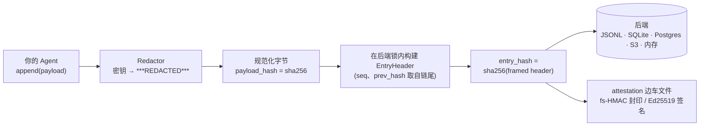
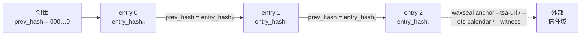
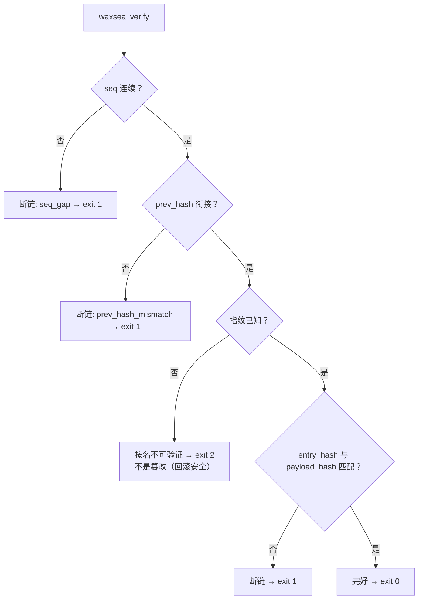
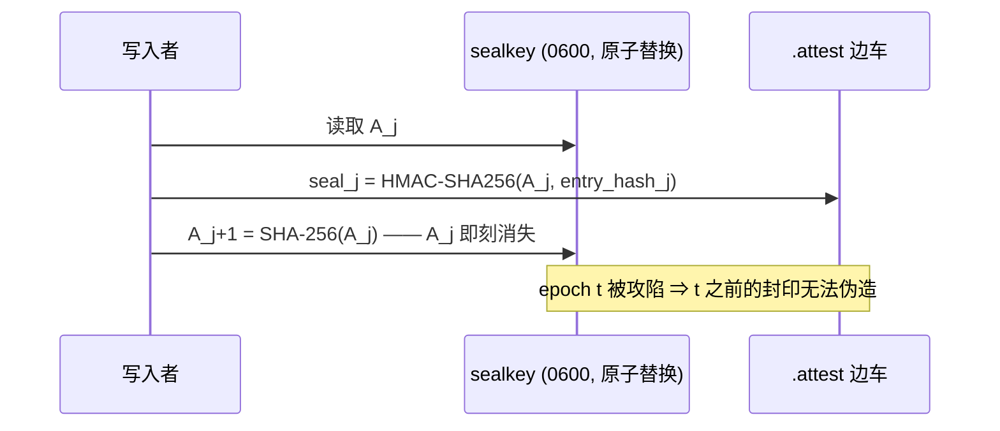

# waxseal

[English](README.md) | [Tiếng Việt](README.vi.md) | **中文**

> **关于本页的链接：** 这份中文 README 是一个入口页。它链接到的文档 —— `SPEC.md`、
> `DESIGN.md`、`REMOTE.md`、`CHANGELOG.md`、`docs/` 下的各篇，以及 `integrations/`
> 和 `examples/` 里的 README —— **目前只有英文版**。这是一个刻意的决定，不是遗漏：
> 一份过时的译文会向读不到原文的读者悄悄陈述一个已经作废的说法，那比没有译文更糟。
> 越权威的文档越要读英文原件 —— `SPEC.md` 是字节级规范，`pyproject.toml` 是依赖的
> 唯一来源。

<!-- 翻译范围决定（waxseal-fg4.31，2026-09-01）。这一条已经定案，不必重新讨论；
     要改的话请连同下面的数字一起改。

     选项：(a) 把 README.zh.md 链接到的文档都译成中文；(b) 在 README.zh.md 里明写
     这些文档只有英文版；(c) 记下“中文 README 是一个礼节性入口页”这一意图。
     取 (b) + (c)。

     测得的实际规模（2026-09-01，develop da252bd）：
       - README.zh.md 共 32 个 markdown 链接、25 个不同目标：2 个外部 URL、1 个页内
         锚点、22 个仓库内。22 个里有 3 个是刻意指向英文的（语言切换的 README.md /
         README.vi.md，以及 README.md#capability-extras 那张 specifier 权威表），
         其余 19 个落在只有英文版的文档上。
       - docs/ 下英文正文档 14 篇：8 篇“对外文档”各有 .vi.md，6 篇 docs/plans/ 三种
         语言都只有英文；.zh.md 一篇也没有。根目录 11 篇英文文档里，只有 README 有
         译本。
       - 选项 (a) 的下限是 README.zh.md 直接链接的 6 篇 docs/ 文档 = 14,535 词；
         如果对同一个读者诚实，还得加上他从同一页点得到的 SPEC.md / DESIGN.md /
         REMOTE.md（共 14,660 词），合计约 29,000 词，且尚未计入 CHANGELOG.md
         (11,102 词) 和 9 篇 integrations/examples 的 README。
       - 稳定性：本仓库 2026-08-21 建立，到 2026-09-01 共 37 次提交。这 11 天里，
         上述 9 篇被链接的文档被改动的提交数为 SPEC.md 8、DESIGN.md 5、REMOTE.md 3、
         threat-model.md 2，其余五篇各 1 —— 合计 22 次，约每 12 小时就有一次。

     理由：这份文档集正处在高频改动期，不是稳定期，所以 (a) 不是“一次性把 6 篇译完”，
     而是给每一次未来的文档改动都挂上两笔翻译债。漏掉一次，中文读者读到的就是一个
     过时的说法，而且他没有任何线索知道自己读到的是旧的 —— 这正是本仓库整体纪律所
     禁止的那件事：未经测量或已经过时的东西，不得读起来像当前的。CLAUDE.md 的
     Ternary Evidence Principle 在文档上的同一形状：宁可标注“未提供中文版”，也不要
     让一份陈旧译文冒充当前译文。

     因此中文 README 的定位是：让中文读者判断这个库是不是他要找的东西，并把他准确地
     交给英文原件。它不是中文文档集的第一块。越权威的内容（SPEC.md 的字节级格式、
     pyproject.toml 的 specifier）越是刻意不翻译。

     越南语一侧形状不同，因为 docs/ 的 8 篇对外文档都已有 .vi.md，没有断崖；不要把
     这条决定推广到 README.vi.md。

     如果以后要重开这个决定：先量一遍上面这些数字（篇数、词数、改动频率）再决定，
     并且要连带回答“谁在每次文档改动时负责同步中文版”。没有这个答案就不要开始译。
     相关：waxseal-fg4.13（owner 未决）——译文里的 [Unverified]/[Inference] 标签用
     哪种语言；真要新增中文译文，先把那条定了，否则新文件会继承同一处不一致。 -->

**面向 AI Agent 框架的防篡改、schema 演进安全的审计哈希链。**
零依赖。MIT 许可证。Python ≥ 3.11。

waxseal 为你的 Agent 提供密码学审计轨迹：每个动作都被追加到一条 SHA-256 哈希链上，
任何对历史记录的修改、删除、插入或重排都会被检测出来。schema 演进不会触发虚假的
篡改警报：旧行按写入时的指纹来验证。


<sub>追加 · 篡改 · schema 演进 · 完整性 · 锚定 · 多 Agent 交接 · 裁决。重新生成：`python tools/gen_workflow_animation.py --render`。</sub>

## 为什么还需要一个审计日志库？

哈希链日志在实践中崩溃的原因往往很平凡：schema 变了。有两起事故塑造了这个库。

第一起，某生产系统扩展了被哈希的字段集，却没有给新的布局一个属于它自己的版本标识。
于是所有历史行都按一套它们从未被写入过的字段集重新计算，全部在同一时刻验证失败，
而响起的那声警报是虚假的。

第二起，一个叫 beads 的 Agent 记忆工具在 1.2.2 版（2026 年 8 月）意外发布了一次
schema 迁移。这个版本被回滚之后，较旧的二进制遇到一个它不认识的数据库，直接拒绝
启动，并打印出 *"schema version mismatch: database is at v65, binary knows up to
v53"*。唯一能绕过它的办法，是一个把安全检查彻底关掉的环境变量。

两次失败的形状是一样的：版本标识只是一个序数，而未知版本被当作错误处理。waxseal
的构造让这两件事都无法表达。

链只哈希一个固定的 header，除此之外什么都不哈希（`seq`、`ts`、`hash_version`、
`payload_type`、`payload_hash`、`prev_hash`）。你的 payload 是任意字节，只通过它的
摘要被引用，所以改动 payload 的 schema 永远不会触及链本身。

`hash_version` 不是任何人手打出来的字符串。它是 header schema 连同其编码的规范化
描述符的 SHA-256，因此扩展字段集或更换编码都会产生一个不同的身份，无论你是否有意
为之。旧行仍旧按它们实际被写入时所用的那个指纹来验证。

当验证方遇到一个它不认识的指纹时，它把那一行报告为 unverifiable by name（按名不可
验证）。它不报告篡改，也不会崩溃。这与 RFC 6962 对待无法识别类型的原则相同，即把
它们看作不透明数据而非错误，也正是这一点让一次版本回滚能够平稳降级，而不是让警报
响起来。

这个库后来把这套机制用在了它自己身上。0.1.4 彻底替换了规范化编码，从 `lp64v1` 换成
无条件单射的 `lp64`（[CHANGELOG](CHANGELOG.md) 解释了原因），而不是并行保留两套。
由于编码本身就是描述符的一个组成部分，所有指纹都随之自行改变。不存在任何可能出错的
迁移过程，而 0.1.3 写的 trail 被 0.1.4 读取时会报为 *unverifiable* 而非 *tampered*，
正是上面那段所承诺的行为。这是一次破坏性格式变更，是在尚无任何以旧编码写入的 trail
存在于开发环境之外时，有意做出的。

## 与其他哈希链方案的对比

任何哈希链库都能检测到被翻转的字节。下面是其他库做不到的事情
（2026 年 8 月对 Python 审计日志库的调研 —— 每项选择背后的文献见 [DESIGN.md](DESIGN.md)）：

|  | waxseal | 常见审计链库 | 自研哈希链 |
|---|---|---|---|
| schema 演进不产生虚假篡改警报（自动指纹） | ✅ | ❌ 手写版本字符串，或没有 | ❌ |
| 版本回滚优雅降级（不可验证 ≠ 被篡改，退出码 2 ≠ 1） | ✅ | ❌ 未知版本 = 报错 | ❌ |
| 完备性单独上报：`dropped_writes`，`None` ≠ `0` | ✅ | ❌ 链完好被当作一切完好 | ❌ |
| 并发追加防分叉，**每个后端**的机制都有文档，锁经过可证伪性测试 | ✅ | 不一定，通常假设单写入者 | ❌ |
| 字节级 SPEC（计划在 v1 冻结）+ 黄金测试向量 → 可移植到 Go/Rust/TS | ✅ | ❌ 格式 = 代码怎么跑就怎么算 | ❌ |
| 零运行时依赖（S3/Postgres 客户端由调用方注入，永不 import） | ✅ | 常常拖入整套加密/序列化栈 | ✅ |
| 先脱敏后哈希（密钥永不落盘，哈希承诺的是脱敏后的字节） | ✅ | 偶尔 | ❌ |
| 内置外部锚定：RFC 3161 TSA、OpenTimestamps、witness，或自写 sink（`anchor_every=N`） | ✅ | ❌ | ❌ |
| 固定链头（TOFU）+ witness 交叉核对，用于对抗不诚实的 chain server | ✅ | ❌ | ❌ |
| 前向安全封印（密钥演进 HMAC，纯标准库）+ 注入式 Ed25519 签名 | ✅ | ❌ | ❌ |
| FssAgg 聚合标签，即便密钥文件泄露也能堵住截断漏洞 | ✅ | ❌ | ❌ |
| 远程 HTTP 后端与本地存储完全对等，信任模型写得明明白白 | ✅ | 少见，信任模型不写明 | ❌ |

前两行正是上文两起事故所属的故障类；每一行背后的文献见 [DESIGN.md](DESIGN.md)。

## 工作原理

**数据流 —— 每次追加：**



**链结构 —— 为什么任何修改都会被发现：**



**验证流程 —— 每种结果都有独立退出码，未知永远不等于篡改：**



## 安装

```bash
pip install waxseal
```

已发布于 [PyPI](https://pypi.org/project/waxseal/)。从源码安装：
`pip install git+https://github.com/cuongbphv/waxseal`

> **在找 WaxSeal SDK 吗？** PyPI 上的 `waxseal` 是本库，一条审计哈希链。npm 上的
> **WaxSeal SDK**（`@waxseal/verify`、`@waxseal/mcp`，以及 waxseal.id 上的服务）
> 是另一位作者的 Ed25519 身份产品：不同语言、不同问题，与本项目没有任何关系。如果
> 你是为了签名和验证 agent 身份而来，那才是你要找的东西。
> [docs/research/landscape.md](docs/research/landscape.md) §3 完整区分了两者。

## 能力扩展（capability extras）

<!-- 翻译决定（waxseal-fg4.32，2026-09-01）：本节翻译正文，而把具体的 specifier
     指回英文表格，不把表格复制到三个 README 里。理由：那张表是活内容 ——
     `rfc3161` 已在 c57a7b7 从 Planned 变为已发布，`evm` 会在 Workstream F3 落地时
     跟着变 —— 一张漏更新的译版表格会印出错误的安装指令（过时的包名或版本
     specifier），而一个指针最多只是多点一次。对新增 extra 的人的影响：只需改
     README.md 里的表格；三个 README 只有在“已发布 extra 的名字清单”变化时才需要
     动，因为这里仍用正文列出了 extra 的名字。 -->

零依赖描述的是内核，而不是 waxseal 能力的上限。内核保持 `dependencies = []`，这是一条
不变量而非偏好；凡是需要第三方客户端的能力，都通过“可选 extra + 注入”抵达：你安装客户
端，你构造它，你把它传进来，waxseal 自己永远不 import 它。[存储后端](#存储后端)一节里的
`S3Backend` 和 `PostgresBackend` 就是这个模式，extras 存在只是为了让 `pip` 替你取一个
兼容的客户端，而不是因为 waxseal 需要它。

今天已发布的是三个 extra：`pip install waxseal[s3]`、`pip install waxseal[postgres]`
和 `pip install waxseal[rfc3161]`。

`rfc3161` 是 waxseal 唯一自己 import 的 extra，而且只在一个函数里
（`adapters/rfc3161_verify.py`）—— 所以它没有任何东西需要你注入。它开启的是
`verify`/`report` 的可选签名维度，并且只有当你用 `--tsa-ca-file` 指名一份 CA bundle
时才生效：CMS 签名或证书链校验失败的 token 是 exit 1，而任何根本无法校验的情况（包括
extra 缺失）是 exit 2 并附上说明是哪一种的标签，绝不会是一个沉默的 exit 0。不带这个
参数则一切照旧：receipt 仍按结构校验，和以前完全一样。参见 [SPEC.md](SPEC.md) 第
17.1 节。

（`dev` 也存在，用于运行测试套件。它不是一个能力 extra。）

`evm`（链上 ledger 层）已在 0.1.5 contract 中被命名，但**尚未发布** —— 不要针对它写
代码。它不在 `pyproject.toml` 里，所以请求它不会多装任何东西。本仓库不会把未发布的
extra 描述成可用：written-but-unwired 不等于 shipped，
[docs/paper/conformance.md](docs/paper/conformance.md) 逐行记着这本账。

增加一个**硬**依赖是另一个问题，答案是不。extras 才是被许可的那条路。

权威表格 —— 哪个 extra 取哪个客户端包、版本 specifier 是什么 —— 在英文的
[README.md § Capability extras](README.md#capability-extras) 里，那里是这些字符串的
唯一来源。

## 使用

```python
from waxseal import AuditLog

log = AuditLog.open("~/.myagent/audit/trail.jsonl")   # SQLite 则用 trail.db

log.append(
    payload={"tool": "bash", "command": "ls -la", "exit_code": 0},
    payload_type="application/vnd.myagent.toolcall+json",
)

result = log.verify()
# VerifyResult(ok=True, checked=1, broken_seq=None, reason=None,
#              unverifiable=(), dropped_writes=0)
```

在哈希与存储**之前**先脱敏：

```python
from waxseal.adapters.redactors import RegexRedactor

log = AuditLog.open("trail.jsonl", redactor=RegexRedactor())
log.append(payload={"cmd": "curl -H 'Authorization: Bearer sk-...'"},
           payload_type="application/vnd.myagent.toolcall+json")
# 明文永远不落盘；哈希承诺的是脱敏后的 payload
```

命令行：

```bash
waxseal verify trail.jsonl   # 退出码 0 完好 / 1 断链 / 2 存在不可验证行 / 3 路径不存在
waxseal tail trail.jsonl -n 20
waxseal inspect trail.jsonl
waxseal head trail.jsonl       # 打印链头（seq + entry_hash），用于外部锚定
waxseal checkpoint trail.jsonl # 打印 {seq, entry_hash, root} —— root 是批量根，不只是链头
waxseal anchor trail.jsonl     # 把一个 checkpoint 追加到本地 .anchors 边车文件
waxseal verify --anchors trail.jsonl  # 额外用 .anchors 校验 trail 历史

# 除 `anchor` 外，以上命令都可以接受一个远程 chain server 的 URL：
waxseal verify http://chain.example.com/v1/chains/default
```

## 存储后端

每个后端都执行同一条规则：读尾 + 追加是一个临界区，并发写入者永远无法让链分叉。

| 后端 | 模块 | 串行化机制 | 额外依赖 |
|---|---|---|---|
| JSONL 文件 | `waxseal.adapters.jsonl` | 跨平台文件锁 | 无 |
| SQLite | `waxseal.adapters.sqlite` | `BEGIN IMMEDIATE` + `PRIMARY KEY(seq)` | 无 |
| 内存 | `waxseal.adapters.memory` | 互斥锁 | 无 |
| Amazon S3 | `waxseal.adapters.s3` | 条件 PUT（`IfNoneMatch: *`） | 注入你的 boto3 客户端 |
| PostgreSQL | `waxseal.adapters.postgres` | `pg_advisory_xact_lock` + `PRIMARY KEY(seq)` | 注入你的 psycopg 连接 |
| 远程（HTTP） | `waxseal.adapters.remote` | 服务端对 `(seq, prev_hash)` 做 compare-and-swap，客户端在 409 时重试 | 无（标准库 `urllib`） |

```python
# S3 —— 客户端由调用方注入；waxseal 本身保持零依赖
import boto3
from waxseal import AuditLog
from waxseal.adapters.s3 import S3Backend

backend = S3Backend(boto3.client("s3"), bucket="my-audit", prefix="agent-1")
log = AuditLog(backend)

# PostgreSQL —— 同样的模式，注入连接工厂
import psycopg
from waxseal.adapters.postgres import PostgresBackend

log = AuditLog(PostgresBackend(lambda: psycopg.connect("postgresql://...")))
```

> 关于 Kafka 的提醒：compacted topic 会删除旧记录（tombstone），**不是**真正的
> append-only —— 不要把它用作防篡改存储。

### 远程后端

`RemoteBackend` 可以和任何实现了 [REMOTE.md](REMOTE.md) 中那份接口约定的服务器
通信 —— 一个很小的 HTTP 接口（`GET /v1/chains/{id}/head`、
`POST .../entries`、`GET .../entries?cursor=`），而不是私有协议。其他后端用锁
维护的临界区，在这里改由服务端维护：`POST` 是对 `(seq, prev_hash)` 的
compare-and-swap，输掉竞争的写入者会重新读取最新链头再重试，而不是让链分叉。

```python
from waxseal import AuditLog

log = AuditLog.open("http://chain.example.com/v1/chains/default")
log.append(payload={...}, payload_type="application/vnd.myagent.toolcall+json")
```

`WAXSEAL_API_KEY` 提供 bearer token（永远不经过命令行参数，也不放进 URL）。

**信任模型，说清楚：** 服务器是*受信任的写入者*，不是拜占庭容错节点。
`verify_chain` 仍然完全在客户端运行，能抓住损坏、截断、重排序 —— 但一个不诚实
的服务器可以给出一份从头到尾一致伪造的重写版本，仅凭 `verify_chain` 抓不出来。
有三件事能收窄它：把链头独立锚定到与 chain server 不同的另一个服务上；保留一份
`--pin`，以便抓到对你此前已确认历史的改写；再加一个位于不同信任域的 `--witness`，
以便抓到 split-view（见下文的锚定与「经证明的时间」小节）。它们都不会让服务器
变得可信，只是把问题挪成：谁掌握 pin、谁掌握 witness、谁掌握 sink。

## 元数据源

除了 Agent 动作，还可以把任何文件/文档的历史纳入链中：

```python
from waxseal.sources.files import record_file, current_matches_last

record_file(log, "SPEC.md", doc_id="spec")          # 把内容哈希快照进链
current_matches_last(log, "SPEC.md", doc_id="spec")  # True / False / None（从未记录）
```

## AI 决策日志

`DecisionRecord` 是面向"做决策或辅助决策"的 AI 系统的决策型 payload：哪个系统、
哪个模型版本、决定了什么、依据是什么，以及是否有人参与。输入在脱敏之后以哈希
形式承诺，而不是被存下来。

```python
from waxseal import AuditLog, DecisionRecord, ModelRef, HumanOversight
from waxseal.adapters.redactors import RegexRedactor
from waxseal.sources.decisions import commit_input, record_decision

redactor = RegexRedactor()
log = AuditLog.open("decisions.jsonl", redactor=redactor)

record_decision(log, DecisionRecord(
    decision_id="DEC-1001",
    decision_type="transaction_approval",
    system_id="screening-agent",
    model=ModelRef(name="my-model", version="2026.08.1"),
    input_commitment=commit_input(model_input, redactor=redactor),  # 先脱敏，再哈希
    outcome="approve",
    rationale="低于阈值，且为已有往来的交易对手",
    human_oversight=HumanOversight(mode="automated"),  # None = 未记录，不等于 automated
))
```

用 `iter_decisions` 读回决策——它按链序遍历 trail，逐条 yield `(entry, record)`。
字节已无法解析为决策的行仍会被 yield（`record=None`），而不是被悄悄跳过；
至于该行是否被*篡改*，那是 `verify` 的问题，会单独作答：

```python
from waxseal.sources.decisions import iter_decisions

for entry, record in iter_decisions(log, decision_type="transaction_approval"):
    if record is None:
        print(f"seq {entry.header.seq}: 无法解析 —— 请运行 `waxseal verify`")
    else:
        print(f"seq {entry.header.seq}: {record.decision_id} → {record.outcome}")
```

审计方读一份报告，并且不需要拿到整个日志就能核验其中某一条决策：

```bash
waxseal report decisions.jsonl              # Markdown；--json 供 SIEM/GRC 使用
waxseal export-proof decisions.jsonl 3 > proof.json
waxseal verify-proof proof.json             # 离线核验；不需要 trail
```

一个 proof bundle 就是一条 entry 加上它的 Merkle 路径，因此回答关于某一个主体的问题，
不会泄露 trail 中其他所有决策。报告会把**没有执行**的检查打印为 *not checked*，
绝不会打印成通过。

- [examples/banking-poc/](examples/banking-poc/README.md) —— 可运行的端到端 demo，
  带数据流动画演示和八个篡改场景，每个场景都会断言自己的退出码
- [docs/architecture/banking-deployment.md](docs/architecture/banking-deployment.md) ——
  参考部署：四个信任域、职责分离、留存与容灾
- [docs/compliance/mapping.md](docs/compliance/mapping.md) —— 对照 EU AI Act、
  NIST AI RMF、DORA RTS 等框架，这一层能证明什么，**并附诚实的差距分析**。
  它是证据层：它支撑记录保存类义务，但不替你履行其中任何一项

## 锚定：checkpoint 与 consistency proof

哈希链本身抵御不了能重写整个 trail 文件的攻击者 —— 篡改点之后的每个
`prev_hash` 都是可以重新算出来的。`checkpoint_for(entry_hashes)` 钉住
`(seq, entry_hash, root)`，其中 `root` 是对目前为止所有 entry hash 的 RFC 6962
批量根；把这个 checkpoint 锚定到写入者够不到的地方，就能堵上链本身堵不住的
整体重写漏洞。

```python
from waxseal import AuditLog
from waxseal.adapters.anchors import FileAnchorSink

log = AuditLog.open("trail.jsonl",
                    anchor_sink=FileAnchorSink("trail.jsonl"), anchor_every=100)
# 每追加 100 次，就在写入路径之外尽力发布一次 checkpoint；
# 锚定失败永远不会阻塞写入 —— 只会计入 anchor_failures
```

`waxseal verify --anchors` 会把每条已记录的 checkpoint 与当前 trail 重放比对，
报告第一个断裂点：`anchor_beyond_head`（checkpoint 之后 trail 被截断）、
`anchor_entry_hash_mismatch`（链头被重写），或 `anchor_root_mismatch`（更早的
entry 被重写，但没有破坏 `prev_hash` 链）。`domain.anchoring` 还提供了 RFC 9162
§2.1.4 的 `consistency_proof`/`verify_consistency` —— 证明后来的链头是早先链头
的延伸，而无需重放整个日志 —— 以及 RFC 6962 的
`membership_proof`/`verify_membership`，用于单条 entry 的 inclusion proof。

## 经证明的时间、pin 与 witness

一个 anchor 的价值，取决于它所依附的权威。下面三条命令把 checkpoint 移出写入者
够得到的范围：

```bash
waxseal anchor trail.jsonl --tsa-url https://freetsa.org/tsr    # RFC 3161 timestamp
waxseal anchor trail.jsonl --ots-calendar https://a.pool.opentimestamps.org
waxseal anchor trail.jsonl --witness https://witness.example/anchor
waxseal verify trail.jsonl --anchors --pin ~/.waxseal/prod.pin --witness https://witness.example/anchor
```

- **RFC 3161** 让 `ts` 从"自己声称"变成"有外部作证"。waxseal 只对回执做*结构性*检查
  —— status、message imprint、nonce、digest 算法 —— 并且在它打印的每一行里都写明这一点。
  它**不**验证 CMS/X.509 签名；那一步被委托给 `openssl ts -verify`，具体做法见文档。
  它读不懂的回执算*不可验证*（exit 2）；只有为不同字节作证的回执才算*断链*（exit 1）。
- **OpenTimestamps** 存的是一份*待定（pending）*的比特币证明，不透明是有意为之。
  日后用 `ots upgrade` / `ots verify` 把它补完。
- 这两者**可以在同一次 `anchor` 运行中一起使用**，把同一个 checkpoint 同时发布到两边
  —— 时间戳权威负责分钟级的检测窗口，calendar 负责长周期的不可否认性 —— 一次运行即可，
  不必连着跑两次。其中一个 sink 连不上不会连累另一个丢掉它的记录；失败会被打上标签打印
  出来，绝不会被悄悄吞掉。你多接通一个独立域，攻击者就要多控制一个权威。
- **`--pin`** 是 trail 的 `known_hosts`：验证方保存一份自己算出来的 checkpoint，
  并拒绝与之矛盾的历史。首次使用会被明确标注，pin 只在一次干净的运行之后才前进，
  已损坏的 pin 绝不会被悄悄重新 pin。pin 还可以携带运维方所**期待**的状态；
  当一次运行观察到的少于所声明的，它会以退出码 2 说出来 —— 这是缺少佐证，
  绝不是篡改指控：
  - `expect_anchor_binding` —— 不带 SPEC 15 聚合字段的 checkpoint frame，与从未有过
    这些字段的 frame 逐字节完全相同，因此控制 `.anchors` sidecar 的攻击者可以悄悄
    剥掉这层保护。开启此标志后，若 sidecar 在已 pin 的 seq 及其之后只有无绑定记录，
    则报告 `anchor_policy_downgrade`。本构建无法解析的记录报告
    `anchor_binding_unreadable` —— 绝不当作"没有绑定"。
  - `max_anchor_age_s` —— 沉默的截止期限。最新的 `.anchors` 记录比它更旧（或根本
    没有记录）即为 `anchor_stale`。无法解析的时间戳报告
    `anchor_timestamp_unparseable`，绝不计为新鲜。
  - `declared_topology` —— 运维方声明有多少个独立权威持有绑定。若一次运行观察到的
    外部 anchor sink 数量更少，或没有一致的 witness，则报告 `separation_shortfall`。
    未声明就读作*未声明*，绝不读作零。

  `verify`/`report --pin` 现在接受 `--expect-anchor-binding`（一个开关）、
  `--max-anchor-age-s SECONDS`，以及 `--declare-topology SPEC`（一次性给出
  `SeparationTopology` 的全部四个子字段，例如
  `seal_escrow=true,anchor_sinks=2,witness=true,pin_separate=true`）来写入这三项声明 ——
  每一个都必须搭配 `--pin`，只在真正推进 pin 的那次运行才会生效，而
  `--declare-topology` 只给出四个子字段中的一部分会被当作 CLI 用法错误，绝不会被
  静默地补上默认值。不带这些参数的一次 pin 前进会原样保留此前已声明的内容。你仍然可以
  直接手改 pin 状态的 JSON，格式仍是 SPEC section 13.1。`waxseal verify`/`waxseal report`
  在每次运行时都会打印 `declared_topology` 所描述的分离度 τ —— 见
  [docs/paper/conformance.md](docs/paper/conformance.md) 的 G2（已完成）。
- **`--witness`** 是 pin 无法充当的外部通道。pin 能抓住一台为你重写历史的服务器；
  只有位于*不同*信任域的 witness，才能抓住一台向两个客户端出示两份不同历史的服务器。
  连不上的 witness 会打印 `unreachable — NOT checked`，并以退出码 2（不可验证）结束：
  没有执行的检查既不是通过，也不是篡改。

- [docs/anchoring-external-time.md](docs/anchoring-external-time.md) —— `openssl ts`
  委托验证的具体做法、OTS 的升级路径，以及如何为另一条链（EVM、Hyperledger、私有链）
  编写 `AnchorSink`
- [docs/security/threat-model.md](docs/security/threat-model.md) —— 为什么纯软件做不到
  tamper-*proof*、面对拜占庭式的链服务器客户端能检测到什么、又可证明地检测不到什么，
  以及如何在不夸大的前提下引用 waxseal 的输出
- [docs/paper/conformance.md](docs/paper/conformance.md) —— 一份对本库的独立形式化再分析
  提出了什么要求、0.1.4 交付了什么，以及逐行附证据地说明还有什么没做。包括此前任何
  release note 都未曾声明的那部分

## 签名与前向安全封印

无密钥的哈希链，任何有写权限的人都能重算。attestation 层堵上这个缺口 ——
且不新增任何依赖：

**前向安全封印（纯标准库 HMAC，Bellare–Yee / Schneier–Kelsey 构造）：**
封印密钥随每条 entry 单向演进（`A_{j+1} = SHA-256(A_j)`），旧密钥即刻丢弃 ——
在 epoch *t* 攻陷机器的攻击者无法伪造或重封 *t* 之前的任何记录。
"自洽地"重写整段后缀现在会验证失败，而不是蒙混过关：



```python
from waxseal import AuditLog
from waxseal.adapters.attest import FileAttestor
from waxseal.domain.sealing import generate_key

k0 = generate_key()                      # 把 A_0 托管给验证方，离开这台机器
log = AuditLog.open("trail.jsonl",
                    attestor=FileAttestor("trail.jsonl", initial_key=k0))
log.append(payload={...}, payload_type="application/vnd.myagent.toolcall+json")

log.verify_attestations(initial_key=k0)  # AttestResult(ok=True, checked=1, ...)
```

**真正的数字签名（Ed25519 等）** —— 签名器由调用方注入，waxseal 永不 import
加密库：

```python
# 任何具有 .algorithm、.key_id、.sign(bytes) -> bytes 的对象
log = AuditLog.open("trail.jsonl",
                    attestor=FileAttestor("trail.jsonl", signer=my_ed25519_signer))
log.verify_attestations(verifier=my_ed25519_verifier)
```

attestation 存放在 `.attest` 边车文件中（不改动任何后端 schema；旧日志照常可读），
验证方不认识的 scheme 会被报告为"按名不可验证" —— 与链本身同一条 never-cry-wolf
规则。验证还内置了 systemd-journald FSS 三个 CVE（2023-31437/38/39）的教训：
封印与位置双向绑定、与从 trail 重新计算的哈希交叉核对，并且**同时截断 trail 与
边车文件的尾部也会被发现** —— keyfile 的 epoch 是单向的，无法回退。
限制：Python 无法清零内存，且机器被攻陷*之后*写入的条目在任何方案下都由攻击者
控制 —— 见 [DESIGN.md](DESIGN.md) §6。

**当 keyfile 本身也不能被信任时**，给 `FileAttestor` 传
`scheme="fs-hmac-agg-sha256-v1"`：每个封印都会折叠进同一个带密钥的运行累加器
（`.sealagg`，只保留最新值），这样攻击者即便拿到了 trail、`.attest` 边车文件、
甚至最终的累加器值，也无法自行重新折叠出同样的结果 —— 堵上了普通方案在 keyfile
连同被截断的尾部一起泄露时留下的缺口。

## 跨 trail 的 handoff binding

当 agent B 的任务由 agent A 委派、且各自保有自己独立的 trail 时，只携带
agent **名字** 的 handoff *phase* 在密码学意义上什么都没有承诺。
`record_handoff` 转而把一个指针 —— `(chain_id, seq, head_hash)` —— 写进
B 自己的 trail，记下 A 的 chain identity 以及委派那一刻 A 的准确 head：

```python
from waxseal.sources.handoff import record_handoff

# 写在 DELEGATE 自己的 trail（log_b）上，指向 ORIGIN（log_a）当前的 head：
entries = list(log_a.entries())
seq_a, hash_a = entries[-1].header.seq, entries[-1].entry_hash

record_handoff(log_b, chain_id="agent-a", seq=seq_a, head_hash=hash_a)
```

一旦 B 的 trail 上任何后续 entry 被 anchor，那次 anchor 也会一并把 A 的
prefix 传递地 pin 到 `seq_a`：`waxseal verify-handoff <delegate-trail>
--origin <origin-trail>` 会把 delegate trail 上记录的每一个 handoff binding
拿去跟 origin trail 当前的历史重新核对，报告哪些（如果有）已经不再
holds —— 对两条 trail 都只读。

`record_handoff` 本身没有、也永远不会有 CLI 命令：它调用 `log.append`，而
CLI 自身的契约就是绝不向 chain 追加 entry（这和上文 `record_file`、
`record_decision`、`generate_key` 是 operator 自己代码直接 import 调用的
库函数、而非 subcommand 的原因完全相同）。

## 完整性度量：统计被丢弃的写入

链的完整性不等于 trail 的完整性 —— 一次在落盘前就丢失的写入，不会给 `verify`
留下任何 `seq` 空隙可抓。`AuditLog.open(path, record_drops=True)` 会把每次丢弃的
原因（绝不包含 payload）记录到一个独立于当前进程的 `.drops` 边车文件中，
`verify`/`inspect` 会以 `dropped_writes >= N (measured minimum, ...)` 的形式报告 ——
`None` 依然表示*从未测量过*，与已测得的 `0` 不同。

## 集成

为七个 agent 框架与编码工具提供审计 hook，另有一个面向自带账本的宿主（OpenClaw）的导出器。每个集成都针对目标当前的
hook 契约做过验证（版本记录在各自 README 中），在执行*之前*记录 dispatch，在哈希前
完成密钥脱敏，超大输出做可见截断，并且**绝不阻塞或否决宿主的工作** —— 任何失败都
退化为带标注、有计数的 dropped write。

一切都随 wheel 分发 —— 无需 checkout 源码，无需复制文件：

```bash
pip install waxseal
waxseal install hermes        # 或 claude-code / codex / cursor / hermes-gateway / openclaw
```

`install` 会把轻量 shim 写入宿主的配置目录（shim 只 import
`waxseal.integrations.*`，因此 `pip install -U waxseal` 即可原地升级 hook 行为），
并打印宿主仍需添加的 settings 片段。LangChain、CrewAI、OpenAI Agents 集成无需
install 步骤 —— 直接 import，例如
`from waxseal.integrations.langchain import WaxsealCallbackHandler`。

| 目标 | 机制 | 目录 |
|---|---|---|
| Claude Code | hooks（`PreToolUse` / `PostToolUse` / `UserPromptSubmit`） | [integrations/claude-code/](integrations/claude-code/) |
| Codex CLI | lifecycle hooks（`hooks.json`，≥ 0.149.0） | [integrations/codex/](integrations/codex/) |
| Cursor | Agent Hooks（`.cursor/hooks.json`） | [integrations/cursor/](integrations/cursor/) |
| LangChain / LangGraph | `BaseCallbackHandler` | [integrations/langchain/](integrations/langchain/) |
| CrewAI | 事件监听器（`crewai.events`） | [integrations/crewai/](integrations/crewai/) |
| OpenAI Agents SDK | `RunHooks` | [integrations/openai-agents/](integrations/openai-agents/) |
| hermes-agent | plugin + gateway hook | [integrations/hermes/](integrations/hermes/) |
| OpenClaw | 审计账本导出器（`openclaw audit --json`，非 hook） | [integrations/openclaw/](integrations/openclaw/) |

对编码工具类集成的范围说明：这些 hook 给你一份并行的、篡改可检测（tamper-evident）的、**不含密钥**的
行动记录。它们不会（也无法）改写工具自身的 transcript 文件 —— 如果密钥已经落入
transcript，请轮换密钥；waxseal 的 trail 才是你可以保留、分享与验证的那份记录。

## 保证与不保证

- 可检测：条目被修改、被删除（seq 缺口）、被插入/重排（prev-hash 断裂）、payload 被替换。
- **链完整性 ≠ 轨迹完备性**：在到达存储之前丢失的写入不会留下缺口。`dropped_writes`
  单独报告此事；`None` 表示*未测量*——永远不与 `0` 混同。
- 并发写入者无法让链分叉（见后端表格）；对 `RemoteBackend` 而言这是服务端的
  compare-and-swap，而不是客户端持有的锁。
- waxseal 提供的是篡改可检测（tamper-evident），而非防止篡改（tamper-proof），
  任何版本都不会改变这一点：拥有写权限的攻击者可以重写链的整个后缀。纯软件无法
  阻止它 —— 本地的每一个字节都可被改写，软件唯一能做的，是让这种改写在与一份
  攻击者够不到的副本比对时*显现出来*。把链头锚定到外部信任域：
  `waxseal anchor --tsa-url`（RFC 3161）、`--ots-calendar`（OpenTimestamps）、
  `--witness`，或 `anchor_every=N` 配合自写的 sink。这只在 sink 位于*另一个管理
  权限*之下时才真正约束攻击；与轨迹同盘的 sidecar 什么也约束不了。
- `RemoteBackend` 的目标是*受信任的写入者*，不是拜占庭容错节点 —— 但有两项客户端
  检查能收窄它。`--pin` 能抓到重写你此前已确认过的那段历史的服务器
  （`pin_mismatch`），以及返回更短历史的服务器（`pin_beyond_head`）。`--witness`
  能抓到向两个客户端展示两份各自自洽历史的服务器 —— 这是单个客户端被证明无法
  独自察觉的情形（fork consistency，Mazières 与 Shasha）。仍然够不到的是：尚无
  pin、也无 witness 的首次连接客户端；与服务器串通的 witness；以及整条网络路径
  都被攻击者掌握的客户端。请把 pin、witness 和 anchor sink 都指向 chain server
  之外的地方 —— 这一权限分离就是全部的安全论据。

## 规范与设计

- [SPEC.md](SPEC.md) 描述字节级格式（lp64 编码、PAE 风格框架、指纹构造；计划在
  v1 冻结），并附带黄金测试向量，因此可以用任何语言重新实现。
- [REMOTE.md](REMOTE.md) —— `RemoteBackend` 的接口约定：端点、envelope 格式、
  认证方式，以及受信任写入者这一信任模型。
- [DESIGN.md](DESIGN.md) —— 算法选型及其背后的学术文献。

## 许可证

MIT
