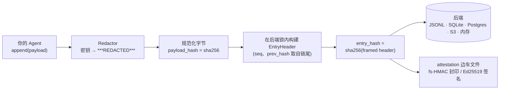
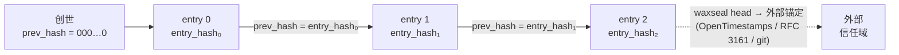
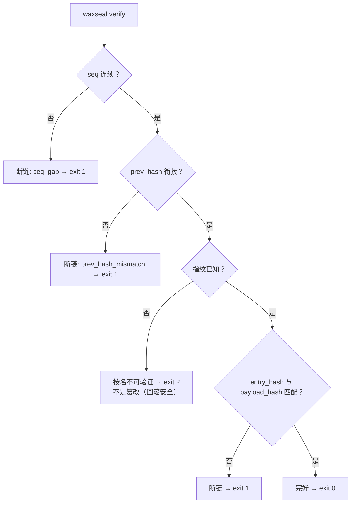
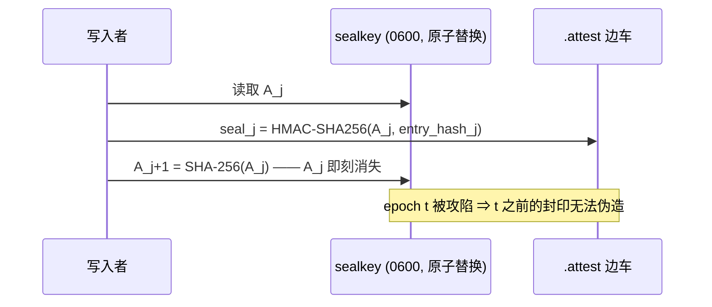

# waxseal

[English](README.md) | [Tiếng Việt](README.vi.md) | **中文**

**面向 AI Agent 框架的防篡改、schema 演进安全的审计哈希链。**
零依赖。MIT 许可证。Python ≥ 3.11。

waxseal 为你的 Agent 提供密码学审计轨迹：每个动作都被追加到一条 SHA-256 哈希链上，
任何对历史记录的修改、删除、插入或重排都会被检测出来。schema 演进不会触发虚假的
篡改警报：旧行按写入时的指纹来验证。

## 为什么还需要一个审计日志库？

哈希链日志在实践中崩溃的原因往往很平凡：**schema 变了**。两起真实事故塑造了这个库：

- 某生产系统在没有版本标识的情况下扩展了被哈希的字段集——所有历史行验证失败，
  引发大规模虚假篡改警报。
- 某 Agent 记忆工具（beads v1.2.2，2026 年 8 月）意外发布了一次 schema 迁移；
  回滚后的二进制遇到 *"schema version mismatch: database is at v65, binary knows up
  to v53"* 直接硬性失败，唯一的逃生通道是完全关闭安全检查。

两者属于同一类故障：*序数式版本标识 + 把未知版本当作错误*。waxseal 让这类故障
无法表达：

1. **信封设计** —— 链只哈希一个固定的 header
   （`seq, ts, hash_version, payload_type, payload_hash, prev_hash`）。payload 是任意
   字节；payload schema 的变化永远不会触及链本身。
2. **自动 schema 指纹** —— `hash_version` 是 header schema 规范化描述符的 SHA-256。
   扩展字段集*不可能*保留旧身份；旧行永远用它自己的指纹来验证。
3. **未知指纹 → "unverifiable by name"（按名不可验证）** —— 永远不是"被篡改"，
   永远不会崩溃（RFC 6962 原则：无法识别的类型是不透明数据，不是错误）。
   版本回滚时优雅降级。

## 与其他哈希链方案的对比

任何哈希链库都能检测到被翻转的字节。下面是其他库做不到的事情
（2026 年 8 月对 Python 审计日志库的调研 —— 每项选择背后的文献见 [DESIGN.md](DESIGN.md)）：

|  | waxseal | 常见审计链库 | 自研哈希链 |
|---|---|---|---|
| schema 演进不产生虚假篡改警报（自动指纹） | ✅ | ❌ 手写版本字符串，或没有 | ❌ |
| 版本回滚优雅降级（不可验证 ≠ 被篡改，退出码 2 ≠ 1） | ✅ | ❌ 未知版本 = 报错 | ❌ |
| 完备性单独上报：`dropped_writes`，`None` ≠ `0` | ✅ | ❌ 链完好被当作一切完好 | ❌ |
| 并发追加防分叉，**每个后端**的机制都有文档，锁经过可证伪性测试 | ✅ | 不一定，通常假设单写入者 | ❌ |
| 字节级 SPEC（计划在 v1 冻结）+ 黄金测试向量 → 可移植到 Go/Rust/TS | ✅ | ❌ 格式 = 代码怎么跑就怎么算 | ❌ |
| 零运行时依赖（S3/Postgres 客户端由调用方注入，永不 import） | ✅ | 常常拖入整套加密/序列化栈 | ✅ |
| 先脱敏后哈希（密钥永不落盘，哈希承诺的是脱敏后的字节） | ✅ | 偶尔 | ❌ |
| 内置外部锚定钩子（`waxseal head`）对抗后缀重写/截断 | ✅ | ❌ | ❌ |
| 前向安全封印（密钥演进 HMAC，纯标准库）+ 注入式 Ed25519 签名 | ✅ | ❌ | ❌ |

前两行正是上文两起事故所属的故障类；每一行背后的文献见 [DESIGN.md](DESIGN.md)。

## 工作原理

**数据流 —— 每次追加：**



**链结构 —— 为什么任何修改都会被发现：**



**验证流程 —— 每种结果都有独立退出码，未知永远不等于篡改：**



## 安装

```bash
pip install waxseal
```

已发布于 [PyPI](https://pypi.org/project/waxseal/)。从源码安装：
`pip install git+https://github.com/cuongbphv/waxseal`

## 使用

```python
from waxseal import AuditLog

log = AuditLog.open("~/.myagent/audit/trail.jsonl")   # SQLite 则用 trail.db

log.append(
    payload={"tool": "bash", "command": "ls -la", "exit_code": 0},
    payload_type="application/vnd.myagent.toolcall+json",
)

result = log.verify()
# VerifyResult(ok=True, checked=1, broken_seq=None, reason=None,
#              unverifiable=(), dropped_writes=0)
```

在哈希与存储**之前**先脱敏：

```python
from waxseal.adapters.redactors import RegexRedactor

log = AuditLog.open("trail.jsonl", redactor=RegexRedactor())
log.append(payload={"cmd": "curl -H 'Authorization: Bearer sk-...'"},
           payload_type="application/vnd.myagent.toolcall+json")
# 明文永远不落盘；哈希承诺的是脱敏后的 payload
```

命令行：

```bash
waxseal verify trail.jsonl   # 退出码 0 完好 / 1 断链 / 2 存在不可验证行 / 3 路径不存在
waxseal tail trail.jsonl -n 20
waxseal inspect trail.jsonl
waxseal head trail.jsonl     # 打印链头（seq + entry_hash），用于外部锚定
```

## 存储后端

每个后端都执行同一条规则：读尾 + 追加是一个临界区，并发写入者永远无法让链分叉。

| 后端 | 模块 | 串行化机制 | 额外依赖 |
|---|---|---|---|
| JSONL 文件 | `waxseal.adapters.jsonl` | 跨平台文件锁 | 无 |
| SQLite | `waxseal.adapters.sqlite` | `BEGIN IMMEDIATE` + `PRIMARY KEY(seq)` | 无 |
| 内存 | `waxseal.adapters.memory` | 互斥锁 | 无 |
| Amazon S3 | `waxseal.adapters.s3` | 条件 PUT（`IfNoneMatch: *`） | 注入你的 boto3 客户端 |
| PostgreSQL | `waxseal.adapters.postgres` | `pg_advisory_xact_lock` + `PRIMARY KEY(seq)` | 注入你的 psycopg 连接 |

```python
# S3 —— 客户端由调用方注入；waxseal 本身保持零依赖
import boto3
from waxseal import AuditLog
from waxseal.adapters.s3 import S3Backend

backend = S3Backend(boto3.client("s3"), bucket="my-audit", prefix="agent-1")
log = AuditLog(backend)

# PostgreSQL —— 同样的模式，注入连接工厂
import psycopg
from waxseal.adapters.postgres import PostgresBackend

log = AuditLog(PostgresBackend(lambda: psycopg.connect("postgresql://...")))
```

> 关于 Kafka 的提醒：compacted topic 会删除旧记录（tombstone），**不是**真正的
> append-only —— 不要把它用作防篡改存储。

## 元数据源

除了 Agent 动作，还可以把任何文件/文档的历史纳入链中：

```python
from waxseal.sources.files import record_file, current_matches_last

record_file(log, "SPEC.md", doc_id="spec")          # 把内容哈希快照进链
current_matches_last(log, "SPEC.md", doc_id="spec")  # True / False / None（从未记录）
```

## 签名与前向安全封印

无密钥的哈希链，任何有写权限的人都能重算。attestation 层堵上这个缺口 ——
且不新增任何依赖：

**前向安全封印（纯标准库 HMAC，Bellare–Yee / Schneier–Kelsey 构造）：**
封印密钥随每条 entry 单向演进（`A_{j+1} = SHA-256(A_j)`），旧密钥即刻丢弃 ——
在 epoch *t* 攻陷机器的攻击者无法伪造或重封 *t* 之前的任何记录。
"自洽地"重写整段后缀现在会验证失败，而不是蒙混过关：



```python
from waxseal import AuditLog
from waxseal.adapters.attest import FileAttestor
from waxseal.domain.sealing import generate_key

k0 = generate_key()                      # 把 A_0 托管给验证方，离开这台机器
log = AuditLog.open("trail.jsonl",
                    attestor=FileAttestor("trail.jsonl", initial_key=k0))
log.append(payload={...}, payload_type="application/vnd.myagent.toolcall+json")

log.verify_attestations(initial_key=k0)  # AttestResult(ok=True, checked=1, ...)
```

**真正的数字签名（Ed25519 等）** —— 签名器由调用方注入，waxseal 永不 import
加密库：

```python
# 任何具有 .algorithm、.key_id、.sign(bytes) -> bytes 的对象
log = AuditLog.open("trail.jsonl",
                    attestor=FileAttestor("trail.jsonl", signer=my_ed25519_signer))
log.verify_attestations(verifier=my_ed25519_verifier)
```

attestation 存放在 `.attest` 边车文件中（不改动任何后端 schema；旧日志照常可读），
验证方不认识的 scheme 会被报告为"按名不可验证" —— 与链本身同一条 never-cry-wolf
规则。验证还内置了 systemd-journald FSS 三个 CVE（2023-31437/38/39）的教训：
封印与位置双向绑定、与从 trail 重新计算的哈希交叉核对，并且**同时截断 trail 与
边车文件的尾部也会被发现** —— keyfile 的 epoch 是单向的，无法回退。
限制：Python 无法清零内存，且机器被攻陷*之后*写入的条目在任何方案下都由攻击者
控制 —— 见 [DESIGN.md](DESIGN.md) §6。

## 集成

为七个 agent 框架与编码工具提供审计 hook。每个集成都针对目标当前的
hook 契约做过验证（版本记录在各自 README 中），在执行*之前*记录 dispatch，在哈希前
完成密钥脱敏，超大输出做可见截断，并且**绝不阻塞或否决宿主的工作** —— 任何失败都
退化为带标注、有计数的 dropped write。

一切都随 wheel 分发 —— 无需 checkout 源码，无需复制文件：

```bash
pip install waxseal
waxseal install hermes        # 或 claude-code / codex / cursor / hermes-gateway
```

`install` 会把轻量 shim 写入宿主的配置目录（shim 只 import
`waxseal.integrations.*`，因此 `pip install -U waxseal` 即可原地升级 hook 行为），
并打印宿主仍需添加的 settings 片段。LangChain、CrewAI、OpenAI Agents 集成无需
install 步骤 —— 直接 import，例如
`from waxseal.integrations.langchain import WaxsealCallbackHandler`。

| 目标 | 机制 | 目录 |
|---|---|---|
| Claude Code | hooks（`PreToolUse` / `PostToolUse` / `UserPromptSubmit`） | [integrations/claude-code/](integrations/claude-code/) |
| Codex CLI | lifecycle hooks（`hooks.json`，≥ 0.149.0） | [integrations/codex/](integrations/codex/) |
| Cursor | Agent Hooks（`.cursor/hooks.json`） | [integrations/cursor/](integrations/cursor/) |
| LangChain / LangGraph | `BaseCallbackHandler` | [integrations/langchain/](integrations/langchain/) |
| CrewAI | 事件监听器（`crewai.events`） | [integrations/crewai/](integrations/crewai/) |
| OpenAI Agents SDK | `RunHooks` | [integrations/openai-agents/](integrations/openai-agents/) |
| hermes-agent | plugin + gateway hook | [integrations/hermes/](integrations/hermes/) |

对编码工具类集成的范围说明：这些 hook 给你一份并行的、篡改可检测（tamper-evident）的、**不含密钥**的
行动记录。它们不会（也无法）改写工具自身的 transcript 文件 —— 如果密钥已经落入
transcript，请轮换密钥；waxseal 的 trail 才是你可以保留、分享与验证的那份记录。

## 保证与不保证

- 可检测：条目被修改、被删除（seq 缺口）、被插入/重排（prev-hash 断裂）、payload 被替换。
- **链完整性 ≠ 轨迹完备性**：在到达存储之前丢失的写入不会留下缺口。`dropped_writes`
  单独报告此事；`None` 表示*未测量*——永远不与 `0` 混同。
- 并发写入者无法让链分叉（见后端表格）。
- waxseal 提供的是篡改可检测（tamper-evident），而非防止篡改（tamper-proof）：
  拥有写权限的攻击者可以重写链的整个后缀。用 `waxseal head` 把链头哈希锚定到外部
  （OpenTimestamps、RFC 3161 时间戳、推送到远端的 git 提交）即可约束这种攻击。

## 规范与设计

- [SPEC.md](SPEC.md) —— 字节级格式（lp64v1 编码、PAE 风格框架、指纹构造；计划在
  v1 冻结）附带黄金测试向量 —— 可移植到任何语言。
- [DESIGN.md](DESIGN.md) —— 算法选型及其背后的学术文献。

## 许可证

MIT
