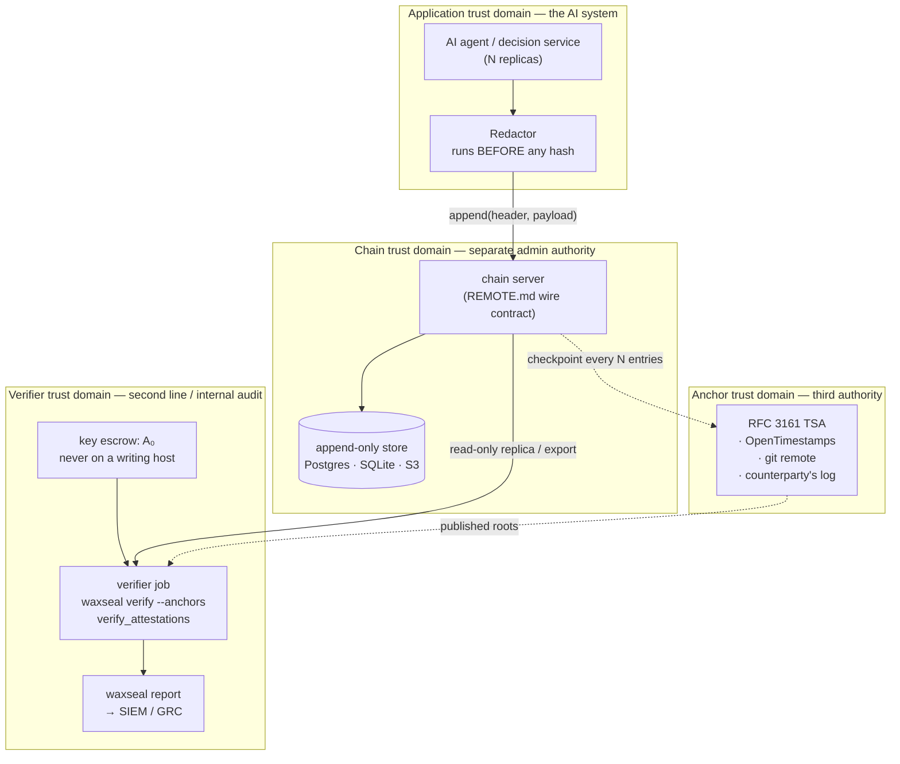

# Reference architecture — verifiable AI decision logs in a regulated institution

*[Tiếng Việt](banking-deployment.vi.md)*

How to deploy waxseal as the evidence layer under AI systems that make or assist
financial decisions. This document describes a topology, a trust model, and the
operational duties that make the trust model true. It names no institution, product, or
person; "the deploying institution" throughout means whoever is running the system.

**Scope.** waxseal is an integrity and evidence layer. It produces technical evidence
that a decision record existed, in a given order, at a given position in a chain, and has
not been altered since. It does **not** provide governance, access control, retention
enforcement, model documentation, or a compliance verdict. See
[docs/compliance/mapping.md](../compliance/mapping.md) for what it does and does not cover
against each framework.

---

## 1. Topology



**The load-bearing property is that these are four different administrative
authorities**, not four boxes on a diagram. Every detection in the tamper walkthrough
that survives an attacker with write access does so because something they needed was
under someone else's control.

| Domain | Holds | Must not also hold |
|---|---|---|
| Application | the model, the redactor, the payloads | the seal key A₀ |
| Chain | the trail and its ordering | the anchor destination |
| Anchor | published roots, timestamped elsewhere | write access to the trail |
| Verifier | A₀, the verification job, the reports | write access to the trail |

If the chain server also owns the anchor destination, scenario 5 of the
[PoC walkthrough](../../examples/banking-poc/README.md) stops being detectable: an
attacker who can rewrite the trail can rewrite the roots that would have contradicted it.

---

## 2. Write path

```
agent decision
  → Redactor                      secrets masked, BEFORE any hash
  → canonical JSON                sorted keys, compact separators, one owner
  → payload_hash = sha256(bytes)
  → EntryHeader built under the backend's critical section
      (seq and prev_hash read from the tail inside the same lock)
  → entry_hash = sha256(framed header)
  → attestation sidecar           forward-secure HMAC seal; key epoch advances
  → every N entries: Merkle checkpoint published to the anchor domain
```

Two rules from `CLAUDE.md` govern this path and are not deployment choices:

- **Redact before hash.** A redaction miss is unrecoverable by design — the cleartext is
  what would have been hashed and stored. The redactor runs first for that reason, not
  because it is optional.
- **Read-tail + append is one critical section.** Concurrent writers must never both
  extend the same `prev_hash`. Every backend enforces this: a file lock for JSONL,
  `BEGIN IMMEDIATE` for SQLite, `pg_advisory_xact_lock` for Postgres, a conditional PUT
  for S3, and a server-side compare-and-swap on `(seq, prev_hash)` for `RemoteBackend`.

### Multi-replica agents

Agent replicas do not coordinate with each other. They all append to the same chain, and
the serialization happens at the backend. A losing writer under `RemoteBackend` retries
against the fresh head rather than forking.

### What goes in a decision record

`DecisionRecord` carries the decision identity, the AI system identity, the model
reference (name, version, digest), a **commitment to the input** rather than the input
itself, the outcome and rationale, the policy version, confidence, and the human
oversight mode. Two fields deserve deployment attention:

- **`input_commitment`** is `sha256(canonical_json(redacted_input))`. The input is not
  stored. This bounds disclosure, but note the limit in §5: a commitment over a
  low-entropy input is confirmable by enumeration.
- **`subject_ref` and `reviewer_ref` must be pseudonymous.** They are opaque references
  into systems that hold the identity, not the identity. A chain is append-only; anything
  written into it cannot later be erased, which collides directly with data-subject
  erasure rights. Keep the mapping in a system that *can* delete.

---

## 3. Separation of duties

| Duty | Who | Why not the writer |
|---|---|---|
| Append decisions | application service account | — |
| Hold A₀ (seal key escrow) | verifier / second line | forward-secure seals detect suffix rewrites only if the attacker cannot obtain an earlier key epoch |
| Publish checkpoints | chain server → anchor domain | a root the writer can rewrite proves nothing |
| Run verification | verifier, on a schedule | a self-verifying writer reports on itself |
| Read reports | second line, internal audit, regulators on request | — |
| Rotate/decommission | change management, dual control | — |

**A₀ handling.** The initial seal key is generated once per chain, handed to the verifier,
and never written to a writing host. The PoC writes `sealkey.escrow` next to the trail
purely because a demo has nowhere else to put it, and says so. In deployment it belongs in
an HSM, a KMS with a separate authorization boundary, or offline escrow.

**Nobody has update or delete.** The store is append-only at the grant level, not only by
convention. In Postgres that means the writer role holds `INSERT` and `SELECT` on the
entries table and nothing more; in S3, object lock with a retention period.

---

## 4. Verification and reporting operations

| Job | Frequency | Command | Escalate when |
|---|---|---|---|
| Chain verify | continuous or hourly | `waxseal verify --anchors <trail>` | exit 1 |
| Attestation verify | daily | `verify_attestations(initial_key=A₀)` | `ok=False` |
| Auditor report | daily, retained | `waxseal report <trail> --json` | any check not ok |
| Consistency proof vs. last root | per checkpoint | `waxseal consistency <trail> --old-seq N --old-root HEX` (RFC 9162 §2.1.4) | exit 1 |
| Selective disclosure | on request | `waxseal export-proof` → `verify-proof` | — |

### Exit codes are the interface

| Exit | Meaning | Operational response |
|---:|---|---|
| 0 | intact | none |
| 1 | broken — first break printed with seq and reason | **security incident**: preserve, do not repair |
| 2 | intact, but rows this build cannot verify by name | **not** an incident — a version-skew signal |
| 3 | the trail path does not exist | configuration error: nothing was read, nothing was created |

Exit 2 exists because of the two incidents in `CLAUDE.md`. A rollback that leaves rows
written by a newer schema must not page anyone as a tampering alarm, and must equally not
be silently recomputed under the wrong field tuple and reported intact. Route exit 2 to
release management, not to the SOC.

**Never wire an automatic remediation to exit 1.** waxseal reports; it does not repair.
No code path may rewrite, reorder, or "fix" entries, and neither may the runbook — which
row is the tamper is a decision only an operator can make, and a repair destroys the
evidence that a court or a regulator would need.

### SIEM and GRC integration

`waxseal report --json` is the integration point. Ship it, not the trail. It carries the
chain verdict, the completeness measure and its source, inventory by payload type and
schema fingerprint, decision counts by type and oversight mode, and the status of each
sidecar check. Fields that were **not checked** are reported as not checked — an alerting
rule must not treat a missing check as a pass.

---

## 5. Trust model and limits

State these to reviewers before they infer something stronger.

- **Tamper-evident, not tamper-proof.** An attacker with write access can rewrite the
  whole trail consistently. What bounds that is anchoring into a domain they do not
  control and a seal key they cannot roll back.
- **A remote chain server is a *trusted writer*, not Byzantine-fault-tolerant.** A
  dishonest chain server can serve a consistently-forged rewrite that chain verification
  alone does not catch. A pinned head catches a rewrite of history this verifier already
  confirmed, and a witness catches a split-view — but only while the pin file and the
  witness host answer to a different authority than the chain server. That is also why
  the anchor sink must point at a service other than the chain server.
- **Chain integrity is not trail completeness.** A decision that was never written leaves
  no `seq` gap and no broken link. `dropped_writes` measures completeness separately, and
  `None` means *not measured* — never zero. A `.drops` sidecar can itself be deleted, and
  a disk too broken to hold a drop record cannot bear witness to its own failure. Treat
  the number as a measured minimum.
- **Commitments are not encryption.** If an input has few possible values, anyone holding
  the log can enumerate them and match the hash. For low-entropy inputs, add a secret salt
  held outside the log, or accept that the commitment is confirmable.
- **Append-only collides with erasure rights.** Nothing personal should enter a payload;
  see the pseudonymity rule in §2.
- **A verified chain says nothing about decision quality.** It says the record is the one
  that was written. Whether the model was right, fair, or well-governed is outside this
  layer entirely.

---

## 6. Retention, DR, and capacity

**Retention.** Under Regulation (EU) 2024/1689, providers of high-risk AI systems must
keep the automatically generated logs under their control "for a period appropriate to the
intended purpose … of at least six months, unless provided otherwise in the applicable
Union or national law" (Art. 19), and deployers carry a parallel at-least-six-months duty
for logs under their control (Art. 26(6)). Art. 19 further provides that providers that
are financial institutions subject to internal-governance requirements under Union
financial services law maintain those logs as part of the documentation kept under that
law. Sectoral record-keeping regimes are typically far longer than six months; the binding
period is whichever is longest across the regimes that apply, which is a determination for
the deploying institution's legal function, not for this document.

Mechanically: **waxseal does not enforce retention.** It is append-only, so it will not
delete on its own — which satisfies a minimum-retention duty by construction and
complicates a maximum-retention or erasure duty by the same construction. Plan chain
rotation (a new chain per period, with the closing head anchored and cross-referenced as
the new chain's genesis context) rather than deletion within a chain.

**DR.** The trail, its sidecars, and the anchor records have different recovery
requirements. The trail can be restored from a replica; a lost `.attest` sidecar means
seals cannot be verified for the covered range, and a lost anchor record means the
published-root defence is gone for that range. Back up sidecars with the trail, and keep
the anchor domain's copy of the roots independent of the chain domain's backups — a single
backup system that holds both reintroduces the shared authority the topology exists to
avoid.

**Capacity.** Growth is linear in decisions; the header is fixed-size and the payload is
whatever the decision record serializes to (the PoC's records are ~580 bytes canonical).
Verification is a single pass over the chain, so full-trail verification cost grows
linearly with the trail — for long-lived chains, verify incrementally from the last
anchored checkpoint using a consistency proof rather than re-verifying from genesis on
every run.

---

## 7. Rollout sequence

1. **Shadow.** Record decisions from an existing system without changing it. Nothing
   depends on the trail yet; the goal is to find redaction gaps and payload-shape churn
   while a miss is still cheap.
2. **Verified.** Stand up the verifier domain, escrow A₀, run scheduled verification, and
   wire exit codes to the right destinations (1 → SOC, 2 → release management).
3. **Anchored.** Add the anchor domain under a different administrative authority. Only
   at this point do scenarios 5 and 6 become detectable.
4. **Disclosed.** Exercise `export-proof` / `verify-proof` end to end with the audit
   function before a regulator asks. The first time a selective disclosure is performed
   should not be under a deadline.

Each step is independently useful, and each one adds a detection the previous step did not
have. Ordering them the other way — anchoring before the redactor is trustworthy — commits
unredacted content to an append-only chain in a domain you cannot clean up.
