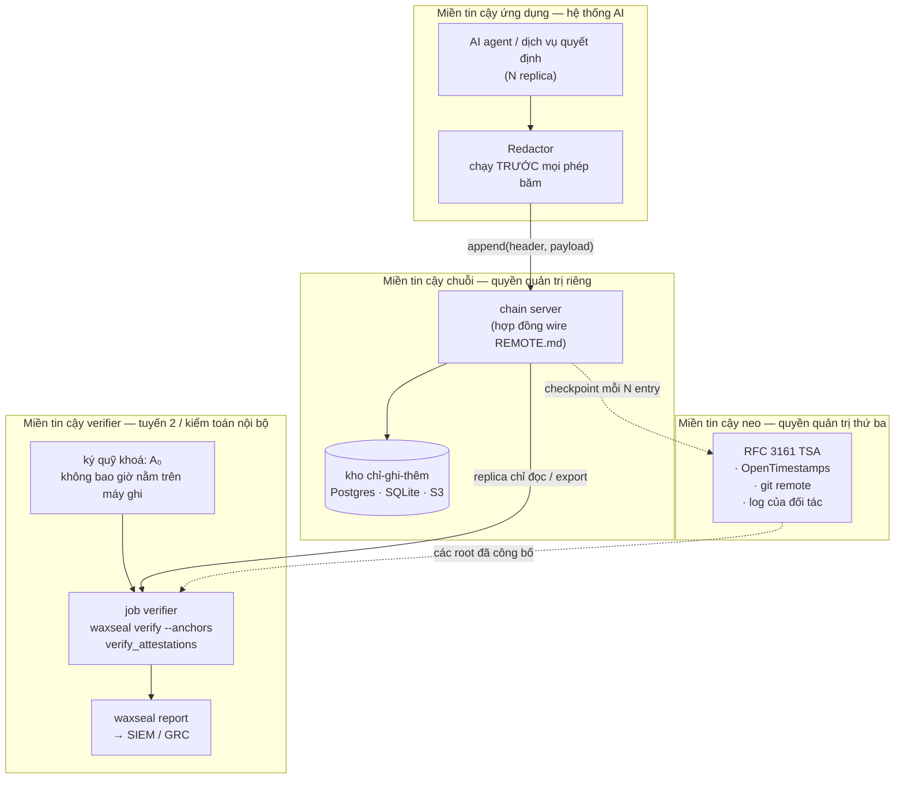

# Kiến trúc tham chiếu — nhật ký quyết định AI kiểm chứng được trong tổ chức được quản lý

*[English](banking-deployment.md)*

Cách triển khai waxseal làm lớp bằng chứng bên dưới các hệ thống AI ra quyết định hoặc hỗ
trợ ra quyết định tài chính. Tài liệu này mô tả một topology, một mô hình tin cậy, và các
nghĩa vụ vận hành làm cho mô hình tin cậy đó thành sự thật. Tài liệu không nêu tên tổ chức,
sản phẩm hay cá nhân nào; "tổ chức triển khai" ở đây nghĩa là bên đang vận hành hệ thống.

**Phạm vi.** waxseal là lớp toàn vẹn và bằng chứng. Nó tạo ra bằng chứng kỹ thuật rằng một
bản ghi quyết định đã tồn tại, theo một thứ tự nhất định, ở một vị trí nhất định trong
chuỗi, và không bị thay đổi từ đó tới nay. Nó **không** cung cấp quản trị (governance),
kiểm soát truy cập, cưỡng chế thời hạn lưu trữ, tài liệu mô hình, hay một phán quyết tuân
thủ. Xem [docs/compliance/mapping.vi.md](../compliance/mapping.vi.md) để biết nó phủ và
không phủ những gì đối với từng khung.

---

## 1. Topology



**Thuộc tính chịu lực ở đây là bốn quyền quản trị KHÁC NHAU**, không phải bốn cái hộp trên
sơ đồ. Mọi phát hiện trong bài trình diễn tấn công mà sống sót trước kẻ có quyền ghi đều
sống sót vì có thứ mà kẻ đó cần lại nằm dưới quyền kiểm soát của người khác.

| Miền | Nắm giữ | Không được đồng thời nắm |
|---|---|---|
| Ứng dụng | mô hình, redactor, payload | khoá niêm phong A₀ |
| Chuỗi | trail và thứ tự của nó | đích neo (anchor destination) |
| Neo | các root đã công bố, gắn dấu thời gian ở nơi khác | quyền ghi vào trail |
| Verifier | A₀, job kiểm chứng, các báo cáo | quyền ghi vào trail |

Nếu chain server đồng thời sở hữu đích neo, kịch bản 5 trong
[bài trình diễn PoC](../../examples/banking-poc/README.vi.md) không còn phát hiện được:
kẻ viết lại được trail cũng viết lại được chính các root lẽ ra sẽ mâu thuẫn với nó.

---

## 2. Đường ghi (write path)

```
quyết định của agent
  → Redactor                      che bí mật, TRƯỚC mọi phép băm
  → JSON chuẩn tắc                khoá đã sắp xếp, không khoảng trắng, một chủ sở hữu
  → payload_hash = sha256(bytes)
  → EntryHeader dựng trong critical section của backend
      (seq và prev_hash đọc từ tail trong cùng một lock)
  → entry_hash = sha256(header đã đóng khung)
  → sidecar attestation           niêm phong HMAC forward-secure; epoch khoá tiến lên
  → mỗi N entry: checkpoint Merkle công bố sang miền neo
```

Hai quy tắc trong `CLAUDE.md` chi phối đường ghi này và không phải là lựa chọn triển khai:

- **Redact trước khi hash.** Một lần redaction sót là không thể cứu vãn theo thiết kế —
  cleartext chính là thứ lẽ ra đã bị băm và lưu lại. Redactor chạy trước vì lý do đó, không
  phải vì nó tuỳ chọn.
- **Đọc-tail + append là một critical section.** Hai writer đồng thời không bao giờ được
  cùng nối tiếp một `prev_hash`. Mọi backend đều cưỡng chế điều này: file lock cho JSONL,
  `BEGIN IMMEDIATE` cho SQLite, `pg_advisory_xact_lock` cho Postgres, conditional PUT cho
  S3, và compare-and-swap phía server trên `(seq, prev_hash)` cho `RemoteBackend`.

### Agent nhiều replica

Các replica agent không phối hợp với nhau. Tất cả cùng append vào một chuỗi, và việc tuần
tự hoá diễn ra ở backend. Writer thua cuộc dưới `RemoteBackend` sẽ thử lại trên head mới
thay vì rẽ nhánh chuỗi.

### Bản ghi quyết định chứa gì

`DecisionRecord` mang định danh quyết định, định danh hệ thống AI, tham chiếu mô hình (tên,
phiên bản, digest), một **cam kết về input** thay vì bản thân input, kết quả và căn cứ,
phiên bản policy, độ tin cậy, và chế độ giám sát của con người. Hai trường đáng lưu ý khi
triển khai:

- **`input_commitment`** là `sha256(canonical_json(input_đã_redact))`. Input không được
  lưu. Điều này giới hạn mức tiết lộ, nhưng xem giới hạn ở §5: cam kết trên input entropy
  thấp có thể bị xác nhận bằng cách liệt kê.
- **`subject_ref` và `reviewer_ref` phải là bút danh (pseudonymous).** Chúng là tham chiếu
  mờ đục tới các hệ thống nắm danh tính, không phải bản thân danh tính. Chuỗi là chỉ-ghi-
  thêm; thứ gì đã ghi vào thì về sau không xoá được, điều này va chạm trực tiếp với quyền
  được xoá dữ liệu của chủ thể. Hãy giữ ánh xạ danh tính trong hệ thống *có thể* xoá.

---

## 3. Phân tách nhiệm vụ

| Nhiệm vụ | Ai | Vì sao không phải bên ghi |
|---|---|---|
| Append quyết định | service account của ứng dụng | — |
| Giữ A₀ (ký quỹ khoá niêm phong) | verifier / tuyến 2 | niêm phong forward-secure chỉ phát hiện việc viết lại phần đuôi nếu kẻ tấn công không lấy được epoch khoá trước đó |
| Công bố checkpoint | chain server → miền neo | một root mà bên ghi sửa được thì không chứng minh điều gì |
| Chạy kiểm chứng | verifier, theo lịch | bên ghi tự kiểm chứng chính mình là tự báo cáo về mình |
| Đọc báo cáo | tuyến 2, kiểm toán nội bộ, cơ quan quản lý khi được yêu cầu | — |
| Xoay vòng / ngừng vận hành | quản lý thay đổi, kiểm soát kép | — |

**Xử lý A₀.** Khoá niêm phong ban đầu được sinh một lần cho mỗi chuỗi, giao cho verifier,
và không bao giờ được ghi lên máy ghi log. PoC ghi `sealkey.escrow` cạnh trail thuần tuý vì
demo không có chỗ nào khác để đặt, và nó nói rõ điều đó. Khi triển khai, khoá này thuộc về
HSM, một KMS có biên uỷ quyền riêng, hoặc ký quỹ offline.

**Không ai có quyền update hay delete.** Kho lưu trữ phải chỉ-ghi-thêm ở mức phân quyền,
không chỉ ở mức quy ước. Với Postgres, nghĩa là role ghi chỉ có `INSERT` và `SELECT` trên
bảng entries, không hơn; với S3, dùng object lock kèm thời hạn lưu giữ.

---

## 4. Vận hành kiểm chứng và báo cáo

| Job | Tần suất | Lệnh | Leo thang khi |
|---|---|---|---|
| Verify chuỗi | liên tục hoặc mỗi giờ | `waxseal verify --anchors <trail>` | exit 1 |
| Verify attestation | hằng ngày | `verify_attestations(initial_key=A₀)` | `ok=False` |
| Báo cáo kiểm toán | hằng ngày, có lưu trữ | `waxseal report <trail> --json` | có bất kỳ kiểm tra nào không ok |
| Consistency proof so với root gần nhất | mỗi checkpoint | `waxseal consistency <trail> --old-seq N --old-root HEX` (RFC 9162 §2.1.4) | exit 1 |
| Tiết lộ chọn lọc | khi có yêu cầu | `waxseal export-proof` → `verify-proof` | — |

### Exit code chính là giao diện

| Exit | Ý nghĩa | Phản ứng vận hành |
|---:|---|---|
| 0 | nguyên vẹn | không cần gì |
| 1 | đứt gãy — in ra chỗ đứt đầu tiên kèm seq và lý do | **sự cố an ninh**: bảo toàn hiện trạng, không sửa |
| 2 | nguyên vẹn, nhưng có dòng bản build này không verify được theo tên | **không** phải sự cố — đây là tín hiệu lệch phiên bản |
| 3 | đường dẫn trail không tồn tại | lỗi cấu hình: chưa đọc gì, chưa tạo gì |

Exit 2 tồn tại vì hai sự cố nêu trong `CLAUDE.md`. Một lần rollback để lại các dòng do
schema mới hơn ghi thì không được đánh thức ai như một cảnh báo can thiệp, và cũng tuyệt
đối không được âm thầm tính lại theo bộ trường sai rồi báo là nguyên vẹn. Hãy định tuyến
exit 2 tới bộ phận quản lý phát hành, không phải tới SOC.

**Không bao giờ nối một cơ chế tự động khắc phục vào exit 1.** waxseal báo cáo; nó không
sửa chữa. Không đường code nào được viết lại, sắp xếp lại hay "sửa" các entry — và runbook
cũng vậy. Dòng nào là dòng bị can thiệp là quyết định chỉ người vận hành mới được đưa ra,
và một hành động "sửa" sẽ phá huỷ đúng thứ bằng chứng mà toà án hoặc cơ quan quản lý cần.

### Tích hợp SIEM và GRC

`waxseal report --json` là điểm tích hợp. Hãy chuyển đi báo cáo này, không phải trail. Nó
mang phán quyết về chuỗi, thước đo tính đầy đủ kèm nguồn của nó, kiểm kê theo payload type
và schema fingerprint, số lượng quyết định theo loại và theo chế độ giám sát, và trạng thái
từng kiểm tra sidecar. Những trường **không được kiểm tra** sẽ báo là không được kiểm tra —
một luật cảnh báo tuyệt đối không được coi kiểm tra bị thiếu là kiểm tra đã đạt.

---

## 5. Mô hình tin cậy và giới hạn

Hãy nói rõ những điều này với người review trước khi họ tự suy ra điều gì mạnh hơn.

- **Tamper-evident, không phải tamper-proof.** Kẻ tấn công có quyền ghi có thể viết lại
  toàn bộ trail một cách nhất quán. Thứ giới hạn được điều đó là việc neo vào một miền mà
  kẻ đó không kiểm soát, và một khoá niêm phong mà kẻ đó không thể quay ngược.
- **Một chain server từ xa là *trusted writer*, không phải Byzantine-fault-tolerant.** Một
  chain server bất lương có thể phục vụ một bản viết lại giả mạo nhất quán mà riêng phép
  kiểm chuỗi không bắt được. Một pinned head bắt được việc viết lại đoạn lịch sử verifier
  này đã xác nhận, và một witness bắt được split-view — nhưng chỉ khi file pin và host
  witness chịu một quyền quản trị khác với chain server. Đó cũng chính là lý do anchor
  sink phải trỏ tới một dịch vụ khác chain server.
- **Toàn vẹn chuỗi không phải tính đầy đủ của trail.** Một quyết định chưa từng được ghi
  thì không để lại khoảng trống `seq` nào và không làm đứt liên kết nào. `dropped_writes`
  đo tính đầy đủ một cách tách bạch, và `None` nghĩa là *chưa đo* — không bao giờ là 0. Bản
  thân sidecar `.drops` có thể bị xoá, và một ổ đĩa hỏng tới mức không ghi nổi bản ghi rớt
  thì cũng không làm chứng được cho chính sự cố của nó. Hãy coi con số đó là một cận dưới
  đã đo.
- **Commitment không phải mã hoá.** Nếu input chỉ có ít giá trị khả dĩ, bất kỳ ai giữ nhật
  ký đều có thể liệt kê hết rồi dò khớp hash. Với input entropy thấp, hãy thêm một salt bí
  mật giữ ngoài nhật ký, hoặc chấp nhận rằng cam kết đó là xác nhận được.
- **Chỉ-ghi-thêm va chạm với quyền được xoá.** Không được để dữ liệu cá nhân nào vào
  payload; xem quy tắc bút danh ở §2.
- **Một chuỗi đã verify không nói gì về chất lượng quyết định.** Nó chỉ nói rằng bản ghi
  này đúng là bản ghi đã được ghi. Mô hình đúng hay sai, công bằng hay không, được quản trị
  tốt hay không đều nằm hoàn toàn ngoài lớp này.

---

## 6. Lưu trữ, DR và dung lượng

**Thời hạn lưu trữ.** Theo Quy định (EU) 2024/1689, nhà cung cấp hệ thống AI rủi ro cao
phải giữ các log tự động sinh nằm dưới quyền kiểm soát của mình "trong khoảng thời gian phù
hợp với mục đích sử dụng dự kiến … ít nhất là sáu tháng, trừ khi pháp luật Liên minh hoặc
quốc gia áp dụng quy định khác" (Điều 19), và bên triển khai (deployer) có nghĩa vụ song
song ít nhất sáu tháng đối với các log dưới quyền kiểm soát của mình (Điều 26(6)). Điều 19
còn quy định rằng nhà cung cấp là tổ chức tài chính thuộc diện các yêu cầu về quản trị nội
bộ theo pháp luật dịch vụ tài chính của Liên minh thì duy trì các log đó như một phần hồ sơ
tài liệu lưu giữ theo pháp luật đó. Các chế độ lưu trữ hồ sơ theo ngành thường dài hơn sáu
tháng rất nhiều; thời hạn ràng buộc là thời hạn dài nhất trong số các chế độ áp dụng, và
đây là việc xác định thuộc về bộ phận pháp chế của tổ chức triển khai, không thuộc tài liệu
này.

Về mặt cơ chế: **waxseal không cưỡng chế thời hạn lưu trữ.** Nó chỉ-ghi-thêm, nên tự nó sẽ
không xoá — điều này thoả mãn nghĩa vụ lưu trữ tối thiểu một cách tự nhiên, và cũng vì thế
mà làm phức tạp nghĩa vụ lưu trữ tối đa hoặc nghĩa vụ xoá. Hãy lập kế hoạch xoay vòng chuỗi
(mỗi kỳ một chuỗi mới, với head đóng kỳ được neo và tham chiếu chéo làm bối cảnh genesis
của chuỗi mới) thay vì xoá bên trong một chuỗi.

**DR.** Trail, các sidecar của nó, và các bản ghi neo có yêu cầu phục hồi khác nhau. Trail
có thể khôi phục từ replica; mất sidecar `.attest` nghĩa là không verify được niêm phong
cho khoảng đã phủ, và mất bản ghi neo nghĩa là mất lớp phòng vệ "root đã công bố" cho
khoảng đó. Hãy backup sidecar cùng với trail, và giữ bản sao các root ở miền neo độc lập
với backup của miền chuỗi — một hệ thống backup duy nhất chứa cả hai sẽ tái tạo lại đúng
cái quyền quản trị chung mà topology này sinh ra để tránh.

**Dung lượng.** Tăng trưởng tuyến tính theo số quyết định; header có kích thước cố định và
payload là kết quả serialize bản ghi quyết định (bản ghi trong PoC khoảng ~580 byte chuẩn
tắc). Kiểm chứng là một lượt duyệt qua chuỗi, nên chi phí verify toàn bộ trail tăng tuyến
tính theo độ dài trail — với các chuỗi sống lâu, hãy verify tăng dần từ checkpoint đã neo
gần nhất bằng consistency proof, thay vì verify lại từ genesis ở mỗi lần chạy.

---

## 7. Trình tự triển khai

1. **Shadow.** Ghi lại quyết định từ hệ thống hiện có mà không thay đổi hệ thống đó. Chưa
   có gì phụ thuộc vào trail; mục tiêu là tìm ra các lỗ hổng redaction và sự biến động hình
   dạng payload khi một lần sót vẫn còn rẻ.
2. **Verified.** Dựng miền verifier, ký quỹ A₀, chạy kiểm chứng theo lịch, và nối exit code
   tới đúng nơi nhận (1 → SOC, 2 → quản lý phát hành).
3. **Anchored.** Bổ sung miền neo dưới một quyền quản trị khác. Chỉ từ thời điểm này kịch
   bản 5 và 6 mới trở nên phát hiện được.
4. **Disclosed.** Diễn tập `export-proof` / `verify-proof` end-to-end cùng bộ phận kiểm
   toán trước khi cơ quan quản lý hỏi tới. Lần đầu thực hiện một tiết lộ chọn lọc không nên
   diễn ra khi đang chạy deadline.

Mỗi bước đều tự nó có ích, và mỗi bước thêm một khả năng phát hiện mà bước trước không có.
Làm ngược thứ tự — neo trước khi redactor đáng tin — sẽ ghi nội dung chưa redact vào một
chuỗi chỉ-ghi-thêm nằm ở miền mà bạn không dọn dẹp được.
