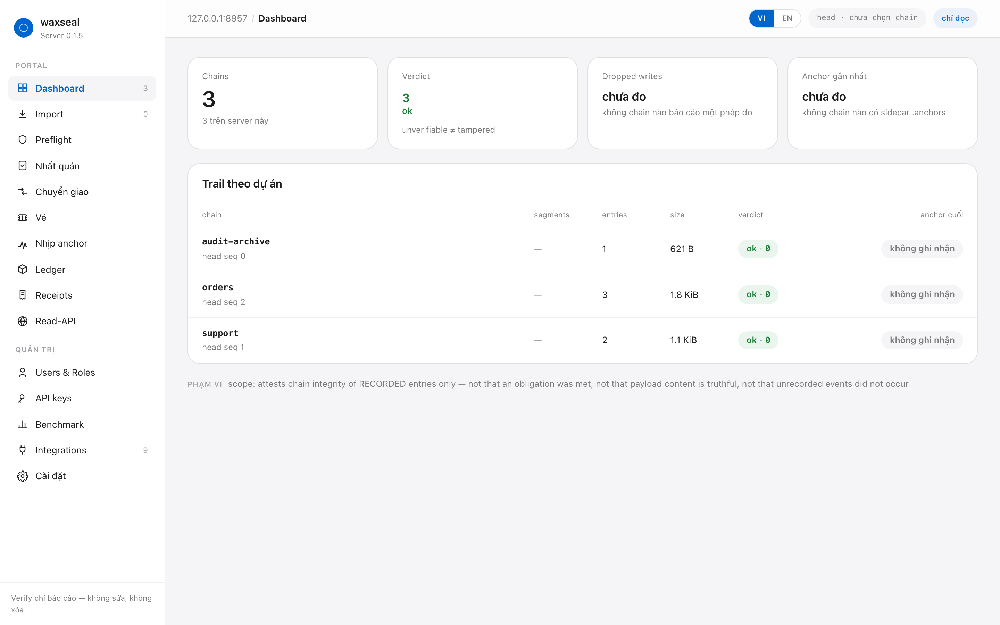
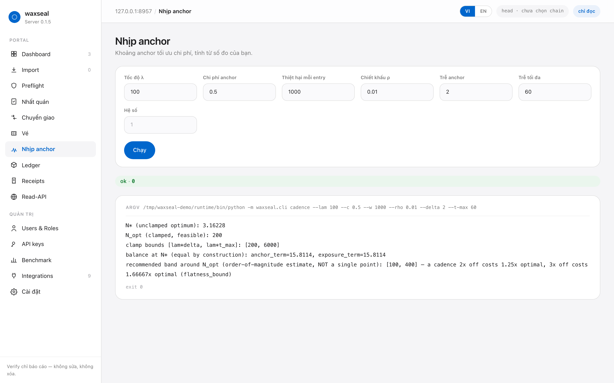
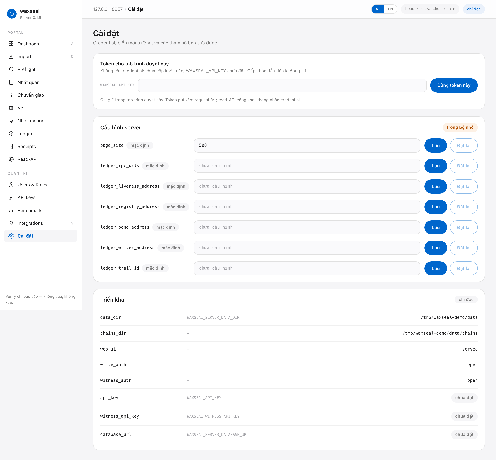
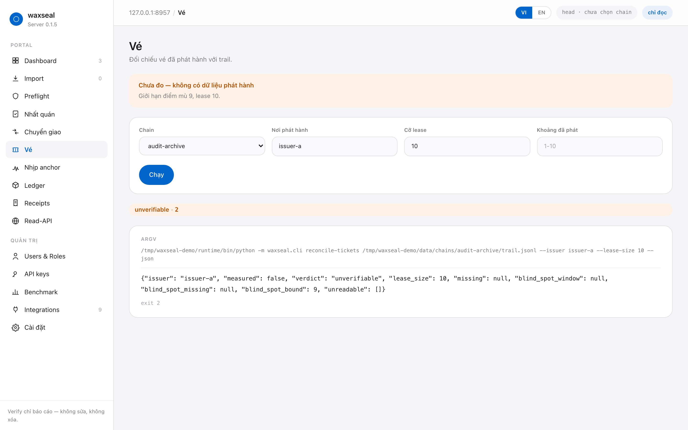
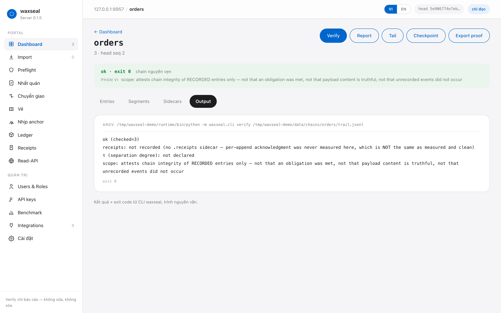

# Triển khai waxseal server

Đây là ứng dụng self-hosted. "SaaS" ở đây nghĩa là source được ship để ai cũng
chạy được; waxseal không vận hành dịch vụ nào và không giữ dữ liệu của ai.

> Bản tiếng Anh: [`deployment.md`](deployment.md). Hai bản được cập nhật cùng
> nhau; khi lệch nhau thì bản tiếng Anh là bản đúng.

## Nó là gì

Ba bề mặt trong một process, cố ý giữ tách biệt:

| Bề mặt | Tiền tố | Credential | Mục đích |
|---|---|---|---|
| Chain API | `/v1/chains/...` | khóa operator, hoặc `WAXSEAL_API_KEY` | Quyền ghi. `RemoteBackend` nói giao thức này. |
| Quản trị | `/v1/operators`, `/v1/keys` | khóa có `keys:manage` | Operator và credential của họ. |
| Witness | `/v1/witness/...` | `WAXSEAL_WITNESS_API_KEY` | Nhận anchor và cho đọc lại chain *của người khác*. |
| Read point công khai | `/public/v1/...` | không cần | Bên thứ ba xác minh mà không được cấp gì. |

Read point công khai **không phải** "cùng dữ liệu, tắt xác thực". Nó là một bề
mặt riêng, trên đó không có route ghi nào cả - quyền chỉ-đọc ở đây là kiến trúc,
không phải một bit phân quyền. Hình dạng này lấy từ mẫu mirror-node (kế hoạch
0.1.5, Workstream G4), và có test khẳng định không route `/public` nào nhận
phương thức khác `GET`.

`GET /public/v1/scope` trả về câu phạm vi đã đóng băng (`waxseal-scope-v1`) từ
chính thư viện sở hữu nó. Portal in nguyên văn câu đó bên cạnh mọi verdict, và
nó có sẵn cả trên server không có chain nào: một lời giới hạn mà biến mất khi
không còn gì để giới hạn thì không phải là lời giới hạn.

## Chạy nhanh

```bash
cd server
./scripts/start-docker.sh           # PostgreSQL + server + portal, rồi seed
# UI và API ở http://127.0.0.1:8000
```

Chạy trên máy, không Docker:

```bash
cd server
./scripts/build.sh                  # dependency backend + bundle frontend
./scripts/start-local.sh --demo     # tạo chain demo, rồi serve ở :8000
```

Cả hai chỉ là wrapper. Nếu bạn muốn gõ lệnh gốc:

```bash
docker compose -f server/docker-compose.yml up --build
```

```bash
cd server/web && npm install && npm run build   # tùy chọn; API chạy được mà không cần
cd server && uv sync --extra dev
WAXSEAL_SERVER_DATA_DIR=./data uv run python -m waxseal_server
```

Nếu UI chưa từng được build, `/` trả về một trang nói rõ điều đó và nêu tên lệnh
build, còn `GET /v1/meta` báo `"web_ui": "not_built"`. Đó là một sự thiếu vắng
**có nhãn**, không phải một trang bị lỗi.

## Script

Mọi thứ bên dưới đã được tự động hóa trong `server/scripts/`. Script nào cũng có
`--help`.

| Script | Làm gì |
|---|---|
| `build.sh` | Dependency backend (`uv sync`), bundle frontend (`npm run build`). `--docker` build luôn image, `--check` chạy pytest + ngưỡng coverage + mypy + `vue-tsc`. |
| `start-local.sh` | Chạy server trên máy này. `--demo` tạo chain demo trước, `--reload` reload khi source đổi, `--port` / `--data` để ghi đè mặc định. |
| `start-docker.sh` | Dựng PostgreSQL + server + portal, chờ healthy, rồi seed operator. `--down`, `--logs`, `--no-build`. |
| `seed-demo.sh` | Ghi chain demo qua **thư viện** waxseal, nên dữ liệu demo không thể là hình dạng mà client thật không tạo ra. |
| `screenshots.sh` | Chụp mọi màn hình ở cả hai ngôn ngữ vào `docs/screenshots/<lang>/`. |

```sh
cd server
./scripts/build.sh --check          # build hết, rồi chứng minh nó đúng
./scripts/start-local.sh --demo     # http://127.0.0.1:8000 có sẵn dữ liệu để xem
./scripts/start-docker.sh           # stack thật, trên PostgreSQL
```

`start-docker.sh` **mặc định build lại**, và đó là chủ ý: image nướng bundle
frontend vào lúc build, nên một container khởi động mà không build lại sẽ serve
đúng cái bundle của lần build trước. Đây là nguyên nhân phổ biến nhất khiến một
màn hình vừa sửa trông như không đổi gì. Có `--no-build` cho lúc bạn biết mình
muốn bundle cũ.

Script cũng từ chối khởi động nếu `WAXSEAL_API_KEY` và
`WAXSEAL_WITNESS_API_KEY` được đặt cùng một giá trị, vì một witness cầm khóa ghi
của chain có thể append entry giả vào đúng cái chain nó tồn tại để đối chiếu
(REMOTE.md mục 8).

## Operator, vai trò và API key

```bash
docker compose -f server/docker-compose.yml exec server \
    waxseal-server-admin seed --email you@example.com
docker compose -f server/docker-compose.yml exec server \
    waxseal-server-admin key-mint --username admin --label laptop
docker compose -f server/docker-compose.yml exec server \
    waxseal-server-admin key-mint --username user-waxseal --label claude-code-hook
```

`seed` tạo hai tài khoản và có tính idempotent, nên script deploy chạy lại được:

| Username | Vai trò | Dành cho |
|---|---|---|
| `admin` | admin | Một con người. Quản trị server, operator và khóa. |
| `user-waxseal` | writer | Một cái máy. Thứ mà agent hook dùng để append. |

`key-mint` cố ý **không** idempotent: mint lần thứ hai là một credential thứ
hai. Plaintext của mỗi khóa được in đúng một lần và không bao giờ nữa - store
chỉ giữ SHA-256, nên server này không thể cho bạn xem lại một khóa và cũng
không thể làm lộ toàn bộ khóa một lúc.

### Bảng vai trò

| Vai trò | Scope |
|---|---|
| `admin` | `trails:read` `head:read` `entries:append` `verify:run` `proof:export` `import:write` `keys:manage` `public:read` |
| `auditor` | `trails:read` `head:read` `verify:run` `proof:export` `import:write` `public:read` |
| `writer` | `entries:append` `head:read` |
| `viewer` | `trails:read` `public:read` |

Hai tính chất đáng nói ra, vì chúng được **thực thi**, không chỉ là ý định:

- **Không vai trò nào sửa được một entry.** Trong toàn hệ thống không có scope
  `entries:edit`, `entries:delete` hay `trails:repair`, nên không thể cấp cho
  admin một cái. Có test đi qua từng scope của từng vai trò và fail nếu xuất
  hiện một cái.
- **Writer không đọc được cái trail nó đang ghi vào.** Đó chính là mục đích của
  vai trò này: khóa nằm trên máy dev hoặc trong CI, và làm lộ nó không được
  đồng nghĩa với làm lộ lịch sử audit. Nó chỉ mở rộng được chain và biết được
  cái tail nó đang nối vào, không gì khác.

### Seed chính là hành động khóa một triển khai

Server không có `WAXSEAL_API_KEY` và chưa mint khóa nào thì **đang mở**, và nó
nói ra điều đó ở `GET /v1/meta` (`"write_auth": "open"`) lẫn trên portal. Ngay
khi khóa đầu tiên tồn tại, nó thôi mở. Không có công tắc "bật auth" riêng để ai
đó quên, vì một fail-open tự mô tả mình là đã bảo mật chính là nửa
false-confidence của cái sụp đổ mà dự án này tồn tại để ngăn.

`WAXSEAL_API_KEY` vẫn là credential bootstrap hợp lệ với scope admin. Nó không
phải operator: không có bản ghi, không có lịch sử, và `GET /v1/whoami` báo
`is_operator: false` để portal không bao giờ liệt kê nó như một con người.

## Cấu hình

Mọi biến môi trường. Không cái nào là tham số dòng lệnh, vì tham số hiện ra
trong process listing (REMOTE.md mục 5).

| Biến | Mặc định | Ý nghĩa |
|---|---|---|
| `WAXSEAL_SERVER_DATA_DIR` | `/var/lib/waxseal` | Chain, bản ghi witness, import - là **file**. |
| `WAXSEAL_SERVER_DATABASE_URL` | chưa đặt | PostgreSQL cho operator, API key và settings. Chưa đặt nghĩa là store trong bộ nhớ, mất khi restart. |
| `WAXSEAL_API_KEY` | chưa đặt | Bearer token bootstrap, scope admin. |
| `WAXSEAL_WITNESS_API_KEY` | chưa đặt | Bearer token cho witness. Không bao giờ là khóa chain hay khóa operator. |

### Hai loại cấu hình, và vì sao chúng tách nhau

Biến môi trường là thứ **process** được khởi động cùng. Mọi thứ trong bảng trên
được đọc một lần lúc start và chỉ-đọc lúc runtime: đổi
`WAXSEAL_SERVER_DATA_DIR` nghĩa là phải restart cái process đang giữ những file
đó, còn đổi credential từ chính console mà nó xác thực là cách một console tự
khóa mình ra ngoài - hoặc âm thầm nới quyền của chính nó.

Bên cạnh đó server giữ một **settings store** nhỏ - các giá trị vận hành mà
operator đổi được không cần redeploy. `GET /v1/settings` trả về cả hai nửa và
màn Cài đặt hiển thị chúng cạnh nhau, để câu "server này đang cấu hình thế nào"
có một câu trả lời ở một chỗ.

| Setting | Mặc định | Ý nghĩa |
|---|---|---|
| `page_size` | `500` | Số entry mỗi trang của `/v1/chains/{id}/entries`. |
| `ledger_rpc_urls` | chưa đặt | Các endpoint JSON-RPC, cách nhau bằng dấu phẩy. **Từ hai cái trở lên**, xem bên dưới. |
| `ledger_liveness_address` | chưa đặt | Contract `AnchoringLiveness`. Đặt nó là thứ bật màn Ledger lên. |
| `ledger_registry_address` | chưa đặt | Contract `FingerprintRegistry`. |
| `ledger_bond_address` | chưa đặt | Contract `BondedCheckpoints`. Cần kèm `ledger_writer_address`. |
| `ledger_writer_address` | chưa đặt | Địa chỉ writer cần kiểm tra bond. |
| `ledger_trail_id` | chưa đặt | Định danh trail on-chain. Mặc định là đường dẫn trail đã resolve. |

Store nằm trong cùng PostgreSQL với operator, và lùi về bộ nhớ khi
`WAXSEAL_SERVER_DATABASE_URL` chưa đặt. Cả hai store đi theo đúng một biến đó là
có chủ ý: operator bền mà settings thì quên sẽ là một triển khai trông như đã
cấu hình rồi âm thầm quay về mặc định sau mỗi lần restart. `GET /v1/settings`
báo backend nào đang trả lời, nên một setting biến mất thì có lý do ngay trên
màn hình.

### Những gì settings store sẽ không bao giờ giữ

Bốn giá trị bị từ chối **theo tên**, không phải chỉ vắng mặt, và lời từ chối
mang theo lý do để sau này không ai thêm vào như một sơ suất:

- `api_key` và `witness_api_key` - là credential. Operator store chỉ giữ SHA-256
  của khóa chính vì mục đích không cho database làm lộ một credential đang sống,
  và khóa witness thuộc về một *authority quản trị khác*: một bảng settings dùng
  chung sẽ đặt cả hai dưới cùng một chỗ sửa.
- `database_url` - không thể nằm trong chính database mà nó trỏ tới.
- `data_dir` - đang bị process chạy giữ mở.

`GET /v1/settings` báo ba secret dưới dạng `state: "set" | "unset"` và **không
có field nào để giá trị có thể nằm vào**. Đó là thứ ngăn một trang "cho tôi xem
cấu hình" trở thành cách đọc credential ra khỏi một triển khai. Cả hai route ghi
đều từ chối các key này với `404 no_such_setting`.

### Vì sao ledger cần hai RPC endpoint

`ledger_rpc_urls` từ chối một endpoint duy nhất, và thư viện phía sau nó cũng
vậy: một endpoint không thể bất đồng với chính nó, nên "đối chiếu" với nó thì
không phải là đối chiếu. Một operator dựa vào một tiếng nói duy nhất thì mù đúng
với cái eclipse mà việc đối chiếu tồn tại để phát hiện. Hãy cấu hình hai nhà
cung cấp độc lập, hoặc để trống - dưới hai endpoint thì `ledger-status` trả
`unverifiable` và nói rõ vì sao, thay vì báo một trạng thái nó không xác nhận
được.

### Vì sao trail không nằm trong PostgreSQL

Database giữ bản ghi **của riêng server này**. Trail vẫn là file JSONL trên data
volume, và đó là một đường ranh có chủ ý, không phải một cuộc migration bỏ dở:

- lời hứa của sản phẩm là một bên thứ ba xác minh được trail bằng `waxseal
  verify` nguyên bản trên máy của họ. Đưa trail vào database này thì server này
  thành thứ duy nhất đọc được nó - đúng cái tập trung niềm tin mà read point
  công khai tồn tại để xóa bỏ;
- thư viện waxseal và CLI của nó không biết gì về PostgreSQL, và thêm driver vào
  chúng sẽ phá quy tắc zero-dependency mà toàn bộ thiết kế dựa lên
  (CLAUDE.md rule 1);
- backup data volume cho bạn những file mà `waxseal verify` đọc trực tiếp, không
  cần server và không cần database nào đang chạy.

## Kubernetes

`deploy/helm/waxseal-server/` cài server này thành một StatefulSet ở một
replica, kèm hook seed, một anchor client đặt cùng chỗ tuỳ chọn, và một
`values.schema.json` ghim số replica. Sở dĩ là một replica vì trail là file
JSONL nằm sau một file lock nên chỉ nhận đúng một writer, còn rolling update
của Deployment sẽ tạo thêm một pod thứ hai trên cùng volume trước khi tắt pod
cũ.

Verifier là **một chart riêng** dành cho một namespace hoặc một cluster riêng:
`deploy/helm/waxseal-verifier/`. Một verifier mà chính người ghi trail cũng
nâng cấp được là một writer tự kiểm chứng chính mình. Không chart nào kèm một
witness, cũng vì lý do đó. Xem [`deploy/README.vi.md`](../../deploy/README.vi.md).

## Bề mặt đọc

Mười sáu trong hai mươi lệnh của wheel là lệnh đọc. Mười một cái tiếp cận được
qua HTTP; bốn cái ghi thì không, và không thể tiếp cận kể cả bằng tên.

| Route | Lệnh | Scope |
|---|---|---|
| `GET /v1/chains/{id}/verify` | `verify` | `verify:run` |
| `GET /v1/chains/{id}/report` | `report --json` | `verify:run` |
| `GET /v1/chains/{id}/inspect` | `inspect` | `verify:run` |
| `GET /v1/chains/{id}/segments` | `segments` | `verify:run` |
| `GET /v1/chains/{id}/preflight` | `preflight` | `verify:run` |
| `GET /v1/chains/{id}/checkpoint` | `checkpoint` | `verify:run` |
| `GET /v1/chains/{id}/export-proof/{seq}` | `export-proof` | `proof:export` |
| `GET /v1/chains/{id}/tail?n=` | `tail` | **`trails:read`** |
| `GET /v1/chains/{id}/consistency?old_seq=&old_root=` | `consistency` | `verify:run` |
| `GET /v1/chains/{id}/verify-handoff?origin=` | `verify-handoff` | `verify:run` |
| `GET /v1/chains/{id}/reconcile-tickets?issuer=&lease_size=&issued=` | `reconcile-tickets --json` | `verify:run` |
| `GET /v1/chains/{id}/ledger-status` | `ledger-status --json` | `verify:run` |
| `GET /v1/cadence?lam=&c=&w=&rho=&delta=&t_max=&M=` | `cadence` | `verify:run` |

`anchor`, `install`, `registry` và `bond` là lệnh ghi. Chúng không có trong tập
lệnh chỉ-đọc của server, nên không request HTTP nào chạm tới được - CLAUDE.md
rule 4 ("verify reports, never repairs") thể hiện thành một bảng URL chứ không
phải một lời hứa.

Ba điều trong bảng đó không hiển nhiên:

- **`tail` trả lời cho `trails:read`, không phải `verify:run`.** Nó in nội dung
  entry, nên nó là cùng mức tiết lộ như `/entries` và phải trả lời cùng một
  scope. Một writer key không được đọc lại chính cái trail nó đang nối.
- **Mọi query parameter đều trở thành một phần tử của `argv`**, đây là chỗ duy
  nhất server này biến input của người gọi thành tham số subprocess. Mỗi cái
  được kiểm tra *trước khi* subprocess tồn tại - một validator từ chối sau đó
  thì đã chạy mất cái lệnh nó định ngăn. Dùng regex neo hai đầu, không dùng
  `float()`, vì `float()` nhận cả `inf`, `nan` và dấu đứng đầu.
- **`verify-handoff --origin` nhận một chain id, không bao giờ nhận đường dẫn.**
  Server tự resolve, nên một request không thể chỉ định một file bất kỳ trên máy
  chủ làm lịch sử gốc.

### `cadence` không mở trail nào

Đây là lệnh đọc duy nhất không có chain trong đó: mọi input là một số đo do
operator cung cấp, nên một server không giữ chain nào vẫn trả lời được. Không
field nào được điền sẵn và không tham số nào có mặc định - một nhịp anchor tính
từ con số do server này tự chọn sẽ là lời khuyên không ai đo, in ra với đúng sự
tự tin của lời khuyên có người đo. Nó trả về một **dải** đề xuất, không bao giờ
một điểm đơn.

### `ledger-status` đọc tham số từ settings store

Lệnh đọc duy nhất mà tham số không đến từ request. Operator cấu hình endpoint và
contract một lần trong Cài đặt; người gọi không thể chỉa RPC client của server
này vào một host do họ chọn. Ba kết quả, không cái nào là trạng thái bịa ra:

| Trạng thái | Ý nghĩa |
|---|---|
| `configured: false`, `reason: no_liveness_address` | Không có gì để chạy. `missing` nêu tên setting cần đặt. Không phải lỗi. |
| `configured: false`, `reason: bond_without_writer` | Có địa chỉ bond mà không có writer. Được nêu tên chứ không gửi cho argparse, vì argparse sẽ trả về usage error - một bug của server đội lốt không-verdict. |
| `configured: true` | Lệnh đã chạy. Verdict của nó được mang qua nguyên văn, kể cả `unverifiable` mà nó trả về khi có dưới hai RPC endpoint. |

## Lệnh đọc chạy qua CLI

Mọi bề mặt verify/report/inspect đều gọi ra `python -m waxseal.cli` và báo lại
exit code của nó. Server không tự tính verdict, nên chỉ luôn có một verifier duy
nhất để đối chiếu. Response mang theo `argv` đã tạo ra nó, nên operator tái hiện
được mọi verdict trên máy của mình.

Hai hệ quả đáng biết:

- Lệnh mà bản build waxseal này không có sẽ báo `"status": "unavailable"` với
  verdict là null. Chúng không bao giờ được chạy, vì argparse cũng exit 2 và
  điều đó sẽ đến trông y hệt "unverifiable" - một verdict không ai tính. Từ
  0.1.5 wheel đã có mọi lệnh đọc mà server này cung cấp, nên đường đi này chỉ
  gặp khi một wheel cũ nằm sau một server mới - đúng trường hợp nó tồn tại vì.
- Exit 3 ("không đọc được gì") được báo là `"absent"`, không bao giờ là một
  break. Báo tamper cho một file không tồn tại là một báo động sai.
- `segments` được đưa **thư mục** chứa trail, không phải file trail: nó đi qua
  một nhóm segment và các binding rotation giữa các file (SPEC.md mục 20). Một
  chain chưa rotate vì thế báo `"absent"` kèm "no sealed segments" trên stderr -
  không có gì được kiểm - thay vì một `ok` sẽ khẳng định đã tìm thấy mọi segment
  của một trail vốn không có segment nào.

## Portal

Mười sáu màn hình, hai ngôn ngữ (VI/EN), responsive xuống tới 390px. Sidebar trở
thành drawer phủ lên khi dưới 900px.



| | |
|---|---|
|  |  |
| **Nhịp anchor** - khoảng anchor tối ưu chi phí, tính từ số đo của chính operator. Không mở trail nào. | **Cài đặt** - credential, biến môi trường, và các tham số. Secret chỉ báo `đã đặt`/`chưa đặt`, không gì khác. |
|  |  |
| **Vé** - thiếu một vé là một mất mát *đã phát hiện*; không có dữ liệu phát hành là *chưa đo*. Không bao giờ hiện thành "0 mất mát". | **Trail** - mọi verdict mang theo `argv` đã tạo ra nó, để operator tái hiện được. |

Bộ đầy đủ: [`docs/screenshots/vi/`](screenshots/vi/) và
[`docs/screenshots/en/`](screenshots/en/), cả desktop lẫn phone, tạo lại bằng
`./scripts/screenshots.sh`.

API token trước đây là một card trên chín màn hình; giờ nó được đặt một lần,
trong Cài đặt. Một ô nhập credential lặp mười hai lần là mười hai chỗ để dán
khóa vào và mười hai chỗ để bỏ quên nó.

### Screenshot được sinh ra, không phải chọn tay

`screenshots.sh` tự dựng server riêng với dữ liệu demo riêng trên một cổng tạm
rồi chụp cái đó - không bao giờ chụp một triển khai thật. Hai lớp bảo vệ chạy
trước mỗi lần bấm máy, vì cả hai lỗi này đều vô hình khi review một khi khung
hình đã thành PNG:

- mọi màn hình đều được kiểm tràn ngang;
- phần text đã render được quét tìm đường dẫn home, API key hay bearer token.

Đường dẫn được ghim dưới `/tmp/waxseal-demo`, và interpreter được gọi qua một
symlink ở đó. Đây không phải chuyện thẩm mỹ: mọi output panel đều in ra `argv`
đã tạo ra nó, nên một khung hình chụp thẳng từ checkout sẽ render thư mục home
của lập trình viên vào ảnh xuất bản.

Dữ liệu demo được ghi qua **thư viện** waxseal, nên nó không thể là hình dạng mà
client thật không tạo ra. Nó không mang tên tổ chức, tên người, địa chỉ hay
credential nào - chỉ có định danh giữ chỗ (`agent-a`, `reviewer-1`).

## TLS

HTTP thuần. TLS kết thúc ở một reverse proxy đặt phía trước - file này không tự
phát minh ra một PKI. Xem bản tiếng Anh, mục *TLS*, để biết cấu hình cụ thể.

## Server được tin cho việc gì, và không được tin cho việc gì

Đây là mục quan trọng nhất của cả tài liệu và được giữ nguyên văn ở bản tiếng
Anh: [*What the server is trusted for, and what it is not*](deployment.md#what-the-server-is-trusted-for-and-what-it-is-not).
Đoạn cần nhớ nhất, nói lại ở đây:

**Một witness được host cạnh chain mà nó làm chứng thì không chứng minh được
gì.** Nếu cùng một người vận hành cả hai, một lần rewrite phối hợp sẽ đi qua cả
hai. Witness chỉ có giá trị khi nó thuộc một authority quản trị khác - và đó là
lý do khóa của nó là một biến môi trường khác, không bao giờ dùng chung với khóa
ghi của chain.

## Chưa làm, và vì sao

Xem bản tiếng Anh, mục [*Not implemented, and why*](deployment.md#not-implemented-and-why).
Ghi lại ở đây theo cùng một tinh thần với conformance ledger: **viết ra chưa phải
là đã ship.** Ba mục đáng nhắc:

- **Không có login bằng mật khẩu, và sẽ không có.** Xác thực là API key, hash
  khi lưu. Một form đăng nhập trên một kho tài khoản không có cột mật khẩu sẽ là
  một cơ chế nhận tất cả mọi người trong khi trông như một cơ chế không nhận.
- **`receipt` không được expose qua HTTP.** Nó chỉ-đọc với trail, nhưng nó ghi
  file receipt và frame vào một thư mục `--out` do operator đặt tên. Một route
  cho nó sẽ khiến server này ghi file thay cho một request, và CLI là chỗ đúng
  để chạy nó.
- **Màn Ledger đã ra khỏi danh sách này.** Trước đây nó báo "chưa cấu hình" và
  không thể báo gì khác, vì không có chỗ nào để đặt RPC endpoint hay địa chỉ
  contract. Settings store giữ những cái đó rồi và
  `GET /v1/chains/{id}/ledger-status` chạy lệnh thật. Cái **không** đổi là
  trường hợp chưa cấu hình: nó vẫn là một trạng thái có nhãn, nêu tên setting
  cần đặt, chứ không bao giờ là một status không ai đọc. Lưu ý một lần đối chiếu
  hoạt động cần **hai** nhà cung cấp RPC độc lập - đó là quyết định mua sắm hơn
  là quyết định cấu hình.
